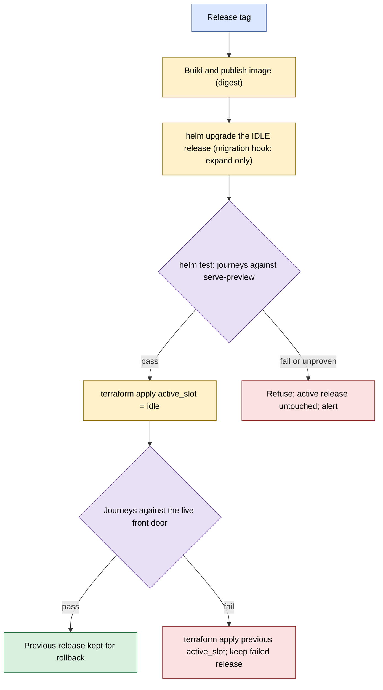

# Spec: Release Slots (blue/green as infrastructure as code)

**Owner:** Ben Booth (B-Tree Labs) • **Status:** Draft (designed, not built) • **Last updated:** 2026-10-06
**PRD:** none yet • **Key ADRs:** [ADR-170](../adrs/adr-170-a-release-is-proven-in-an-idle-slot-before-traffic-moves.md), [ADR-169](../adrs/adr-169-a-live-surface-is-checked-by-a-scripted-user-journey.md)

## Overview

The serving tier is deployed as two Helm releases (`blue`, `green`) on a Kubernetes cluster, behind one stable
Service that selects the active slot. Terraform declares the cluster objects, both releases and the switch.
A release goes into the idle slot, is proven there by synthetic journeys, and only then does the switch change.

**Everything below is designed, not built.** The current state, verified in code and on a node on 2026-10-06:

| Piece | Exists today | Gap |
|---|---|---|
| Helm chart for the serving app | No (the only chart deploys the secrets store) | New chart |
| Terraform for the cluster and releases | A module for the secrets chart only; no backend | New module, backend |
| Ingress | Disabled at cluster creation | Enable, add TLS and forward-auth |
| Image publishing | Wheel only; images are `latest` with pull-never, imported by hand | Build, publish, pin by digest |
| CI validation of IaC | None (`helm template` and `terraform fmt` run only if installed locally) | Lint, render, schema, validate, smoke |
| Cluster in use on the node | A single-server cluster with the database, a model server, an authorization store, an embeddings service | Serving tier lives outside it |



## Profiles: one definition, from a laptop to a node

The chart and the Terraform module are the same everywhere; a profile is a values overlay.

| Profile | For | Differences |
|---|---|---|
| `micro` | a laptop in local-host mode | one replica per release; small resource requests; local-path storage; loopback-only ingress with a self-signed certificate; a small CPU model (the existing small-model server) or none; the idle slot created on demand for a release rehearsal, not kept running |
| `node` | a single production node | digest-pinned images; a host GPU model server through an ExternalName Service; the site's certificate; forward-auth to the gate; both slots kept; a disruption budget |
| `cluster` | later, several nodes | replicas, anti-affinity, an external database |

**How it ties into running locally.** `axi infra` is the entry point for every profile. Today it chooses k3d,
then docker-compose (database only), then native, and applies inline manifests built in code (the database, the
model server). Under this design its k3d path creates the cluster from the same definition the module uses
(published ports and ingress enabled, instead of the bundled ingress being disabled) and applies the chart and
module with `--profile micro` (default on a laptop) or `--profile node`. The inline manifests are removed. The
docker-compose and native paths stay for machines without a cluster and are documented as single-slot: no
preview, no blue/green.

**A local release rehearsal** is the production flow at laptop scale: `axi infra release` upgrades the idle
release, runs `axi synthetic run` against the preview Service, and only on `pass` switches. It is also the
developer's own safe local-host-mode workflow: a change is proven before it replaces the version being used.

**Parity.** CI's cluster smoke test runs the `micro` profile in an ephemeral cluster (the same command a developer
runs locally), plus `helm lint`, `helm template` into `kubeconform`, and `terraform validate` on every profile. A
profile that does not render fails CI, so the laptop and the node cannot drift apart unnoticed.

## Resource introspection: a laptop is not always micro

A profile is chosen from what the machine has, not hard-coded. Nothing in the repository maps resources to a
profile or a model today (verified): `setup/probe.py` reads RAM and CPU count but no consumer uses them,
`cli/doctor.py` parses GPU memory only for a contention warning, the Postgres sizing helper takes a container
limit, and the model roles of ADR-140 are fixed (a quick model and a reasoning model) with a user dial.

Design: one function, `probe_resources()`, returns facts (total memory, CPU count, container limits where present,
GPU vendor and memory, and whether memory is unified, as on Apple silicon), built from the readers that already
exist; and one pure function, `select_profile(facts)`, returns a tier. The sizing the tier controls is the model
roles (quick only, or quick plus reasoning), replica counts and resource requests.

| Tier | Initial rule (proposed; tune by measurement) | Models |
|---|---|---|
| `micro` | unknown, or under 16 GB memory and no usable GPU | quick only |
| `standard` | 16 GB or more, or a GPU with 8 GB or more | quick and reasoning |
| `large` | 64 GB or more, or a GPU with 24 GB or more | quick and reasoning, larger replicas |

An unknown or failed probe selects `micro`. A flag overrides the choice; the chosen tier and the facts behind it are
printed, so the decision is never hidden. The thresholds above are a starting proposal, not measured.

## Terraform state

Resolved (2026-10-06): a single laptop uses a local state file, since one person and one machine use it and
Terraform locks the file. A production node uses Terraform's Postgres backend, which stores state in a database
that is already backed up and already the standard, with locking. To avoid needing the database to exist before its
own state, the cluster and database are applied first as a small separate step with local state, and everything else
(the serving tier and the switch) uses the Postgres backend. Secrets stay out of state by reference to the secrets
store (ADR-002 of that extension), and the state database's access is restricted. Revisit if more than one operator
applies changes.

## Contracts

### Chart: `axiom-serve`

Values that matter to the mechanism:

```yaml
slot: blue                    # blue | green; becomes a pod label and part of every resource name
image: {repository: ..., tag: "...", digest: "sha256:..."}   # digest required; never "latest"
service: {port: 8768}
probes: {readiness: /health, liveness: /health}
resources: {requests: {...}, limits: {...}}
podDisruptionBudget: {minAvailable: 1}
migrations: {enabled: true, mode: expand}    # pre-upgrade hook Job
```

Resource names are `<release>-<component>` so two releases never collide; every pod carries `slot` and
`release-version` labels.

### Services

| Service | Selector | Used by |
|---|---|---|
| `serve-active` | `slot: <active_slot>` | the ingress; on-node clients (telemetry ingest) through the cluster's published port |
| `serve-preview` | `slot: <idle slot>` | the helm test Job and the pre-switch journeys |
| `model-server` | none; an ExternalName or Endpoints to the host GPU service | both slots (shared) |

On-node clients never address a slot's own Service; that is what makes the switch move them too. The cluster's
published ports (set at creation) include the stable client port.

### Terraform module

```hcl
variable "active_slot" { type = string  validation { condition = contains(["blue","green"], var.active_slot) } }
variable "release_blue"  { type = object({ image_digest = string, chart_version = string }) }
variable "release_green" { type = object({ image_digest = string, chart_version = string }) }
# resources: namespace, ingress controller, TLS secret reference, helm_release.blue, helm_release.green,
#            kubernetes_service_v1.serve_active (selector slot = var.active_slot), serve_preview (the other)
```

State is a remote backend with locking; the backend choice is an open question below. A switch is a change to
`active_slot` through review and `terraform apply`; the previous value is the rollback. A plan that changes both
`active_slot` and the active release's image in one apply is rejected by a validation rule.

### Gate

1. `helm upgrade` the idle release (digest pinned); wait for readiness.
2. `helm test` runs a Job with the site's journeys (ADR-169) against `serve-preview`; require exit status 0.
   `fail` (1) and `unproven` (3) both refuse.
3. `terraform apply` with the new `active_slot`.
4. Journeys against the live front door. On a non-zero status, apply the previous `active_slot`, keep the failed
   release for diagnosis, and raise an alert (ADR-169 phase 2).

### Migrations

A pre-upgrade hook Job runs expand-only migrations (additive; compatible with the previous release's code).
A contracting change ships in the next release after the switch is final. The release gate fails a migration
marked incompatible.

## Design

- **Where it lives.** The chart and module are in the Axiom repository as a reference deployment of the serving
  tier, domain-agnostic; a site supplies values (image, ports, journeys, hostnames) and its backend.
- **Forward authentication.** The ingress forward-authenticates every request to the gate, preserving today's
  cookie-versus-bearer behaviour (the verify subrequest strips the browser's bearer). This is the largest
  behavioural migration and is specified with its own tests.
- **Failure behaviour.** A release that fails readiness, `helm test` or the migration hook is never activated.
  A failed `terraform apply` leaves the Service as it was. A partial `helm upgrade` is rolled back by
  `--atomic` and cannot affect the active release.
- **Shared state** (database, model server, authorization store, chat UI) is declared once outside the slots.

## Phases

0. **Validate the IaC in CI.** `helm lint`, `helm template` into `kubeconform`, `terraform fmt` and `validate`,
   an ephemeral-cluster smoke test; apply it first to the existing secrets chart and module. Valuable alone.
1. **Chart, images and the `micro` profile.** `axiom-serve` chart with `micro` and `node` overlays; image build and
   publish by the release pipeline; digest pinning; `axi infra` applies the chart for the k3d path and drops its
   inline manifests; the CI smoke test runs `micro`.
2. **Ingress and stable front door.** Re-enable an ingress controller with TLS and forward-auth; `serve-active`
   and `serve-preview`; move on-node clients behind the published port.
3. **Terraform module with the switch and the gate;** remote state; `helm test` journeys; automatic switch-back.
4. **Move the chat UI and the front door into the cluster;** retire the serving systemd units and the
   in-place install path.

## Decisions

- ADR-170: two Helm releases, idle-only upgrade, stable Service selector switch owned by Terraform, journeys as the
  gate, expand-only migrations, shared infrastructure outside the slots, no privileged host step.
- Resolved 2026-10-06 (Ben Booth): the chat UI is shared infrastructure, outside the slots. The earlier
  draft's root-owned reload unit is dropped in favour of this design.

## Open questions

- The `micro` profile uses an in-cluster Postgres, not SQLite (ADR-174). For a machine with no container runtime,
  whether an embedded Postgres is acceptable (owner: implementer; verify the candidate's license and maintenance).
- The tier thresholds above are unmeasured (owner: implementer, measure on a few laptops before phase 1).
- How a laptop's loopback-only ingress keeps local-host mode safe by default, and what an operator must do to
  expose it (owner: implementer, phase 2).

- Ingress controller: re-enable the cluster's bundled one or install another; how forward-auth is expressed in each
  (owner: implementer, phase 2).
- Moving the cluster to publish additional ports requires recreating it; how to sequence that with the data
  already in it (owner: node operator, before phase 2).
- Disk headroom for a second release's images and volumes on the target node; memory is ample (owner: node operator).
- Whether the pipeline identity's cluster credentials are a service account token or a short-lived credential
  (owner: Ben Booth).
