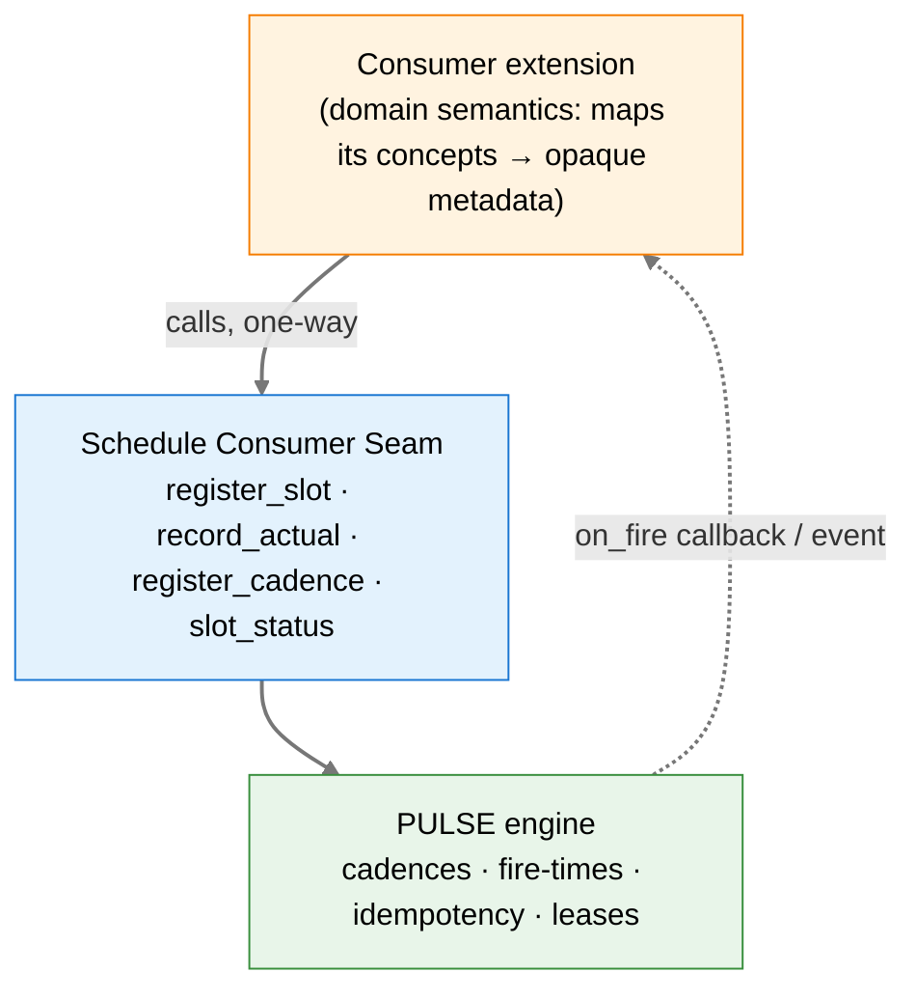

# Spec — Schedule Consumer Seam

**Status:** Draft (starter — wiring in progress under axiom-os#480)
**Last Updated:** 2026-06-08
**Builds on:** [prd-axiom-schedule.md](../prds/prd-axiom-schedule.md) (PULSE), [prd-calendar-protocol.md](../prds/prd-calendar-protocol.md)
**Layer:** Axiom platform (domain-agnostic). This spec names **no** domain consumer.

---

## 1. Purpose

PULSE (`axi schedule`) gives the platform a time/cadence engine. This spec defines the **consumer seam**: the small, stable API a consumer extension calls to reserve time and react to it, without re-implementing scheduling. A consumer's thin CLI verb finishes a scheduling feature against this seam; Ben builds the seam "slightly ahead" so the consumer side is a mapping exercise, not an engine build.

## 2. Layer boundary (load-bearing)

- **Axiom owns** the generic time primitive: slots (abstract time reservations), cadences (one-shot / interval / cron), fire-times, planned-vs-actual timestamps, idempotency, leases. It stores opaque consumer `metadata` and never interprets it.
- **Axiom does NOT know** any domain concept (no experiments, facilities, reactors, orders, tenants-as-domain). Those are the consumer's, mapped into `metadata`.
- **Dependency is one-way: consumer → Axiom.** Axiom must never import or reference a consumer. Calendar adapters, when they exist, live here (`schedule/calendar/`), not in the consumer.

## 3. The seam API

Exposed as skill-functions per ADR-056 (`(params, ctx) -> SkillResult`), so the same calls are reachable from a consumer's CLI verb, from a peer agent over A2A, and over MCP. Signatures below are the contract; refine field names during wiring.

| Function | Input | Returns | Semantics |
|---|---|---|---|
| `register_slot` | `planned_start`, `planned_end?`, `metadata: dict` | `slot_id` | Reserve an abstract time window. `metadata` is opaque and round-tripped verbatim. Idempotent on `(planned_start, metadata-hash)` within a window. |
| `record_actual` | `slot_id`, `actual_start`, `actual_end?` | updated slot | Record what actually happened against a planned slot (enables planned-vs-actual analytics). |
| `register_cadence` | `cadence` (one-shot / interval / cron), `on_fire` (skill ref or event subject), `metadata: dict` | `schedule_id` | Register a recurring/one-shot firing. Manifest-declared `[[extension.schedule]]` entries are the declarative form of this call. |
| `slot_status` | `slot_id` | slot record (planned, actual, state, metadata) | Read-back for the consumer's own views. |

**Slot data model (Axiom-owned):** `slot_id`, `planned_start`, `planned_end?`, `actual_start?`, `actual_end?`, `state` (reserved → active → done / cancelled), `metadata` (opaque JSON), provenance/timestamps. Lives in the `schedule` extension's Postgres schema (ADR-052). The consumer keeps its *own* domain record and stores `slot_id` as a foreign reference — it does not push domain fields into Axiom.

**Firing & idempotency:** single-node (PULSE-1), idempotency key `(schedule_id, fire_time_bucket, params_hash)`. `on_fire` delivers back to the consumer via a registered skill or a bus event subject; the consumer does the domain action (e.g. send a reminder, advance its own state). Axiom does not know what the action means.

## 4. What this seam is NOT

- Not calendar sync. Reading/writing external calendars (CalDAV / Google / M365) is the **Calendar Protocol** (`schedule/calendar/`, draft) — a separate, later increment. CalDAV is the first realistic adapter (no OAuth); Google needs calendar OAuth wired; M365/Outlook is OAuth-blocked.
- Not trigger-style (calendar-event-→-action) schedules — that's PULSE-2.
- Not distributed/exactly-once multi-node firing — PULSE-2.

## 5. Open questions (refine during wiring)

1. `record_actual` — push (consumer calls on its state transition) vs. the seam subscribing to a consumer signal? Push is simpler for PULSE-1; revisit when SCAN routing matures.
2. `on_fire` delivery — registered skill ref vs. bus event subject as the default. (Bus subject decouples; skill ref is synchronous.)
3. Slot vs. cadence overlap — is a "reminder N hours before a slot" a first-class seam helper, or does the consumer compose `register_slot` + `register_cadence` itself? Lean: compose for PULSE-1, consider a helper later.
4. Metadata size/shape limits and indexability (the consumer will want to query its slots by its own keys — does it query Axiom by metadata, or keep the index on its side keyed by `slot_id`? Lean: consumer-side index).

## 6. Acceptance (this week)

- `register_slot` / `record_actual` / `register_cadence` / `slot_status` implemented and tested (TDD), single-node idempotent firing green.
- Manifest-declared `[[extension.schedule]]` discovery wired into the tick loop.
- A one-page interface note a consumer can code against by mid-week (the sync point with the consumer-side ticket).
- Stretch: Calendar PR-1 scaffold (Protocol + contract tests + wizard shell, no vendor adapter).

_Copyright (c) 2026 The University of Texas at Austin and B-Tree Labs. Apache-2.0 licensed._
