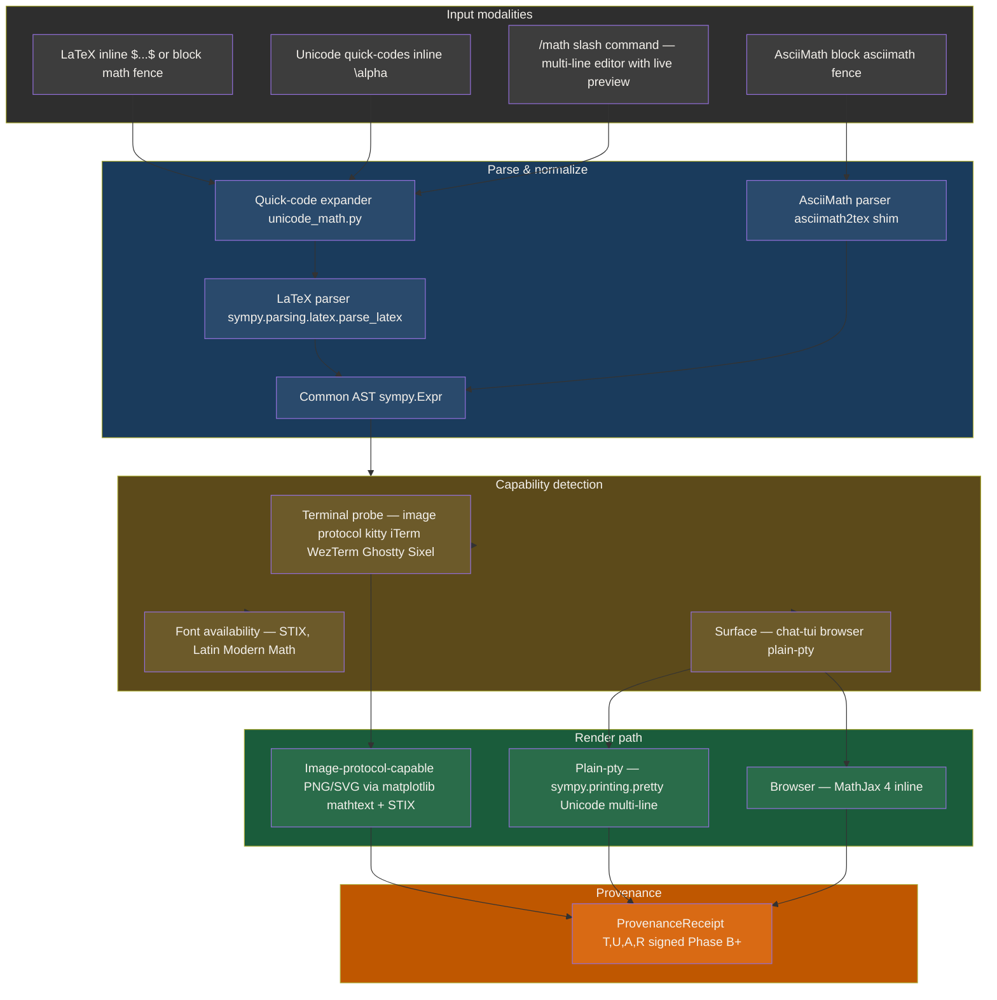
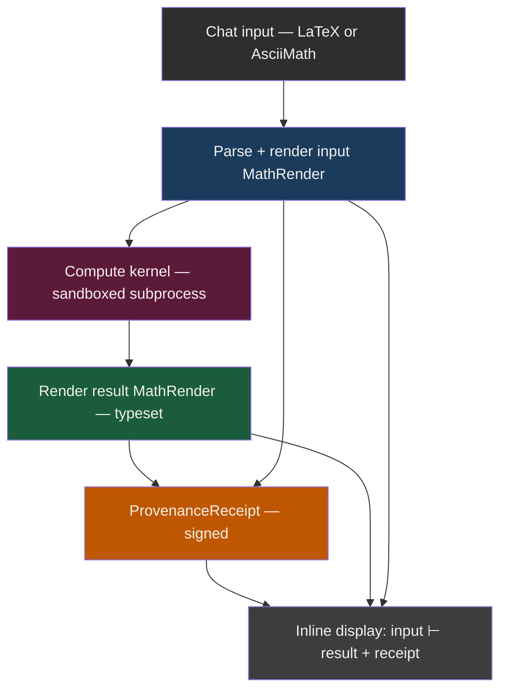
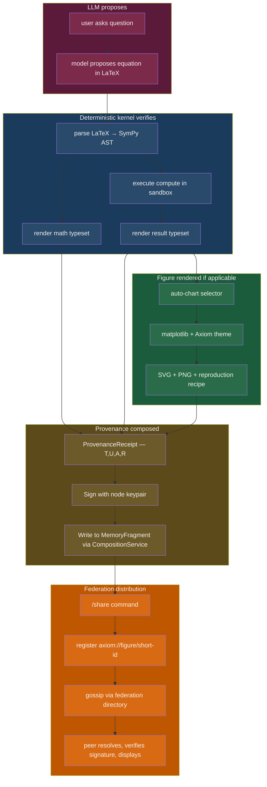

# Spec — Scientific Displays

**Status:** Draft (design)
**Owner:** Ben Booth (B-Tree Labs)
**Created:** 2026-05-01
**Last updated:** 2026-05-01
**PRD:** `docs/prds/prd-scientific-displays.md`
**ADR:** `docs/adrs/adr-039-scientific-displays.md`

**Related specs:** `spec-aeos-0.1.md`, `spec-model-routing.md`, `spec-event-bus.md`, `spec-extension-layout.md`, `spec-brand-identity.md`, `spec-classification-boundary.md`.

---

## 1. Goals (recap)

Three pillars, one closed loop:

1. **Math rendering with character precision.** LaTeX/AsciiMath/Unicode-quick-codes → a typeset surface that adapts to terminal capability, never improvises.
2. **Deterministic computation.** SymPy + NumPy + SciPy + mpmath in a sandboxed subprocess; long jobs back-grounded; very long jobs federation-routed to capable peers.
3. **Auto-selected, themed charts.** Data-shape sniff + chat-context override; matplotlib + Axiom theme; SVG + PNG dual output; one-keystroke peer-shareable signed artifact.

The asymmetric edge is the *closed loop*: model proposes → SymPy verifies → result is provenance-tracked → figure is signed → package flows through federation. Section 11 anchors the spec around that loop.

## 2. Module Layout

Per AEOS §5.1.1 (built-in flat layout) and §5.4 (purpose-named, no type suffix):

```
src/axiom/extensions/builtins/scidisplay/
├── __init__.py                          # __all__ enumerates the public surface
├── axiom-extension.toml                 # AEOS manifest with builtin = true
├── agents/
│   └── (none in v0.1; future: SCI-E for chart-suggestion learned policy)
├── tools/
│   ├── render_math/                     # tool: latex/asciimath -> rendered output
│   ├── compute/                         # tool: deterministic SymPy/NumPy executor
│   └── render_chart/                    # tool: data + intent -> themed figure
├── commands/
│   ├── math/                            # axi sci math <subcommands>
│   ├── compute/                         # axi sci compute <subcommands>
│   └── chart/                           # axi sci chart <subcommands>
├── services/
│   └── share_resolver/                  # long-running: resolves short-URL -> artifact
├── adapters/
│   ├── share_local/                     # filesystem backend
│   ├── share_s3/                        # S3 backend (also SeaweedFS via S3 API)
│   └── share_federation/                # signed federation-hosted backend
├── hooks/
│   └── on_chat_message.py               # detects $...$ / ```math / ```chart blocks
├── skills/
│   └── (none in v0.1; charts intentionally rule-based, not skill-driven)
├── tests/
│   ├── unit_tests/test_standard.py
│   ├── unit_tests/test_render_math.py
│   ├── unit_tests/test_compute_kernel.py
│   ├── unit_tests/test_chart_selector.py
│   ├── integration_tests/test_chat_inline_render.py
│   ├── integration_tests/test_federation_share.py
│   └── fixtures/equations/, fixtures/datasets/, fixtures/snapshots/
└── docs/
    ├── overview.md
    └── decisions/adr-001-quick-code-table.md
```

A subset of rendering primitives that other capabilities will reuse (e.g. a future report-generation extension) lives one level up at `src/axiom/infra/sci_render/`:

```
src/axiom/infra/sci_render/
├── __init__.py
├── capability.py       # terminal-image-protocol probe, font availability
├── theme.py            # the canonical Axiom matplotlib theme
├── unicode_math.py     # quick-code expansion, supplemental-operator helpers
└── png_inline.py       # iTerm2/Kitty/WezTerm/Ghostty inline image protocols
```

The split rule: anything domain-neutral and reusable by non-`scidisplay` consumers (a future report generator, a future evals dashboard) lives in `infra/sci_render/`. Anything that is the user-facing scientific-display experience stays inside the extension. This mirrors the way `axiom.identity` is shared infra and `axiom.extensions.builtins.federation` is the user-facing extension.

## 3. Public API Surface

The extension's `__init__.py` declares `__all__` enumerating every symbol other extensions may import. Everything else is private.

```python
# scidisplay/__init__.py
from scidisplay.tools.render_math import render_math, MathRender
from scidisplay.tools.compute import compute, ComputationResult, ComputationError
from scidisplay.tools.render_chart import render_chart, ChartRender, ChartIntent
from scidisplay.adapters.share_federation import SharedArtifact, share

__all__ = [
    "render_math", "MathRender",
    "compute", "ComputationResult", "ComputationError",
    "render_chart", "ChartRender", "ChartIntent",
    "share", "SharedArtifact",
]
```

Type sketches (full pydantic models live in code; this spec is the contract):

```python
@dataclass(frozen=True)
class MathRender:
    source: str                          # original LaTeX or AsciiMath
    source_lang: Literal["latex", "asciimath", "unicode_quickcode"]
    sympy_ast: Optional[sympy.Expr]      # None if parse failed
    rendered_paths: dict[str, Path]      # {"png": ..., "svg": ..., "unicode": stringpath}
    capability: TerminalCapability
    provenance: ProvenanceReceipt        # (T, U, A, R) tuple, signed in Phase B+

@dataclass(frozen=True)
class ComputationResult:
    input_render: MathRender
    mode: Literal["symbolic", "numeric", "arbitrary"]
    result_ast: sympy.Expr
    result_render: MathRender            # the answer, also typeset
    latex_proof: str                     # the closed-form steps if symbolic
    elapsed_ms: int
    executed_on: NodeId                  # local node, or federation peer
    provenance: ProvenanceReceipt

@dataclass(frozen=True)
class ChartIntent:
    asked_for: Optional[str]             # "trend over time", "distribution", ...
    data_shape: DataShape                # output of the sniffer
    overrides: dict[str, Any]            # from per-domain policy file

@dataclass(frozen=True)
class ChartRender:
    chart_type: ChartType                # the selected type
    rule_fired: str                      # which selector rule chose it (for transparency)
    paths: dict[str, Path]               # {"svg": ..., "png": ...}
    capability: TerminalCapability
    reproduction_recipe: ReproductionRecipe
    provenance: ProvenanceReceipt

@dataclass(frozen=True)
class SharedArtifact:
    artifact_id: str                     # short ID, e.g. "k7q2x"
    axiom_uri: str                       # axiom://figure/<short-id>
    public_url: Optional[str]            # https://<peer>/sci/<short-id> when http surface up
    backend: Literal["local", "s3", "seaweedfs", "federation"]
    signature: bytes
    cohort_scope: list[CohortId]
    expires_at: Optional[datetime]
```

## 4. Manifest

```toml
# src/axiom/extensions/builtins/scidisplay/axiom-extension.toml

[extension]
name = "scidisplay"
version = "0.1.0"
description = "Scientific Displays — math, deterministic computation, auto-charts, signed federation-shareable artifacts"
owner = "b-tree-labs"
license = "Apache-2.0"
aeos_version = "0.1.0"
classification_ceiling = "controlled"          # supports CUI; per-tenant policy may raise to restricted
trust_profile = "standard"
builtin = true

[extension.compatibility]
mcp = ">= 2025-11"
a2a = ">= 0.3"
python = ">= 3.11"
axiom = ">= 0.11, < 0.13"
platforms = ["linux", "darwin", "windows"]

[[extension.provides]]
kind = "tool"
name = "render_math"
entry = "axiom.extensions.builtins.scidisplay.tools.render_math:render_math"
description = "Typeset LaTeX/AsciiMath; capability-aware output (PNG/SVG/Unicode/MathJax)"
idempotent = true
side_effects = "none"

[[extension.provides]]
kind = "tool"
name = "compute"
entry = "axiom.extensions.builtins.scidisplay.tools.compute:compute"
description = "Deterministic symbolic/numeric/arbitrary-precision computation; sandboxed; backgroundable; federation-routable"
idempotent = true
side_effects = "subprocess"

[[extension.provides]]
kind = "tool"
name = "render_chart"
entry = "axiom.extensions.builtins.scidisplay.tools.render_chart:render_chart"
description = "Auto-select chart type from data shape + intent; render in Axiom theme"
idempotent = true
side_effects = "none"

[[extension.provides]]
kind = "cmd"
noun = "sci"
entry = "axiom.extensions.builtins.scidisplay.commands:cli"
description = "Scientific displays CLI"
subcommands = ["math", "compute", "chart", "share"]

[[extension.provides]]
kind = "service"
name = "share_resolver"
entry = "axiom.extensions.builtins.scidisplay.services.share_resolver:Service"
description = "Resolves axiom://figure/<id> to the underlying signed artifact"
ports = []
deployment_profile = "edge|workstation|server|platform"

[[extension.provides]]
kind = "adapter"
integration = "share_federation"
entry = "axiom.extensions.builtins.scidisplay.adapters.share_federation:FederationShareAdapter"
auth_methods = ["axiom_node_signature"]
capabilities = ["publish", "resolve", "revoke"]

[[extension.provides]]
kind = "hook"
events = ["chat.message.pre_render"]
entry = "axiom.extensions.builtins.scidisplay.hooks.on_chat_message:detect_scientific_blocks"
priority = 200
fail_mode = "warn"

[[extension.consumes]]
kind = "core"
package = "axiom"
version = ">= 0.11, < 0.13"

[extension.federation]
shareable = true
requires_attestation = false        # raised in Phase D for Gold conformance
quarantine_recoverable = true

[extension.signing]
required = true
methods = ["sigstore"]
publisher_identity = "b-tree-labs"

[extension.testing]
standard_tests = ["unit", "integration"]
test_base_class = "axiom_tests.unit_tests.ExtensionStandardTests"
minimum_coverage = 85
```

No new manifest schema fields are required; AEOS 0.1 is sufficient.

## 5. Math Input Pipeline



### 5.1 Quick-code expansion table (excerpt)

The full table ships as `unicode_math.py:QUICK_CODES`. It is deterministic, ordered, and matched left-to-right with longest-match-first to avoid `\alpha` shadowing `\al`. Excerpt:

| Code | Char | Code | Char | Code | Char |
|---|---|---|---|---|---|
| `\alpha` | α | `\Alpha` | Α | `\beta` | β |
| `\gamma` | γ | `\Gamma` | Γ | `\delta` | δ |
| `\epsilon` | ε | `\theta` | θ | `\lambda` | λ |
| `\mu` | μ | `\nu` | ν | `\pi` | π |
| `\sigma` | σ | `\Sigma` | Σ | `\phi` | φ |
| `\omega` | ω | `\Omega` | Ω | `\infty` | ∞ |
| `\sum` | ∑ | `\prod` | ∏ | `\int` | ∫ |
| `\partial` | ∂ | `\nabla` | ∇ | `\sqrt` | √ |
| `\le` | ≤ | `\ge` | ≥ | `\ne` | ≠ |
| `\approx` | ≈ | `\equiv` | ≡ | `\propto` | ∝ |
| `\to` | → | `\implies` | ⇒ | `\iff` | ⇔ |
| `\in` | ∈ | `\subset` | ⊂ | `\supset` | ⊃ |
| `\cup` | ∪ | `\cap` | ∩ | `\emptyset` | ∅ |
| `\R` | ℝ | `\Z` | ℤ | `\C` | ℂ |
| `\bbN` | ℕ | `\bbQ` | ℚ | `\bbH` | ℍ |

### 5.2 Unicode coverage by terminal

The plain-terminal fallback uses `sympy.printing.pretty` which leans on these Unicode blocks:

| Block | Range | Examples | Terminal/font support notes |
|---|---|---|---|
| Mathematical Operators | U+2200–U+22FF | ∀ ∃ ∈ ∇ ∂ ∑ ∏ ∫ ∮ | Universally rendered in any modern monospace font (Menlo, JetBrains Mono, Cascadia, DejaVu Sans Mono). |
| Supplemental Mathematical Operators | U+2A00–U+2AFF | ⨀ ⨁ ⨂ ⨄ ⨅ ⨆ ⨉ ⨊ | Hit-or-miss in default macOS/Linux monospace; STIX Two Math or Cambria Math fills gaps. Detect via fontconfig and warn. |
| Mathematical Alphanumeric Symbols | U+1D400–U+1D7FF | 𝐀 𝐚 𝓐 𝔄 𝕬 ℝ ℂ ℕ | Requires plane-1 font support; **fails on default Windows cmd.exe and tmux-over-ssh with stripped UTF-8.** Detect via codepage probe + control-sequence query; if absent, downgrade `\R → R` (ASCII proxy with a one-time advisory line). |
| Combining marks for accents | U+0300–U+036F | x̄ ẋ θ̂ | Most monospace fonts compose correctly; iTerm2 + WezTerm + Kitty + Ghostty all OK. xterm without antialiasing renders combining marks offset; we ship a snapshot test for this. |
| Arrows | U+2190–U+21FF, U+2900–U+297F | → ⇒ ⇔ ↦ ⟶ ⟹ | Universally good. |

The terminal capability probe records exactly which blocks render correctly and degrades the typesetter's character set per session.

### 5.3 `/math` slash command grammar

```
/math                         # opens multi-line editor; live preview every keystroke pause >= 200ms
/math <one-line LaTeX>        # immediate render (no editor)
/math --asciimath             # opens editor in AsciiMath mode
/math --pretty                # forces Unicode pretty-print path even on image-capable terminal
/math --no-compute            # render only, skip the compute pass
/math --mode=symbolic|numeric|arbitrary    # default symbolic
```

The editor surface re-uses the existing chat fullscreen TUI primitives (`chat/fullscreen.py`); it is a modal layer, not a separate program.

## 6. Math Rendering Pipeline

### 6.1 Capability detection

Implemented in `infra/sci_render/capability.py`:

```python
@dataclass(frozen=True)
class TerminalCapability:
    image_protocol: Literal["iterm2", "kitty", "wezterm", "ghostty", "sixel", "none"]
    plane1_unicode: bool             # U+1D400 range renders
    supplemental_ops: bool           # U+2A00 range renders
    combining_marks: bool
    width: int                       # columns
    height: int                      # rows
    pixel_width: Optional[int]
    pixel_height: Optional[int]
    over_ssh: bool
    in_tmux: bool
    color_depth: Literal["mono", "16", "256", "truecolor"]
    can_open_files: bool             # darwin `open`, linux `xdg-open` available
```

Probes are run once per chat session and cached. Results are observable via `axi sci diag`.

### 6.2 SVG/PNG generation

Path A (image-capable terminal):
1. SymPy AST → matplotlib mathtext via `matplotlib.mathtext.MathTextParser('agg')`.
2. Render to a tight-bbox PNG at 2× DPI, transparent background.
3. SVG fallback if vector inline is requested (`/math --svg`); rendered via matplotlib SVG backend, embedded as inline image in image-protocol-capable terminals that support it (Kitty does; iTerm2 prefers PNG).
4. Inline-display via the appropriate escape sequence (`infra/sci_render/png_inline.py`).
5. Cache by digest of normalized AST → identical equations re-displayed are zero-cost.

Path B (plain pty):
1. SymPy AST → `sympy.printing.pretty.pretty(expr, use_unicode=True, num_columns=cap.width)`.
2. Emit the multi-line block inline.
3. If `cap.plane1_unicode` is False, the printer pre-substitutes plane-1 chars to safe ASCII proxies (with a single-line advisory the first time it happens per session).

Path C (browser, post-Prague):
1. SymPy → LaTeX (`sympy.printing.latex.latex`).
2. Render via MathJax 4 (`tex-svg` build) on the client.
3. Chrome the figure with the same provenance footer as the terminal paths.

### 6.3 Fonts

- Primary: STIX Two Math (Apache 2.0; bundled).
- Fallback: matplotlib's default `dejavusans` mathtext (always available).
- Detection: matplotlib's font cache + a one-time bundled-STIX install at extension first-run.

### 6.4 Mirroring the Mermaid pattern

The on-disk rendering pattern follows `chat/fullscreen.py:615–730` exactly:

```
- Cache by content digest (digest = fingerprint(normalized_input, length=MEDIUM))
- Skip re-render if output exists (cache hit by file existence)
- subprocess.run with explicit timeout (15s; matches Mermaid)
- Capture stdout/stderr; never raise from the renderer
- Placeholder line for the chat surface: "  ▸ Equation rendered → <path>"
- Open-file helper: darwin `open`, linux `xdg-open`
```

This keeps two independently-evolving systems (math, Mermaid) on the same surface contract; chat compositor only needs one display protocol.

## 6b. Code Rendering Pipeline

Code rendering is a Pillar 1 capability alongside math: the harness should produce code displays better than any other terminal-based agentic harness. The pipeline is deliberately staged so Pygments-default ships in Phase A and the tree-sitter semantic upgrade lands in Phase B without breaking the surface contract.

### 6b.1 Detection + lexer selection

Implemented in `infra/sci_render/code.py`:

```python
@dataclass(frozen=True)
class CodeBlock:
    body: str
    language: str | None        # explicit hint from fence info-string or path
    path_hint: str | None       # filename hint when emitted as part of a write_file action
    diff_against: Path | None   # set by the chat surface when the block represents an edit
```

Lexer-selection priority:

1. Explicit fence info-string (` ```python `, ` ```ts `, etc.) — wins.
2. Path-hint extension when the block came from a `write_file` action — `agent.py` → Python.
3. Pygments built-in `guess_lexer` over the body — fallback.
4. Plain text — final fallback when guess confidence is below threshold (Pygments returns `TextLexer` and we keep it; no false-positive coloring).

### 6b.2 Render path: Pygments default (Phase A) → tree-sitter semantic (Phase B)

Phase A uses Rich's `Syntax` widget on top of Pygments lexers, with the Axiom-themed style class (see §6b.3). True-color terminals get the full palette; ANSI-256 terminals get a downsampled palette curated to keep the same visual identity (no surprise color-swap on degraded terminals).

Phase B introduces a tree-sitter render path for the top-20 language list. Detection is per-block: if a tree-sitter grammar is installed for the detected language, the semantic path runs; otherwise the Pygments path renders the block. This means the surface contract never breaks — a user installing tree-sitter grammars sees an upgraded render with no API change.

The semantic improvements observable to a reader:

- **Variable-vs-definition distinction** — `x` on declaration colored differently from `x` on reference.
- **Scope-aware coloring** — module-level vs function-local highlighted distinctly when the language has lexical scope.
- **Type-annotation dimming** — `x: int` dims the `: int` to a secondary token color.
- **Decorator + magic-method slots** — `@dataclass`, `__init__` get their own visual slot; never accidentally collide with the keyword color.
- **Builtin-shadowing alert** — `id =`, `type =`, `list =` get a faint underline to flag builtin shadowing (deterministic; nothing to do with the LLM).

Tests assert that the upgrade-path is non-breaking: a fixture corpus of 100 code blocks renders identically in shape (same line count, same gutter width) under both render paths; only token colors differ.

### 6b.3 Themes

Three themes ship in Phase A as Pygments style classes registered via the `axiom-scidisplay` extension's `entry_points` group `pygments.styles`:

| Theme name | Background | Default text | Accent | Use case |
|---|---|---|---|---|
| `axiom-dark` (default) | `#2e2e2e` graphite | `#f4f1ec` off-white | `#BF5700` UT burnt-orange | Standard chat terminal |
| `axiom-light` | `#f4f1ec` off-white | `#2e2e2e` graphite | `#BF5700` UT burnt-orange | Bright environments / printable |
| `axiom-high-contrast` | `#000000` true black | `#ffffff` true white | `#FF6B1A` saturated orange | Accessibility / WCAG AAA |

Token-color mapping (excerpt — full table in `infra/sci_render/code_themes.py`):

| Pygments token | axiom-dark | Notes |
|---|---|---|
| `Keyword` | `#BF5700` (accent) | Brand orange — intentional brand-anchor on language structure |
| `Name.Function` | `#7fb3d5` light blue | Calm complement to accent |
| `Name.Class` | `#dfa86a` warm tan | Lower saturation than accent so classes don't compete |
| `Literal.String` | `#a0c89a` muted sage | Strings are highly frequent — deliberately calm |
| `Literal.Number` | `#dca3c2` pink-mauve | Distinguishes numbers from strings at a glance |
| `Comment` | `#7d7d7d` mid-grey, italic | De-emphasized but readable |
| `Operator` | `#f4f1ec` (default) | Operators use default text — never accent-color (would create visual noise on math-heavy code) |
| `Token.Error` | `#ff5555` red on `#3d2020` red-bg | High contrast error band |

The themes publish as standard Pygments styles so they're portable: a user can `pip install axiom-scidisplay` and reference `axiom-dark` from `bat`, GitHub Codespaces, or any other Pygments consumer.

### 6b.4 Layout: gutter, badge, ligature advisory

```
                                              ┌─────────────┐
                                              │ python · 18 │
┌─────────────────────────────────────────────┴─────────────┘
 1  from sci_render.code import render
 2
 3  def example(x: int) -> int:
 4      """Tiny demo."""
 5      result = x * 2
 6      return result
└────────────────────────────────────────────────────────────
```

- **Gutter** — line numbers when block > 10 lines. Aligned right; subtle separator. Hidden for ≤ 10 lines (avoids visual noise on snippets).
- **Language badge** — corner pill with `<lang> · <line-count>`. Renders only on terminals that support box-drawing (vanilla cmd.exe falls back to a header line).
- **Ligature-font advisory** — first time a code block renders in a session, append a one-line tip:
  ```
   Tip: install JetBrains Mono / Fira Code / Cascadia Code for ligatures (=> != == >=).
        Hide with: /hint suppress code-font
  ```
  Suppression state lives in `$AXI_STATE_DIR/scidisplay/hints.json`. The advisory is not enforcement; we never refuse to render because the font isn't ideal.

### 6b.5 Diff-aware integration with `write_file` actions

Code blocks emitted as part of a `write_file` action are detected (the action carries `file_path` + `content`) and routed to the existing `chat/diff_render.py` path (already shipped 2026-05-01). The user sees a typed diff, not a fresh paste. The diff path inherits all of §6b's theming + lexer selection.

### 6b.6 Code-share receipts (Phase B)

`/share <code-block-ref>` produces a federation-resolvable artifact whose receipt includes:

- `language` — declared or detected
- `language_version` — pinned for reproducibility (`python>=3.11`, `node>=20`, etc.)
- `formatter_pass` — output of running the language's canonical formatter (`black`/`ruff format`/`prettier`/`gofmt`/`rustfmt`/...): pass/diff
- `linter_pass` — output of `ruff check`/`eslint`/`clippy`/`golangci-lint`/...: pass/findings
- `typecheck_pass` — when applicable (`pyright`/`tsc`/`mypy`/`tsc -strict`/...): pass/findings

These attestations sign with the producing node's keypair and resolve through the federation directory using the same `SHARED_ARTIFACT` record type as figures (per ADR-037). A peer resolving a shared code block sees the code AND the attestation badges — "linted ✓ formatted ✓ typed ✓" — independent of trusting the producer's chat-side claims.

This is the asymmetric edge for code: peers don't share linted-then-pasted code, they share *attested* code, and the attestation travels with the artifact. No other agentic harness produces signed code provenance today.

## 7. Deterministic Computation

### 7.1 Sandbox model

Computation runs in a subprocess (not in the chat process). The wrapper:

```python
def compute(
    input_render: MathRender,
    mode: Literal["symbolic", "numeric", "arbitrary"] = "symbolic",
    timeout_s: float = 5.0,
    memory_mb: int = 512,
    precision_dps: int = 50,             # mpmath digits when mode="arbitrary"
) -> ComputationResult: ...
```

Subprocess characteristics:

- New process group; `prctl(PR_SET_PDEATHSIG, SIGKILL)` on Linux to ensure death with parent.
- `RLIMIT_AS` and `RLIMIT_CPU` set; `RLIMIT_NOFILE` minimized.
- No inherited file descriptors; no inherited environment beyond a curated allow-list (`PATH`, `PYTHONPATH`, `LANG`).
- No network: `unshare --net` on Linux when available; on macOS, deny via `sandbox-exec` profile (Apple Seatbelt) with a deny-all `network*` rule.
- `PYTHONHASHSEED=0` for determinism.
- Input/output via pickle on a single-use pipe; never `eval` or `exec` of user-supplied code.

The kernel imports SymPy, NumPy, SciPy, mpmath at startup. Workload is one of:

- `symbolic`: `sympy.simplify`, `sympy.solve`, `sympy.integrate`, `sympy.diff`, `sympy.series`, `sympy.dsolve`, `sympy.Matrix.diagonalize`.
- `numeric`: SymPy `lambdify` → NumPy/SciPy.
- `arbitrary`: SymPy `evalf(precision_dps)` or direct mpmath.

Mode is chosen by the caller; the LLM never picks the mode autonomously without a deterministic confirm step. (See ADR-039 D2.)

### 7.2 Protocol: render → compute → re-render



The closed loop: every numerical result is keyed back to the input via the provenance receipt, so the user can always re-derive it from the displayed input alone.

### 7.3 Background-job protocol

For `mode in {numeric, arbitrary}` or when a pre-flight estimator (a cheap heuristic on input shape: matrix dimension, expression node count, dsolve order) flags `expected_runtime > 2s`:

1. Compute is dispatched to the existing background-tasks primitive coordinated through `axiom.agents.background_service` (per the Coordinator pattern in `background_service.py`). A new heartbeat-style entry `scidisplay.compute` is registered when the extension is installed.
2. The chat surface receives a `job_started` event on the event bus (subject `scidisplay.compute.job.started.<job_id>`).
3. Inline placeholder shows "[computing… cancellable with /cancel <short-id>]" with a spinner.
4. Progress events (`scidisplay.compute.job.progress.<job_id>`) update the placeholder; the kernel emits these from inside the subprocess on a 250ms cadence (or per SymPy's `progress_callback` where available).
5. On completion, a `job_completed` event carries the `ComputationResult`; the chat surface re-renders the placeholder in place with the typeset result.
6. `/cancel` sends `SIGTERM` then `SIGKILL` to the subprocess; the placeholder is replaced with a "cancelled" line.

Event subjects use NATS-shape (`scidisplay.compute.job.>`) per `spec-event-bus.md` §5.

### 7.4 Federation routing of long compute

For jobs flagged `expected_runtime > 30s`:

1. Pre-flight estimator runs (cheap heuristic; not LLM).
2. Routing layer queries the federation directory (ADR-037 `CAPABILITY` records) for visible peers within the current cohort that declare `scidisplay.compute` capability AND meet-or-exceed the data's `classification_ceiling`.
3. Peers are scored by (a) advertised compute, (b) current `LIVENESS` claim, (c) recent successful job rate, (d) network distance.
4. The user is offered the top peer by default; one keystroke confirms (or `--auto-route` skips).
5. The job submits over the existing federation A2A protocol; the result returns over the same channel signed by the executing peer.
6. Local provenance receipt records `executed_on=<peer-node-id>` with the peer's signature attached.

Routing trigger choice (pre-emptive vs post-fail-fallback) is decided in ADR-039 D4.

## 8. Auto-Chart Selector

### 8.1 Data-shape sniffer

Input: any of `pd.DataFrame`, `pl.DataFrame`, `np.ndarray`, `list[dict]`, file path to CSV/Parquet/JSONL.

Output:

```python
@dataclass(frozen=True)
class DataShape:
    n_rows: int
    n_cols: int
    column_kinds: dict[str, Literal["numeric", "categorical", "temporal", "boolean", "ordinal", "text"]]
    series_count: int                # 1 for one column; N for wide; long-form detected separately
    long_form: bool                  # melted shape detected
    has_temporal_axis: bool
    has_grouping: bool
    cardinality_per_col: dict[str, int]
    monotonic_per_col: dict[str, bool]
```

Inference rules are deterministic. No LLM in the sniffer.

### 8.2 Decision rule table

The selector is a **rule table evaluated in declared order**. The first rule whose precondition matches wins. The fired rule is recorded in `ChartRender.rule_fired` and surfaced in the chat output (per M10 transparency requirement).

| # | Precondition | Chart type | Notes |
|---|---|---|---|
| 1 | `data_shape.has_temporal_axis AND series_count >= 1 AND all-numeric` | `line` (time-axis) | Multi-series → grouped line. |
| 2 | `intent contains {"trend over time", "evolution", "vs epoch", "vs step", "over time"}` | `line` (time-axis) | Forces line even if temporal axis isn't pure. |
| 3 | `intent contains {"distribution", "histogram", "density"}` | `histogram` | KDE overlay if `n_rows >= 200`. |
| 4 | `intent contains {"correlation", "scatter", "vs"} AND 2 numeric cols` | `scatter` | Hex-bin if `n_rows >= 5000`. |
| 5 | `2 numeric cols AND no temporal AND no obvious intent` | `scatter` | Default for numeric pairs. |
| 6 | `1 categorical AND 1 numeric, low cardinality (<= 30)` | `bar` | Sorted descending unless `intent contains "ordered"`. |
| 7 | `1 categorical AND 1 numeric, cardinality > 30` | `bar` (top-K) + `--full` flag | Avoid unreadable bar charts. |
| 8 | `2D grid (2D ndarray, no clear column kinds)` | `heatmap` | Diverging colormap if values straddle zero. |
| 9 | `intent contains {"compare", "comparison"} AND >= 2 numeric series` | `bar` (grouped) or `box` (if intent includes "spread") | Tiebreak goes to `bar`. |
| 10 | `n_cols >= 6, all numeric, no clear primary axis` | `pca → scatter` (2D) or `parallel coords` if `intent contains "across dimensions"` | High-D fallback. |
| 11 | `boolean column + numeric` | `box` per-class | Two-sample comparison shape. |
| 12 | _no rule matches_ | `table` (rendered figure of the data) | Honest non-decision; never guess. |

### 8.3 Per-domain policy override

A domain extension may ship a TOML policy file at `<extension>/scidisplay-policy.toml`:

```toml
# Example: a hypothetical materials-science domain extension's policy
[scidisplay.policy]
priority = 100              # higher overrides lower; 0 is the built-in default

[[scidisplay.policy.rule]]
match.intent = ["phase diagram"]
match.column_kinds = ["numeric", "numeric", "categorical"]
chart = "ternary"
notes = "domain convention: 3-component phase diagrams render as ternary plots"

[[scidisplay.policy.rule]]
match.intent = ["spectrum"]
match.column_kinds = ["numeric", "numeric"]
match.column_names_regex = ["wavelength|energy|wavenumber", ".*"]
chart = "line"
options.invert_x = true
options.log_y = false
```

At chart-selection time, the selector concatenates [domain policies sorted by priority desc] + [built-in rules] and walks the combined list top-to-bottom.

### 8.4 LLM tiebreak hook

When (a) no rule matches AND (b) the user provided no explicit intent string AND (c) `LLM_TIEBREAK_ENABLED` is true (default true on Workstation+; false on Edge to keep Edge fully deterministic), a `simple` tier LLM call (per ADR-035 LLM-tier policy) suggests one of the rule-table chart types from the candidate list. The selector does **not** ask the LLM to invent a chart type; only to choose from the closed set. The LLM call is logged as the rule_fired value (`"llm_tiebreak:line"`) so transparency holds.

## 9. Chart Rendering Pipeline

### 9.1 Theme

The canonical Axiom matplotlib theme (`infra/sci_render/theme.py`):

| Element | Color | Note |
|---|---|---|
| `figure.facecolor` | `#2e2e2e` | graphite |
| `axes.facecolor` | `#2e2e2e` | graphite |
| `axes.edgecolor` | `#f4f1ec` | off-white |
| `axes.labelcolor` | `#f4f1ec` | off-white |
| `axes.titlecolor` | `#f4f1ec` | off-white |
| `xtick.color` | `#f4f1ec` | |
| `ytick.color` | `#f4f1ec` | |
| `text.color` | `#f4f1ec` | |
| `grid.color` | `#4a4a4a` | subtle |
| `axes.prop_cycle` (data accent) | `["#BF5700", "#7ec4cf", "#e5c07b", "#a3be8c", "#c678dd", "#e06c75", "#5c6370"]` | UT burnt orange leads; rest are accessible-contrast accents |
| `font.family` | `["STIX Two Text", "STIX Two Math", "DejaVu Sans"]` | math co-typeset |
| `figure.dpi` | `144` | 2× standard for retina |
| `savefig.dpi` | `200` | publication-quality PNG |
| `savefig.bbox` | `tight` | |
| `savefig.transparent` | `False` (opaque graphite) | predictable on any background |
| `legend.facecolor` | `#2e2e2e` | matches |
| `legend.edgecolor` | `#f4f1ec` | |

A light-on-light variant (`theme_light()`) is provided for export to docs/papers expected on white backgrounds.

### 9.2 Render path

1. Selector picks chart type + populates an internal `RenderRequest` dataclass.
2. matplotlib draws to a `Figure` with the theme applied via `with theme.applied(): ...` context manager.
3. SVG saved first (vector, durable). PNG saved second (preview at `savefig.dpi`).
4. Reproduction recipe attached: `(data_pointer, code_snippet, mermaid_lineage)`.
5. ProvenanceReceipt issued; figure is now eligible for `/share`.

### 9.3 Inline display

Same capability detection as math (§6.1). Image protocol selection:

| Terminal | Protocol | Implementation |
|---|---|---|
| iTerm2 | `OSC 1337` (ImgCat-style) | base64-encode PNG, emit escape sequence |
| Kitty | `kitty graphics protocol` | chunked base64; png or rgba |
| WezTerm | iTerm2 OSC 1337 (compatible) | reuse iTerm2 path |
| Ghostty | iTerm2 OSC 1337 (compatible) | reuse iTerm2 path |
| Sixel-capable (e.g. mlterm, xterm-with-sixel) | Sixel | matplotlib `--backend module://matplotlib-sixel` or write directly |
| None | "Saved to <path>" line | path is clickable on terminals that link paths |

### 9.4 Reproduction recipe

Every chart carries a `reproduction_recipe.json` sidecar (and an embedded PNG metadata block):

```json
{
  "data_pointer": "axiom://memory/fragment/<fragment_id>",
  "code_snippet": "from scidisplay import render_chart\nrender_chart(data, intent='trend over time')\n",
  "mermaid_lineage": "flowchart TB\n  A[raw csv]-->B[parse]\n  B-->C[render_chart]\n",
  "axiom_version": "0.11.0",
  "scidisplay_version": "0.1.0",
  "rule_fired": "1: temporal-axis grouped line",
  "issued_at": "2026-05-01T12:00:00Z",
  "issuer_node_id": "node:axiom:..."
}
```

This is what makes shared figures reproducible by design.

## 10. Sharing Protocol

### 10.1 Backend interface

```python
class ShareBackend(Protocol):
    name: str
    def publish(self, artifact: bytes, recipe: ReproductionRecipe, scope: ShareScope) -> SharedArtifact: ...
    def resolve(self, artifact_id: str) -> tuple[bytes, ReproductionRecipe, Signature]: ...
    def revoke(self, artifact_id: str) -> None: ...
```

Built-in backends:

| Backend | Use case | Trust model |
|---|---|---|
| `share_local` | Single-user; no peer involvement | Filesystem ACLs only |
| `share_s3` (and SeaweedFS via S3 API) | Org-internal storage | IAM / S3 bucket policy |
| `share_federation` | The interesting case | Producer signature + cohort scope + trust graph |

### 10.2 Federation-hosted sharing

The asymmetric capability. Flow:

1. Producer's node signs `(artifact_bytes_hash, recipe_hash, scope, expires_at)` with the node keypair (per ADR-026 ownership model).
2. Producer's `share_resolver` service registers `axiom://figure/<short-id>` in the federation directory as a new typed record (`SHARED_ARTIFACT`).
3. Cohort scope: defaults to the producer's home cohort + any explicit cohorts named via `--cohort`. Cross-cohort defaults to deny; `--public` makes it visible to the entire visible federation.
4. Resolution: any peer queries `axiom://figure/<short-id>` against its local view of the federation directory; the record names the producer; the peer fetches the artifact + recipe + signature from the producer (or a cohort-mirror, if the producer's cohort runs one).
5. Verification at resolution: signature must validate against the producer's pubkey from `IDENTITY` records; cohort scope must include the resolver's cohort (or be `public`); classification ceiling must be at-or-above the artifact's classification.
6. Public-URL face: when a peer runs an HTTP surface (per the future http extension), `axiom://figure/<id>` resolves to `https://<peer>/sci/<short-id>` for browser viewing; the underlying artifact is the same signed package.

Revocation: producer issues a `REVOKED_SHARED_ARTIFACT` record gossiped via the same channel; resolution after revocation returns a `revoked` error.

### 10.3 Backend selection at `/share`

```
/share                              # use the default backend from settings; default is share_federation
/share --backend=local              # write to ~/.axi/scidisplay/figures/<id>
/share --backend=s3 --bucket=...    # write to S3
/share --cohort=<cohort-id>         # add cohort to scope (federation backend only)
/share --public                     # cross-cohort visible (federation backend only)
/share --expires=7d                 # TTL on the share
```

Settings file:

```toml
# ~/.axi/scidisplay/settings.toml
[scidisplay.share]
default_backend = "share_federation"
default_cohort = "auto"             # "auto" = current chat session's cohort
default_expires = "30d"
```

## 11. The Closed Loop (Centerpiece)



Reading the loop: the LLM never authorizes the answer. It proposes; deterministic code verifies; provenance composes; the figure (if any) is signed; the federation distributes the signed package. This is the asymmetric edge.

## 12. Test Matrix per Phase

### Phase A — closed loop (render + input + compute + browser + code)

- Unit: SymPy parse round-trip on 500-equation eval set.
- Unit: quick-code expansion table — every entry round-trips, no left-anchored shadowing.
- Snapshot: PNG render in iTerm2, Kitty, WezTerm, Ghostty (CI matrix on macOS + Linux).
- Snapshot: Unicode pretty-print render in vanilla xterm + tmux-over-ssh.
- Snapshot: MathJax render in the browser surface — visual diff against the matplotlib SVG render (parity gate).
- Snapshot: Plane-1 codepoint detection on Windows cmd.exe (advisory + ASCII proxy correctness).
- Property (Hypothesis): random-but-valid LaTeX subset never raises uncaught.
- Integration: chat surface inline render via the Mermaid-pattern hook; `/math` editor open/preview/submit cycle.
- Latency: M1 + M12 enforced by perf test.
- Unit: compute kernel invariants — every result has a SymPy AST trail. (Promoted from Phase B.)
- Unit: sandbox enforcement — escape-attempt corpus (file open, network, exec) all blocked. (Promoted from Phase B.)
- Property: arbitrary-precision `evalf` agrees with `mpmath` for 200 known constants. (Promoted from Phase B.)
- Eval: M3 enforced — CI fails any release with a `result_block` lacking SymPy provenance. (Promoted from Phase B — the asymmetric-edge gate ships with the rendering, not after.)
- **Snapshot: Pygments-rendered block in each Axiom theme (`axiom-dark`, `axiom-light`, `axiom-high-contrast`) across the 20-language fixture corpus — true-color + ANSI-256 matrix.** (M13 gate.)
- **Unit: lexer-selection priority — explicit fence > path hint > guess > plaintext fallback; `guess_lexer` confidence threshold.**
- **Unit: gutter rendering — line-number alignment correct on 1-, 10-, 100-, 1000-line blocks; gutter hidden for ≤ 10 lines.**
- **Snapshot: language-badge render on box-drawing-capable terminals + header-line fallback on cmd.exe.**
- **Integration: ligature-font advisory fires once per session; `/hint suppress code-font` persists to `$AXI_STATE_DIR/scidisplay/hints.json`; second session in same env shows no advisory.**
- **Integration: `write_file`-emitted code blocks route through `diff_render.py` and inherit Axiom theme.**

### Phase B — provenance + backgrounding + alternate input + semantic code

- Integration: AsciiMath alternative input round-trip on the 500-equation eval set.
- Integration: background-job protocol — start, progress, cancel, complete.
- Integration: provenance receipts — every artifact's `(T, U, A, R)` validates with producer signature.
- **Snapshot: tree-sitter semantic render for each top-20 language — variable/definition distinction, scope-aware coloring, type-annotation dimming, decorator slot, builtin-shadowing alert all visually distinct from Pygments path.**
- **Property: tree-sitter ↔ Pygments shape parity — same line count, same gutter width, same width characters per line; only token colors differ.**
- **Integration: code-share receipt — formatter pass + linter pass + typecheck pass (when applicable) all signed by producer keypair; peer resolves and verifies.** (M14 gate.)

### Phase C — federation + auto-charts

- Unit: data-shape sniffer on 100-fixture corpus.
- Unit: chart-selector rule table — every rule has at least one positive + negative test case.
- Unit: domain-policy override resolution — priority + first-match semantics.
- Snapshot: chart render in each terminal × each chart type (matrix CI).
- Eval: M6 (chart accuracy) on the 100-pair eval set.
- Integration: federation routing — round-trip a numeric job through a live peer in test federation.
- Integration: federation share — produce on node A, resolve on node B, verify signature + classification + cohort scope.
- Eval: M5, M7, M8 enforced.

### Phase D — polish + ecosystem

- Behavioral attestation tests (AEOS Gold).
- Quarantine + recovery ceremony test.
- Notebook export round-trip (data + receipt → `.ipynb` → load → re-execute → matches).
- Domain-pack starter set: 3 reference policies pass `axi sci chart eval`.

## 13. Back-Compat & Adjacent Pattern Reuse

- **No back-compat shims.** Greenfield extension; per `feedback_no_backward_compat_shims`, no consumers exist yet so no shims will be carried.
- **Mermaid-pattern reuse is mandatory.** The on-disk render-cache + subprocess-with-timeout + placeholder-line + open-file pattern in `chat/fullscreen.py:615–730` is the contract for inline-rendered artifacts; math + chart implementations reuse it verbatim. If divergence becomes necessary, lift the pattern to `infra/sci_render/inline_artifact.py` and migrate Mermaid as part of the same change (no parallel half-migrations).
- **Background-tasks reuse is mandatory.** `axiom.agents.background_service.dispatch_due_agents` Coordinator pattern is the dispatch model; do not invent a parallel job runner.
- **Federation directory reuse is mandatory.** `SHARED_ARTIFACT` and `REVOKED_SHARED_ARTIFACT` are new record types in the ADR-037 directory; do not stand up a new registry.

## 14. Open Questions & Alternatives Considered

### OQ1 — Sandbox model: subprocess vs container vs eBPF

Subprocess + Seatbelt/seccomp is the v0.1 choice (operational simplicity, available everywhere Python runs). Containers (`docker run --rm`) are stronger isolation but require Docker on the user's machine — a Prague-blocker for laptop users. eBPF restrictions are more elegant on Linux but macOS has no equivalent. **Decision deferred to ADR-039 D3.**

### OQ2 — Federation routing trigger

Pre-emptive (estimate-then-route) is the v0.1 default. Post-fail fallback (run locally first, only escalate after the local job exceeds a threshold) is simpler but wastes the user's local CPU. **Decision in ADR-039 D4.**

### OQ3 — Chart selector authority

Deterministic-with-LLM-tiebreak is the v0.1 default (fully deterministic on Edge profile; LLM tiebreak optional on Workstation+). Pure-LLM is opaque and untestable; pure-deterministic is opaque to users when the rule fires unexpectedly. **Decision in ADR-039 D5.**

### OQ4 — `/share` defaults

Federation backend, current cohort, 30d expiry is the v0.1 default. Argument: "any share" should be defaultably non-destructive (cohort-scoped, time-limited). Counter: defaults that are too narrow get bypassed with `--public`, training the user out of the safety. **Resolved in ADR-039 D7.**

### OQ5 — MathJax vs KaTeX for browser

MathJax 4 is the v0.1 choice (matches LaTeX's coverage exactly; the cost is bundle size). KaTeX is faster but covers a subset. Browser surface is post-Prague; revisit when web work begins.

### OQ6 — Theme variant for export

The `theme_light()` variant is provided. Open: should chart export to docs default to light or dark? Defaulting to light matches paper conventions; defaulting to dark matches the chat surface. **v0.1 ships dark default; export-time `--light` flag.**

### OQ7 — Editorial: should `compute` results display "verified" badging?

Argument for: makes the closed loop visible. Argument against: false sense of certainty (verified-the-computation ≠ verified-the-physics-or-the-input). **v0.1 ships a neutral provenance footer, not a "verified" badge; revisit after user testing.**

---

_Copyright (c) 2026 B-Tree Ventures, LLC. Apache-2.0 licensed._
