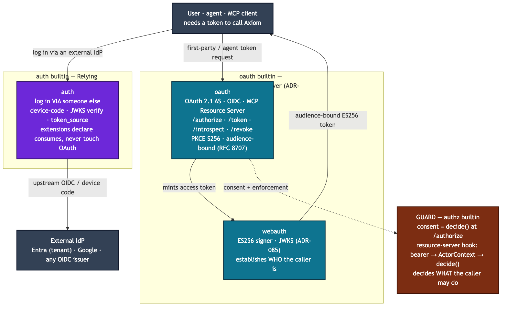
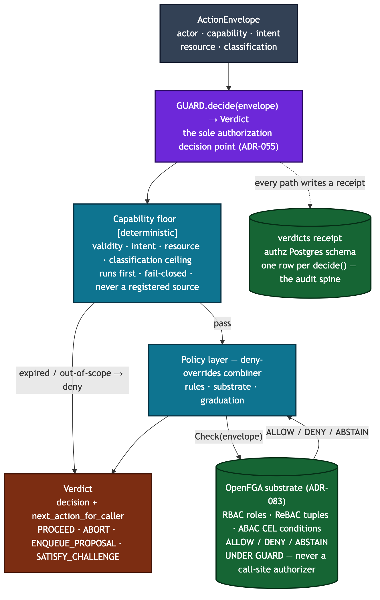

# Axiom Security Spec

**Status:** Draft
**Owner:** Ben Booth
**Created:** 2026-03-18
**Last Updated:** 2026-09-16
**PRD:** [Security PRD](../prds/prd-security.md)

**Scope:** Identity & authentication (Axiom's own OAuth 2.1 Authorization Server —
the `oauth` builtin, ADR-082 — plus the `auth` relying-party that federates
external IdPs upstream, ADR-075; `webauth` ES256 session tokens, ADR-085),
authorization (GUARD as the sole decision point — the `authz` builtin, ADR-055 —
with OpenFGA as a substrate *under* GUARD, ADR-083), credential & capability
management (KEEP / vault, ADR-055; the secrets provider registry), export-control-
adjacent routing & screening (mechanism only), and audit (per-decision receipts +
the EC-mode HMAC chain).

> **Supersedes the Gen-1 identity design.** Earlier drafts of this spec taught a
> third-party identity server and OpenFGA as a direct call-site authorizer. Neither
> was built. ADR-082 makes Axiom its *own* OAuth 2.1 AS; ADR-083 makes OpenFGA a
> substrate GUARD calls, never a direct authorizer. This document describes the
> architecture that exists in the tree.

---

## 1. Architecture Overview

Authentication and authorization are two separate seams, and the platform keeps
them separate on purpose. **Authentication** establishes *who* a caller is and
hands the request a `Principal`. **Authorization** — GUARD — decides *what* an
already-identified principal may do. The seam between them is small and
one-directional: the auth layer resolves a request to a principal; the HTTP authz
hook then asks `GUARD.decide(...)`. The auth layer never re-implements
authorization, and GUARD never mints or verifies tokens.

| Concern | Owner | ADR |
|---------|-------|-----|
| Issue first-party / agent / MCP tokens (Authorization Server) | `oauth` builtin | ADR-082 |
| Log a user in *via* an external IdP (Relying Party) | `auth` builtin | ADR-075 |
| Sign / verify web-session tokens (ES256 + JWKS) | `axiom.webauth` | ADR-085 |
| The single authorization decision point (PDP) | GUARD — `authz` builtin | ADR-055 |
| Fine-grained RBAC / ReBAC / ABAC substrate under GUARD | OpenFGA via `authz` | ADR-083 |
| The governance view of the actor (roles / tenant / assurance) | `ActorContext` | ADR-084 |
| Delegation — an agent acting on behalf of a human | `CapabilityToken` chain | ADR-086 |
| Capability tokens + credential dereference (never raw creds to agents) | KEEP — `vault` builtin | ADR-055 |
| Export-control-adjacent tier routing & screening | LLM router + RAG gates | — |
| Per-decision audit receipts + EC-mode HMAC chain | `authz` schema + `axi audit` | ADR-055 |

Two views of the two seams follow: how tokens are *issued vs. federated*
(§3), and how a request is *decided* (§4).

---

## 2. Trust Model: Deterministic vs Model-Mediated

Axiom has two fundamentally different kinds of behavior, and
conflating them is a security bug. Every feature, agent action, and
documented workflow must be classified as one or the other, and the
classification must be made visible to the reader.

### 2.1 The Two Categories

**Deterministic behavior** — code plus explicit policy plus
cryptographic verification. Testable, provable, replayable.
Categories include:

- Authorization decisions (`GUARD.decide()` — the deterministic capability
  floor, the rule engine, and the OpenFGA-substrate `Check` beneath it)
- Identity verification (ES256 token signature checks against the published
  JWKS, Ed25519 node-to-node signatures, TOFU key binding, fingerprint
  comparison)
- Schema validation (JSON schema, dataclass type checks, migration
  integrity)
- Version compatibility checks (`MIN_PEER_VERSION_FOR_IDENTITY_BINDING`,
  migration window enforcement)
- Export-control and classification-tier gates (public / internal /
  regulated / controlled — see the content-tier model in
  `spec-classification-boundary.md` and `spec-rag-architecture.md`)
- Cryptographic revocation propagation

**Model-mediated behavior** — LLM judgment.
Non-deterministic, approximate, useful for *shaping* and *classifying*
but **not for authorizing**. Categories include:

- Classification and triage (signal severity, content relevance,
  query-sensitivity classification)
- Natural-language policy interpretation
- Writing assistance, summarization, briefing generation
- Install/upgrade guidance narration (a built-in LM explaining why a
  version bump matters, helping an operator reason through a
  rare human-decision point)
- Agent workflow steering via SKILLS.md (tone, domain focus,
  workflow style)
- LLM-as-judge evaluation (recommendation, never enforcement)

### 2.2 The Rule

**Authorization is ALWAYS deterministic.** `GUARD.decide()` is a capability
check, a rule match, and (where modelled) an OpenFGA relation check. An LLM
output never grants or denies access to any resource or action.

**Classification can be model-mediated**, but results that feed into
an authorization decision must flow through a deterministic gate
afterward. A model may classify a document as `regulated`, but the
act of refusing access is a code check against the classified tag,
not the LLM's say-so.

**Guidance, narration, UX enrichment** is model-mediated; the
underlying action being narrated is deterministic. A built-in LM may
say "I recommend upgrading — here's why"; the actual pip install +
signature check + version bump + validation sequence is
deterministic code.

### 2.3 SKILLS.md Files Are Model-Mediated

Every agent's `SKILLS.md` file falls on the model-mediated side. It
shapes an agent's behavior within already-granted capabilities. It
**never grants capability**. If a malicious actor edited a
SKILLS.md to claim the agent could bypass RACI or access restricted
data, nothing would actually change — the deterministic gates would
refuse, because authorization is enforced in code (`GUARD.decide()`
against the actor's capability + roles). The blast radius
of SKILLS.md tampering is *behavioral misbehavior* (agent acts
weird, gives bad advice, lies about what it's doing), not
*authorization bypass*.

This is a deliberate design property: SKILLS.md files are
untrusted-shaping-only. They can be authored, reviewed, modified,
and even federated across nodes without introducing capability
leakage, because capability is not what they govern.

Every SKILLS.md must contain an explicit "Authorization Model"
section that states this boundary for its agent: which actions
flow through deterministic gates (and cite them), which aspects
of behavior are LLM-shaped.

### 2.4 Installation and Upgrade Assistance

Install and upgrade flows benefit from model-mediated assistance
precisely because they occasionally require human judgment
("peer key rotation detected — is this expected?", "upgrade
skipped a version — roll forward or investigate?"). A built-in LM
narrates these moments, surfaces context, and elicits reasoning.

Constraint: the underlying action must remain deterministic. The LM
may say "upgrading is recommended"; the pip install, wheel
signature check, migration integrity check, and validation smoke
test must all be code-verified. If the LM is unavailable, the
deterministic flow still runs with plain-text output — no action
is gated on LLM availability.

This policy applies equally to `axi nodes add` key-rotation
refusal, `axi update` version-skew warnings, `axi install-shim`
PATH-setup guidance, and any future install/upgrade entry point.

### 2.5 Labeling Convention in Docs

Documents that describe agent behavior, federation protocols, or
decision flows must label sections where ambiguity is possible.
Adopted conventions:

- **[deterministic]** — section describes behavior with hard
  guarantees from code, policy, or cryptography.
- **[model-mediated]** — section describes LLM-shaped behavior.
- **[hybrid]** — section involves both; must explicitly describe
  the handoff (e.g. "LLM classifies the signal; GUARD decides
  whether to act on it").

Unlabeled sections are presumed deterministic. A section that is
actually model-mediated but labeled or defaulted to deterministic
is a documentation bug and a potential source of operator
misunderstanding.

### 2.6 Validated Classification — Canonical [hybrid] Pattern

Many properties in the system are declared statically today (node
profile, trust level, content tier, agent capability, federation
relationship type) but the declaration becomes wrong over time as
reality drifts. **Validated classification** is the [hybrid]
pattern that addresses this:

1. Declare the property statically at creation time.
2. Periodically (not per-action — cost/latency matter at scale),
   the node's built-in LM re-validates the declaration against
   observed behavior and evidence.
3. The LM emits an advisory re-classification with confidence and
   cited evidence.
4. A deterministic gate decides whether the advisory triggers an
   operator-approval prompt, an automatic change (only under
   narrow, policy-bounded conditions), or a log entry.

**The LM's classification is advisory, never authoritative.** It is
a better starting point than a stale static declaration, but it
does not itself confer privilege. Privilege change still flows
through deterministic code — RACI approval, policy match, or an
explicit operator action.

**Good candidates:** properties that drift with time or scale.
Node profile (workload changes), trust level (accumulated
interaction history), content tier (re-reading reveals hidden
export-controlled content), agent capability (actual workflow
demonstrates more/less than advertised), federation relationship
(partnerships dormant, consortiums active).

**Bad candidates:** cryptographic primitives (root keys,
signatures, hashes), schema versions, identity roots. These are
hard-versioned and must never be re-classified by heuristic.

**Audit cadence:** daily to weekly per property, not per
transaction. Confidence thresholds are policy knobs
(`confidence > 0.9 across 30 days of consistent signal` for
auto-promotion; lower thresholds only surface advisory prompts,
never take action).

**Log the delta:** every validated-classification cycle records
`declared X, validated Y, confidence Z, evidence [...]`. This is
audit material — drift detection often matters more than the
classification itself.

### 2.7 Review Questions

When reviewing any proposed agent behavior or system response, ask:

1. **"What's the deterministic check backing this?"** If the answer
   is "the LLM decides," the proposal is not acceptable for
   anything involving authorization or data-tier gating —
   redesign required.
2. **"Is this declaration going to drift?"** If a property is
   declared statically but reality will change it over time,
   consider the validated-classification pattern (§2.6) instead
   of hoping the declaration stays accurate.

---

## 3. Identity & Authentication

Axiom serves one backend to a first-party web app, a mobile app, and agents / MCP
clients. The industry has converged on OAuth 2.1 with audience-bound bearer tokens
and deferral of fine-grained authorization to the resource server. Axiom follows
that convention with **two distinct extensions** whose names encode the split
(ADR-082):

- **`auth` = relying party (RP).** Axiom logs a user in *via* someone else — an
  external IdP. See §3.1.
- **`oauth` = authorization server (AS).** Axiom *issues* its own tokens to
  first-party and agent clients. See §3.2.

External IdPs federate in *upstream* through `auth`; first-party and agent clients
get their tokens *from* `oauth`. `webauth` (§3.3) is the signer underneath the AS.

### 3.1 `auth` — Relying Party (ADR-075)

The `auth` builtin is an OAuth **client**. It lets an operator or an extension
obtain a token from an external identity provider and use it — Axiom never sees
the user's IdP password.

- **IdP registry (open, ADR-075 §2):** providers resolve through a registry, not a
  hardcoded list. `entra(tenant_id)` is tenant-scoped (an institutional Entra
  tenant); `google()` is issuer-scoped; `from_discovery(issuer)` builds a config
  from any OIDC issuer's `.well-known/openid-configuration`. No caller hardcodes a
  provider list or a default.
- **Flows:** device-code login (`login_with_device_code`), JWKS verification of
  returned tokens, and a `token_source` callable backed by a keychain-stored,
  auto-refreshing token store.
- **CLI:** `axi auth login | whoami | logout | providers`.
- **Extension consumption:** an extension declares *what* it needs in an
  `[[extension.consumes]]` block (an IdP, some scopes, a `min_posture` floor); the
  runtime resolves that to a `token_source`, **enforcing the posture floor first**
  so an under-assured principal cannot dereference a floored credential. The
  extension never touches OAuth directly.

### 3.2 `oauth` — Authorization Server (ADR-082)

The `oauth` builtin is a standards-compliant **OAuth 2.1 Authorization Server +
OpenID Connect Provider + MCP Resource Server**. Any conformant MCP/agent client
discovers the endpoints and receives an audience-restricted token.

**Endpoints** mount on the `http` substrate as ordinary `MountSpec`s. The discovery
and token mounts are public (`requires_authz = false`, `requires_authn = false`):
a client must reach AS/OIDC metadata and the public JWKS *before* it holds any
token, and the token endpoint authenticates the *client* from the request itself
(Basic / `private_key_jwt`), so it is not a GUARD-protected resource.

| Endpoint | Purpose |
|---|---|
| `GET /.well-known/jwks.json` | Public ES256 keys (RFC 7517) — verify tokens with no shared secret |
| `GET /.well-known/oauth-authorization-server` | AS metadata (RFC 8414) |
| `GET /.well-known/openid-configuration` | OIDC discovery |
| `GET /oauth/authorize` | Authorization-code issuance (PKCE-S256-bound) |
| `POST /oauth/token` | `authorization_code` / `refresh_token` / `client_credentials` grants |
| `/oauth/revoke`, `/oauth/introspect`, `/oauth/userinfo`, `/oauth/register` | Advertised in metadata; wired progressively |

**Flows:**

- **Authorization Code + PKCE S256** (mandatory, OAuth 2.1). The `/authorize`
  handler validates the request, resolves the resource owner through an injected
  subject resolver (the login page is a webapp concern), issues a single-use
  PKCE-bound code, and 302s it back. An untrusted `redirect_uri` errors in place
  (no open redirect); other errors bounce to the `redirect_uri` with `error` +
  `state` (RFC 6749 §4.1.2.1).
- **Refresh** — rotating (RFC 6749 §6): each use mints a new access + new refresh
  in the same family, scope may narrow but never widen. **Reuse detection** —
  replaying a rotated-away token revokes the whole family (the OAuth 2.1
  stolen-token defense).
- **Client credentials** — headless agents, `client_secret_basic`; an
  audience-bound token (RFC 8707 resource indicator, or the issuer as the safe
  default).

**Consent is routed through GUARD.** `/authorize` builds an `ActionEnvelope` and
calls `decide()`; a `PROPOSE_TO_HUMAN` / `AWAIT_HUMAN` verdict *is* the per-client
consent primitive (and the confused-deputy defense). Scopes are a coarse transport
claim, never an authorization bypass — GUARD remains the sole decision point.

**What ships today:** the public discovery + JWKS surface, and the token /
authorize endpoints for the authorization-code (+PKCE), rotating-refresh, and
client-credentials grants. Clients, codes, and refresh tokens live in in-memory
stores.

**What's next (explicitly deferred):** `private_key_jwt` client auth (RFC 7523,
already advertised in the metadata); Postgres-backed client / code / refresh
stores and an `axi oauth client` verb; resource-server enforcement — the first
production `AuthzHook` into `axi serve` (bearer → `ActorContext` → `GUARD.decide`),
with Protected Resource Metadata auto-derived from the router registry and RFC 9470
step-up challenges; and RFC 8693 token-exchange delegation (ADR-086, §4.4).

### 3.3 `webauth` — ES256 Session Tokens (ADR-085)

`webauth` is the human/web authentication layer lifted from SoilMetrix: login,
passwords (stdlib scrypt), and JWT sessions. It establishes *who* a browser or
mobile client is and issues/verifies the session tokens that carry that claim,
then hands the request an `axiom.vega.identity.principal.Principal`. It is
deliberately distinct from GUARD and never re-implements authorization.

- **ES256 (ECDSA P-256), not HS256.** For an AS whose tokens are verified by
  third-party MCP clients and resource servers, symmetric signing is disqualifying:
  every verifier would hold the signing secret and could forge tokens for any user.
  ES256 lets any verifier check a token against the **public** JWKS with no shared
  secret.
- **Not the node's Ed25519 identity key.** Reusing it would couple OAuth `kid`
  rotation to federation-identity rotation. Ed25519 stays the node-to-node signer
  (ADR-022); ES256 is the token signer.
- **Algorithm agility** via `kid`-keyed keys (`kid` = RFC 7638 JWK thumbprint);
  the JWKS is published by the `oauth` extension; private keys are stored through
  the Axiom secrets provider. Access tokens are RFC 9068 `at+jwt` (typed,
  audience-bound, `iss`-stamped, short TTL); refresh tokens are opaque + rotating
  with reuse-detection → family invalidation.

---

## 4. Authorization: GUARD (the sole PDP)

### 4.1 One decision point

GUARD is the `authz` builtin and the platform's **single Policy Decision Point**.
Every action that crosses an authorization boundary calls
`decide(ActionEnvelope) → Verdict` **exactly once** (ADR-055, prd-axiom-authz §5.1).
Callers branch on the verdict's `next_action_for_caller`; they never inspect the
raw `decision`, and they never reach around GUARD to a substrate.

The `ActionEnvelope` is the universal currency (see `spec-governance-fabric.md` §1):
`actor` (a minimal `Principal`), `capability` (a `CapabilityToken`),
`classification`, `intent` (a registered verb), `resource`, provenance, and an
optional `actor_context` / `subject`. The decision pipeline:

1. **Capability floor [deterministic].** Runs first and fail-closed; it is never a
   registered policy source. The token must be valid at decision time and must
   permit this `intent`, this `resource`, and this `classification` (its ceiling).
   A failure short-circuits to `EXPIRED_CAPABILITY` or `DENY`.
2. **Policy layer.** A `PolicySourceRegistry` combines sources with a configurable
   combiner (deny-overrides by default; permit-overrides / first-applicable
   selectable): the rule engine (per-resource per-intent rules), the OpenFGA
   substrate `Check` (§4.2), and RACI graduation for novel actions. New sources
   (a rate limiter, break-glass, a second substrate) register without touching
   `decide()`.

**Every path writes a receipt** (§6). The `Verdict` carries a `decision`
(`permit` / `deny` / `propose_to_human` / `rate_limit` / `expired_capability` /
`step_up_required`), a canonical `reason`, the receipt id, and the
`next_action_for_caller` (`PROCEED` / `ABORT` / `ENQUEUE_PROPOSAL` / `AWAIT_HUMAN`
/ `SATISFY_CHALLENGE`). A `step_up_required` verdict carries an RFC 9470
`Challenge` (ADR-084) — step-up originates *from* the decision, not beside it.

### 4.2 OpenFGA is a substrate *under* GUARD (ADR-083)

Fine-grained authorization — **RBAC** (roles as relations), **ReBAC** (relationship
tuples), and **ABAC** (CEL conditions + contextual tuples) — is delegated to
**OpenFGA**, but OpenFGA is a *substrate GUARD calls*, **never a direct
authorizer checked at a call site**. This is the single most important correction
over the Gen-1 design.

- **Extensions never call OpenFGA directly** — always via `GUARD.decide()`. There
  is one decision engine and one audit trail.
- The substrate is a small three-valued port, `AuthzSubstrate.check(envelope) →
  ALLOW | DENY | ABSTAIN`:
  - **`DENY`** — the substrate refuses (e.g. an explicit `blocked` relation).
    Deny-overrides: the decision stops here.
  - **`ALLOW`** — an affirmative grant; authoritative in the combiner.
  - **`ABSTAIN`** — the resource is not modelled yet, so the decision falls
    through to rules + graduation + the floor. Un-modelled actions **abstain, not
    deny**, so a per-type authoritative rollout never breaks novel actions.
- **Fail-safe defaults:** `NullSubstrate` (the default) abstains on everything, so
  the pipeline is behavior-preserving until a real backend is wired.
  `DenyAllSubstrate` is the fail-closed stance a deployment registers when it
  *mandates* substrate coverage. The live adapter (`OpenFgaHttpClient`) speaks
  OpenFGA's HTTP API; it is wired through `AXIOM_OPENFGA_URL` /
  `AXIOM_OPENFGA_STORE_ID` / `AXIOM_OPENFGA_ON_ERROR` (default `abstain`; set
  `deny` for a strict node). A URL without a store id raises rather than silently
  running without the substrate.
- **Substrate choice, decided (ADR-083):** OpenFGA's check cache is off by default
  → strong consistency, so a revoked tuple is visible on the very next `Check` with
  no snapshot-token bookkeeping. SpiceDB is the documented fallback only if
  read-after-revoke at scale ever demands it; Cedar/OPA are ruled out as primary
  (stateless evaluators, not storage-backed relationship graphs).

The model mapping is transparent (`authz/fga/README.md`): the subject is
`subject.fga_user` or `user:<actor handle>`; the object is `<scheme>:<identifier>`
from the resource; a permit relation is the dotted intent; the deny relation is
`blocked`; contextual tuples ride from `subject.contextual_tuples`. Because OpenFGA
models are *closed* while Axiom intents/schemes are *open*, a production deployment
registers its own `TupleMapper` collapsing its intents onto the model's relations
(reads → `viewer`, writes → `editor`, admin → `owner`). `starter.fga` is the
template: an explicit `blocked` deny, `group#member` team grants, and a
hierarchical `owner → editor → viewer` chain.

### 4.3 The actor: `ActorContext` + `SubjectContext` (ADR-084)

`decide()` needs roles, tenant, and assurance to express RBAC/ABAC/step-up, but
`vega.identity.Principal` stays the **minimal cryptographic identifier** (`handle`
+ `public_bytes`) — its bytes are load-bearing in capability signatures, so it is
never bloated. The richer view rides alongside:

- **`ActorContext`** = `handle` + `tenant` + `roles` + `attributes` + `Assurance`
  (`posture`, `aal`, `acr`, `amr`, `auth_time`), with a normative posture ↔ NIST
  AAL ↔ `acr` mapping so `attested` / `sso` become expressible assurance levels.
- **`SubjectContext`** (`tenant` / `fga_user` / `attributes` / `contextual_tuples`)
  feeds the substrate `Check`.

Both are resolved **deterministically from verified token claims** at the identity
boundary (`resolve_actor`) — no lookups, no I/O, no clock inside `decide()`.

### 4.4 Delegation lives on the capability, not the principal (ADR-086)

An agent acting on behalf of a human is expressed through the **capability chain**,
not a field on the principal. A `CapabilityToken` carries `subject` (who may
present it), `delegation_depth` (how many further delegations remain; 0 = leaf),
and `parent_capability` (the parent token's id). A holder with
`delegation_depth > 0` re-issues narrower tokens (lower depth, same-or-narrower
scope, same-or-earlier expiry, same-or-lower classification); cryptographic
verification chains parent → child. ADR-086 maps RFC 8693 token exchange onto this
object and makes monotonic narrowing + proof-of-possession mandatory, re-verified
independently in `decide()`; the token-exchange grant is hosted on the `oauth` AS
(build phase P4).

---

## 5. Credentials & Capability Tokens

The fabric **never exposes a raw credential** (an API key, an OAuth access token, a
database password) to a calling agent. This is the KEEP discipline (ADR-055 D3, see
`spec-governance-fabric.md` §2.3):

- **KEEP (the `vault` builtin)** issues, validates, expires, and revokes
  `CapabilityToken`s, and owns the outbound-call chokepoint. An agent presents a
  capability; KEEP dereferences it to the underlying credential and performs the
  action through `outbound_call(capability, request, ctx)`. KEEP is the only
  process that ever holds the cleartext credential.
- **`get_credential(name)`** is the resolution chain for connection credentials —
  env var → settings → connection credential file → stored-credential token. It
  returns `None` rather than throwing when nothing resolves, so callers degrade
  gracefully.
- **Operational secrets** resolve through the `secrets` builtin's
  `SecretStoreProvider` registry (OpenBao is the default backend). This is distinct
  from KEEP: KEEP governs *capabilities*; the secrets provider is where the
  dereferenced *secret material* lives.

---

## 6. Audit

GUARD's `decide()` writes **one `verdicts` receipt row per call** into the `authz`
Postgres schema (ADR-052; `session_for('authz')`). The row serializes the envelope
verbatim (actor, intent, resource, classification, capability id, provenance,
federation origin, dedup key) plus the `decision`, `reason`, and the
`matched_rules` that produced it. Two sibling tables complete the schema:
`policies` (per-resource per-intent rules) and `graduation` (RACI graduation state
per actor + intent class). This is the single audit spine (ADR-055 D2/D8) — there
is no separate security-events table.

`axi audit` reads it: `list` / `show` / `chain` / `causes` / `explain` (the last
uses `matched_rules` to explain *why* a verdict fell the way it did). In
export-control mode the audit records are additionally chained under an HMAC keyed
by `AXIOM_AUDIT_HMAC_KEY`; `axi audit --verify` walks the chain and reports whether
it is intact or names the record where it broke (tamper-evidence).

Receipt-write failure never fails the action itself; a separate hygiene check
(TIDY) audits receipt-write rates, and a persistent failure is a hygiene finding.

---

## 7. Export-Control-Adjacent Routing & Screening

> **Mechanism only.** This section teaches *how* the tiering works. It deliberately
> contains no trigger-term lists, no named controlled codes, and no facility
> identifiers. Those live in configuration and in the screening modules, not in this
> spec; see the EC-safety note at the end.

Classification tiers are ordered `public < internal < regulated < controlled`
(`axiom.governance.classification`). A resource's tier is a property *of the
resource*, not of the actor, and the deterministic gates below compare against it.

**Query routing — the sensitivity router (`axiom.llm.router`).** Before any LLM
dispatch, a query is classified *locally* into a tier; no cloud call is made to
decide routing. A `public`-tier query may go to a cloud provider; an
export-controlled query routes only to a **private-network endpoint** (a provider
flagged as requiring the isolated network). The classification pipeline
short-circuits on the first definitive result: a session-mode override, then a
keyword screen (with an allowlist that suppresses context-specific false
positives), then a small **local** model that judges the recent conversation window
semantically, then a fallback governed by a `strict` / `balanced` / `permissive`
sensitivity setting. The classification is a hint; the *act* of routing to (or
withholding from) an endpoint is a deterministic gate (§2.2).

**Ingest screening (`axiom.rag.ec_screening`).** Every RAG ingest — not only the
public tier — is screened for control markings in the *content* (markings live on
cover pages and footers, so callers pass extracted text, not just paths). The
screener classifies severity and recommends an action: controlled content is
rejected / quarantined (routing it to a "restricted" tier on a non-authorized node
is still exposure), sensitive content gates on human review, and unmarked content
is fine for the community tier.

**Retrieval-time gating (`axiom.rag.gating`).** At retrieval, a generic
principal-based gate filters chunks: a chunk declares a classification tag plus the
required attribute(s) and allowed values; the principal presents a **signed
attestation** carrying attribute values; a caller-supplied verifier checks the
signature (the federation layer holds the trust chain). The gate is not coupled to
any one scheme — the same mechanism enforces **nationality** gating for export
control, clearance for one domain, or citizenship for another. Ingest screening
decides *where a chunk lives*; the retrieval gate decides *who may retrieve it*; the
two compose.

---

## 8. Extension Layout

Security is not one extension. The current builtins:

| Extension | Role | Key surface |
|-----------|------|-------------|
| `oauth` | OAuth 2.1 AS + OIDC + MCP Resource Server (ADR-082) | Public discovery/JWKS + `/oauth/*` mounts on the `http` substrate |
| `auth` | Relying party — external-IdP login (ADR-075) | `axi auth login/whoami/logout/providers`; `[[extension.consumes]]` resolution |
| `authz` | GUARD — the decision point (ADR-055) | `authz_decide` tool, the `tool.pre_invoke` authority hook, `axi audit`, the OpenFGA substrate, Postgres `authz` schema |
| `vault` | KEEP — capability tokens + outbound-call credential chaining (ADR-055) | `vault_get_capability`, `vault_outbound_call` |
| `secrets` | Operational secret store — provider registry (OpenBao default) | `SecretRef` resolution |

`webauth` (`axiom.webauth`) is a library, not a builtin extension: the ES256
signer, JWKS, password store, and JWT session layer the `oauth` AS builds on.

The GUARD authority hook is worth calling out: `authz` registers a
`tool.pre_invoke` hook at priority 1000 so that every tool call through the tool
gateway consults `decide()`. Its first step is fail-open with a receipt (P5 step 1,
`fail_mode = "warn"`); the site-manifest step flips it fail-closed. This is how
GUARD reaches every tool without every tool importing GUARD.

---

## 9. Implementation Status & Roadmap

The four governance primitives (GUARD/authz, KEEP/vault, and the shared
`axiom.governance` substrate) are built; the identity layer is mid-rollout.

- **Built:** `axiom.governance` (envelope, capability, classification, intent,
  verdict, `ActorContext`, `SubjectContext`); GUARD `decide()` with the capability
  floor, rule engine, graduation, policy combiner, and the `AuthzSubstrate` seam
  (Null / DenyAll defaults + the OpenFGA HTTP adapter); the `authz` schema +
  `axi audit`; KEEP capability lifecycle + `outbound_call`; `webauth` ES256 + JWKS;
  the `auth` relying party (device-code, IdP registry, consumes-resolution); the
  `oauth` AS public discovery/JWKS + authorize/token endpoints (authorization-code
  + PKCE, rotating refresh, client-credentials).

- **Next — identity (ADR-082/085):** `private_key_jwt` client auth;
  Postgres-backed OAuth stores + an `axi oauth client` verb; the webapp wiring the
  subject resolver and serving login + consent pages.

- **Next — resource-server enforcement (ADR-082):** the first production
  `AuthzHook` into `axi serve` (bearer → `ActorContext` → `GUARD.decide`), Protected
  Resource Metadata auto-derived from the router registry, and RFC 9470 step-up
  challenges. Until this lands, served surfaces run only with `--insecure`.

- **Next — substrate (ADR-083):** the OpenFGA-on-Postgres deployment and the
  Check-latency benchmark that gates `HIGHER_CONSISTENCY` fleet-wide before the
  read cache is enabled.

- **Next — delegation (ADR-086):** the RFC 8693 token-exchange grant on the
  `oauth` AS, with monotonic-narrowing + proof-of-possession enforced at issuance
  and re-verified in `decide()`.

---

## Related Documents

- [Governance Fabric Spec](spec-governance-fabric.md) — `ActionEnvelope`, `CapabilityToken`, receipts, the four primitives
- [ADR-082](../adrs/adr-082-agent-native-identity-provider.md) — Agent-native identity provider (OAuth 2.1 AS)
- [ADR-083](../adrs/adr-083-authorization-substrate-openfga.md) — OpenFGA as substrate under GUARD
- [ADR-084](../adrs/adr-084-identity-unification-actor-context.md) — `ActorContext` identity unification
- [ADR-085](../adrs/adr-085-webauth-asymmetric-session-tokens.md) — `webauth` ES256 + JWKS
- [ADR-086](../adrs/adr-086-authenticated-delegation-token-exchange.md) — Authenticated delegation / token exchange
- [Classification Boundary Spec](spec-classification-boundary.md) — content-tier model
- [Connections Spec](spec-connections.md) — `get_credential()`, health checks
- [Agent Architecture Spec](spec-agent-architecture.md) — agent framework
- [Model Routing Spec](spec-model-routing.md) — sensitivity classification / tier routing
- [Security PRD](../prds/prd-security.md), [Executive PRD](../prds/prd-executive.md)

_Copyright (c) 2026 The University of Texas at Austin and B-Tree Labs. Apache-2.0 licensed._
