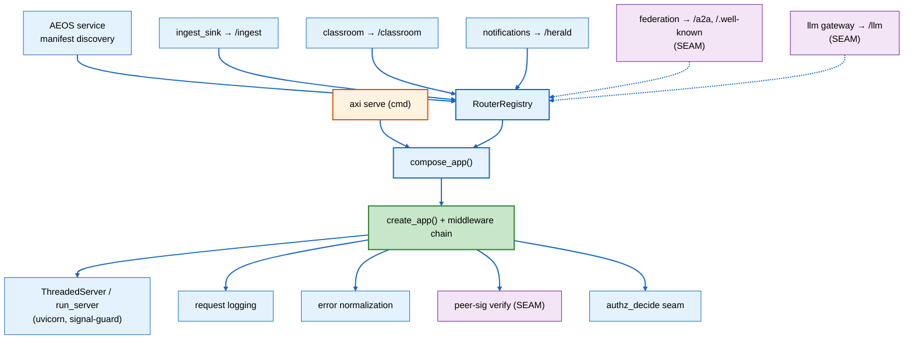

<!--
Copyright (c) 2026 The University of Texas at Austin
SPDX-License-Identifier: Apache-2.0
-->

# Spec: `serve` — Axiom HTTP Serving Substrate

> **Implementation Status (2026-06-25):** 🟡 Seed exists. The `http`
> extension ships `create_app` / `ThreadedServer` / `run_server` with a
> uvicorn signal-handler guard, and three consumers each build their own app
> on it. This spec promotes `http` → `serve` and adds the router registry,
> composed app, `axi serve`, and shared middleware. Federation A2A mount,
> peer-signature middleware, LLM HTTP front, and runtime profile gating are
> **seams** (defined here, built later).

**Status:** Draft (2026-06-25)
**Owner:** Ben Booth
**Layer:** Axiom core (`serve` extension)
**Related PRD:** [prd-serve.md](../prds/prd-serve.md)
**Related:** [spec-federation.md](spec-federation.md), [spec-aeos-0.1.md](spec-aeos-0.1.md), [prd-axiom-authz.md](../prds/prd-axiom-authz.md)

---

## 1. Purpose & Scope

This spec covers the **mechanics** of Axiom's HTTP serving substrate: the
router registry, the composed-app build, the middleware chain, the `axi serve`
command, the federation substrate seam, and the deployment/install model. The
"what" and "why" are in `prd-serve.md`.

**In scope:** router registration API; `create_app` and middleware signatures;
the composed-app build; `axi serve`; the federation mount + verifier seam;
deployment profiles/tiers; dependency/install + diagnose; migration of the two
legacy stdlib servers; testing.

**Out of scope:** authorization policy (`authz` extension); federation A2A
handler implementations (`spec-federation.md §7`); the in-process LLM gateway
internals (`src/axiom/llm/gateway.py`); MCP transports (stdio).

---

## 2. Architecture



The substrate has three pieces:

1. **Router registry** — extensions register a router under a path prefix.
2. **Compose** — `compose_app()` calls `create_app`, installs the middleware
   chain, and mounts every registered router in deterministic order.
3. **Runner** — `axi serve` runs the composed app via the existing
   `run_server` (blocking) / `ThreadedServer` (tests), keeping the
   uvicorn signal-handler guard.

The **path-prefix mount fabric is the internal routing/proxy**: a request to
`/classroom/...` is dispatched to the classroom router in-process. No nginx or
ingress is needed for a single-node deployment. Federation peers reach each
other by calling the other node's `serve` endpoints directly (SRV-033) — there
is no central reverse proxy.

---

## 3. Router Registry & Registration API

A registered router is a `(prefix, router, options)` triple. The registry is a
process-global singleton populated either programmatically (an extension's
`on_load` hook) or by manifest discovery (§4).

```python
# axiom.extensions.builtins.serve.registry

from dataclasses import dataclass, field
from fastapi import APIRouter

@dataclass(frozen=True)
class MountSpec:
    """A router an extension contributes to the composed app."""
    prefix: str                 # e.g. "/ingest" — must start with "/", no trailing slash
    router: APIRouter           # the FastAPI router to mount
    extension: str              # owning extension name (for --list + conflict reporting)
    requires_authz: bool = True # opt out only for genuinely public routes (e.g. /.well-known)
    profiles: tuple[str, ...] = ()  # (); empty = all profiles. e.g. ("server",) gates the mount


class RouterRegistry:
    def register(self, spec: MountSpec) -> None:
        """Register a router. Raises PrefixConflictError if `prefix`
        collides with an already-registered prefix (SRV-004)."""

    def specs(self, *, profile: str | None = None) -> list[MountSpec]:
        """Return registered specs sorted by prefix (SRV-006), filtered to
        `profile` when given (a spec with empty `profiles` matches any)."""


def register_router(spec: MountSpec) -> None:
    """Module-level convenience over the process-global registry."""
```

Conflict rule (SRV-004): two specs conflict if either prefix is a path-segment
prefix of the other (`/classroom` conflicts with `/classroom/coordinator` only
if both are top-level mounts; nested mounts are expressed as one router with
sub-routes). `compose_app()` raises before binding a socket.

---

## 4. Manifest Discovery

`serve` auto-discovers routers from installed extensions' AEOS `service`
manifests (SRV-003). A serving extension declares a `service` block whose entry
returns a `MountSpec`:

```toml
# data_platform/axiom-extension.toml
[[extension.provides]]
kind = "service"
name = "ingest_sink"
entry = "axiom.extensions.builtins.data_platform.ingest_sink.api:mount_spec"
description = "Bronze-tier ingest endpoint"
deployment_profile = "server"
prefix = "/ingest"
```

Discovery walks loaded extension manifests, imports each `service` entry that
declares a `prefix`, calls it to obtain a `MountSpec`, and `register()`s it.
Discovery runs once at `axi serve` startup (after the extension loader has run)
and is idempotent. An extension may also register programmatically in
`on_load`; the manifest path is the default so installing an extension that
serves HTTP is sufficient to mount it.

> AEOS note: `serve` is the canonical `service` (the composed app) + `cmd`
> (`axi serve`) pairing for `spec-aeos-0.1.md §4.4` / §4.1. The per-consumer
> `service` blocks declare `prefix` (a `serve`-specific field) alongside the
> standard `ports` / `deployment_profile`.

---

## 5. `create_app`, Compose & Middleware Signatures

`create_app` keeps its current signature and gains a middleware-configuration
argument; the existing `redoc_url=None` default and `ThreadedServer` /
`run_server` are unchanged (the signal-handler guard stays).

```python
# axiom.extensions.builtins.serve.server  (promoted from http.server)

def create_app(
    *,
    title: str = "Axiom Service",
    version: str = "0.1.0",
    description: str = "",
    middleware: "MiddlewareConfig | None" = None,
) -> FastAPI:
    """Return a FastAPI app with Axiom's default configuration and the
    middleware chain installed (§6). `middleware=None` installs logging +
    error normalization only (seams off)."""


def compose_app(
    *,
    profile: str | None = None,
    middleware: "MiddlewareConfig | None" = None,
    registry: RouterRegistry | None = None,
) -> FastAPI:
    """Build the composed app: create_app(), install middleware, run manifest
    discovery, then mount every registered MountSpec (filtered by `profile`)
    in sorted order. Raises PrefixConflictError on collision (SRV-002/004)."""
```

```python
@dataclass
class MiddlewareConfig:
    request_logging: bool = True          # SRV-020
    error_normalization: bool = True      # SRV-021
    authz: "AuthzHook | None" = None      # SRV-022 seam; None = off
    peer_sig: "PeerSigHook | None" = None # SRV-023 seam; None = off


# Seams — injected callables, mirroring the federation gateway's injected
# signer/verifier discipline (vega/federation/gateway.py).
AuthzHook = Callable[["Request"], "AuthzDecision"]
"""Calls authz_decide (axiom.extensions.builtins.authz.decide:decide). Returns
allow/deny + reason. Injected so serve has no hard dep on authz."""

PeerSigHook = Callable[["Request"], "PeerVerifyResult"]
"""Calls vega/federation Ed25519 verification on inbound peer requests.
Injected so serve has no hard dep on federation."""
```

---

## 6. Middleware Chain

Fixed, documented order (SRV-024), outermost first:

```
request → [logging] → [error-normalization] → [peer-sig] → [authz] → route
```

| Stage | Behavior | Status |
|---|---|---|
| **logging** (SRV-020) | Assign/propagate a request id; log method, path, status, latency as structured records | build now |
| **error-normalization** (SRV-021) | Catch unhandled + HTTP exceptions; emit one envelope (below) | build now |
| **peer-sig** (SRV-023) | If `peer_sig` hook set, verify inbound peer signature; on fail return 401 in the envelope. SEAM | seam |
| **authz** (SRV-022) | If `authz` hook set and the matched `MountSpec.requires_authz`, call `authz_decide`; deny → 403 in the envelope | seam (build the call site now; default-on once authz installed) |

Error envelope (one shape for every route):

```json
{
  "error": {
    "code": "forbidden",
    "message": "human-readable reason",
    "request_id": "req_7f3a2b9e",
    "extension": "classroom"
  }
}
```

`code` is a stable machine token (`bad_request`, `unauthorized`, `forbidden`,
`not_found`, `internal`). `extension` is the owning mount when resolvable.

---

## 7. `axi serve` Command

Per ADR-056, the CLI verb is a thin wrapper over a skill function:

```
axi serve [--host 127.0.0.1] [--port 8787] [--profile server]
          [--list] [--log-level warning]
```

| Flag | Default | Behavior |
|---|---|---|
| `--host` | `127.0.0.1` | Bind host (SRV-011) |
| `--port` | `8787` | Bind port (SRV-011) |
| `--profile` | resolved from config | Gates which routers mount (SRV-014) |
| `--list` | — | Print the composed route table (prefix → extension), do not bind (SRV-013) |
| `--log-level` | `warning` | Passed to `run_server` |

The skill function (`serve/skills/serve.py`, `(params, ctx) -> SkillResult`)
calls `compose_app(profile=...)` then `run_server(app, host=..., port=...)`.
`run_server` retains the signal-handler guard so the CLI owns Ctrl-C / SIGTERM
(SRV-012). `--list` returns the route table in the `SkillResult` without
binding a socket.

> The `http` manifest already declares a `cmd noun="serve"` (a chat HTTP API
> absorbed from `web_api/`). That command is folded into this composed model:
> the chat HTTP API becomes a mounted router (e.g. `/chat`) on the composed
> app rather than a standalone server (PRD open question 2).

---

## 8. Federation Substrate Mechanics (SEAM)

Federation does not build its own server; it rides `serve` (SRV-030/031).

**Mount.** The federation extension registers a `MountSpec` for its A2A task
endpoints and its well-known documents:

```python
register_router(MountSpec(
    prefix="/a2a", router=a2a_router, extension="federation",
    requires_authz=False,          # peer-sig governs, not authz
    profiles=("server",),          # only mounted on a serving node (SRV-032)
))
register_router(MountSpec(
    prefix="/.well-known", router=well_known_router, extension="federation",
    requires_authz=False,          # agent-card / manifest are discovery docs
))
```

This satisfies `spec-federation.md §2.1`'s "A2A Server … serves
`/.well-known/agent-card.json`, `/.well-known/axiom-manifest.json`, A2A task
endpoints" — the server is `serve`, the routes are federation's.

**Inbound auth.** `serve`'s `peer_sig` middleware is wired to federation's
Ed25519 verification (`vega/federation/identity.py`). On an inbound peer
request the hook verifies the signature against the peer's known key and
attaches the resolved peer identity to the request state; failure returns 401
via the error envelope. This is the **single meeting point**: federation and
`serve` meet at exactly (a) the router registry and (b) the auth middleware —
nowhere else. The `vega/federation/gateway.py` policy runtime stays transport-
free; `serve` calls the verifier, federation owns the verifier.

**Topology.** Peers call each other's `serve` endpoints directly (SRV-033). No
central reverse proxy. The `--profile server` gate decides whether the A2A
router is mounted on a given node (SRV-032).

---

## 9. The LLM Gateway HTTP Front (SEAM)

`src/axiom/llm/gateway.py` is an in-process request router/dispatcher, not an
HTTP server. The seam is a `MountSpec` for `/llm` whose router adapts inbound
HTTP requests onto the in-process gateway's `route(request)` call. Defined
here; not built in this cut. When built, it is just another registered router —
no special-casing in `compose_app`.

---

## 10. Deployment Profiles & Tiers

| | |
|---|---|
| **Tier** | `serve` is `core` — always present as a library. No daemon implied by the tier alone. |
| **library** profile | No daemon; extensions call `create_app` / `compose_app` directly (tests, embedding). |
| **server** profile | One composed uvicorn process; all installed consumers (and profile-eligible routers) mount. |
| **server (isolated)** profile | An extension (e.g. data-platform) runs its own server on a separate port (`deployment_profile = "server"`, distinct port) for isolation. Shares the registry, mounts a subset. |

Runtime gating of *which* daemon runs and *what* mounts by profile is a SEAM
(SRV-041/052): the profile vocabulary and the `MountSpec.profiles` filter are
defined now; the install/service-manager wiring that starts the right daemon is
later.

---

## 11. Dependencies & Install

- `fastapi` + `uvicorn` are a declared optional extra, e.g.
  `pip install axiom-os-lm[serve]` (SRV-050). Base installs stay lean; an
  install that runs the daemon pulls the extra (mirrors the data-platform
  optional-extra pattern).
- **Diagnose (SRV-051):** importing `serve.server` without the extra raises a
  legible message, not a bare `ModuleNotFoundError`:

  ```
  The 'serve' HTTP substrate needs fastapi + uvicorn.
  Install with:  pip install 'axiom-os-lm[serve]'
  (mirrors the extraction-deps install gap)
  ```

  `axi serve` and `axi doctor` surface this as an actionable check rather than
  a traceback.
- On install, `serve` is discovered and the daemon is started when the
  deployment profile calls for it (SRV-052; SEAM — see
  `docs/working/install-scenarios.md`).

**Default auth posture (open question 1).** Proposed: the authz seam is
**on** when the `authz` extension is installed and **off** otherwise — so a
minimal node serves without a hard `authz` dependency, while a governed node
gets authorization on every route with no per-consumer code.

---

## 12. Migration Plan — Legacy stdlib Servers

| Server | Today | Migration |
|---|---|---|
| `signals/serve.py` | `http.server.BaseHTTPRequestHandler` | Re-express handlers as a FastAPI `APIRouter` under `/signals`; register a `MountSpec`; delete the stdlib handler in the same PR (no shim, per `feedback_no_backward_compat_shims`). |
| `classroom/coordinator_server.py` | mid-migration to FastAPI | Complete the FastAPI migration as a router under `/classroom/coordinator`; register it; it composes into the one app alongside the existing classroom router. |

The three current FastAPI consumers (`ingest_sink`, `classroom`,
`notifications`) migrate from "own `create_app` + own server" to "export a
`MountSpec`, let `compose_app` run it" — their route handlers are unchanged;
only the wiring moves (SRV-005).

---

## 13. Testing

- **Registry:** register two routers, assert sorted compose order (SRV-006);
  register a colliding prefix, assert `PrefixConflictError` (SRV-004).
- **Compose:** `compose_app()` with the three consumers; assert the route
  table contains `/ingest`, `/classroom`, `/herald` (SRV-005).
- **Runner:** `ThreadedServer(compose_app()).serving()` (existing harness);
  hit one route per consumer; assert 200 + the structured log record + a
  request id (SRV-020).
- **Error envelope:** a route that raises returns the one envelope shape with
  a stable `code` (SRV-021).
- **Authz seam:** inject a stub `AuthzHook` that denies; assert 403 in the
  envelope on an `requires_authz=True` mount and pass-through on a `False`
  mount (SRV-022).
- **Peer-sig seam:** inject a stub `PeerSigHook` (mirroring the gateway's
  stub verifier in `vega/federation` tests); assert 401 on bad signature and
  the resolved peer on a good one (SRV-023).
- **Diagnose:** simulate the missing extra; assert the legible message, not a
  bare import error (SRV-051).
- **Manifest discovery:** a fixture extension with a `service` block + `prefix`
  is auto-mounted by `compose_app` without a programmatic `register` call
  (SRV-003).

---

## 14. Decision: consolidate under one engine

**DECIDED (2026-06-26):** all Axiom HTTP serving consolidates under this single
engine — there is no second bespoke server. The existing `cmd noun="serve"`
chat HTTP API folds into a `/chat` mounted router (resolves former Q2). Default
authz posture is **on-when-`authz`-installed** (resolves former Q1). The value
(one place for auth/audit/logging/TLS, federation gets its substrate, one
operational surface) is judged to outweigh the cons below, which the design
must actively mitigate rather than ignore.

### 14.1 Noteworthy cons → mitigations (load-bearing)

| Con (of one engine) | Mitigation (required, not optional) |
|---|---|
| **Coupled blast radius** — one bad router crashes everything it co-serves | **Per-mount fault isolation**: a mount that fails to import or raises at mount-time is logged + **skipped**, never aborts `compose_app`; a runtime error inside one mount returns *its* error envelope and never propagates to siblings. Health endpoint reports per-mount up/down. |
| **Conflated trust zones** — internal + peer-facing + EC-sensitive traffic on one socket/posture | **Per-mount `bind`/`trust_zone`**: loopback-only mounts bind on a separate socket from LAN/peer-facing ones; auth posture is per-mount. EC-sensitive surfaces never share a bind with public ones. (Load-bearing given the export-control posture.) |
| **Coupled deploy / restart cadence** | **`deployment_profile`**: an extension may run on its own process/port (`server (isolated)`) for independent release/restart while still using the shared primitive + registry. |
| **Dependency weight on headless installs** | serve is a `core` **library** always present, but the **running daemon + fastapi/uvicorn** are gated by `deployment_profile` + installed consumers; CLI-only installs pay nothing. |
| **Resource contention** (one worker pool for hot + cold paths) | Hot/cold paths that need isolation use a separate `server (isolated)` process (e.g. bulk ingest vs. interactive chat); documented as the scaling lever. |

## 15. Open Questions (remaining)

1. Per-prefix middleware overrides beyond `requires_authz` (richer per-mount
   policy) — deferred; `MountSpec.requires_authz` is the minimal version.
2. `server (isolated)` profile: shared registry + subset mount (default) vs.
   private registry.
3. Request-id propagation across the federation hop (likely yes; deferred with
   the A2A build).

---

## Cross-references / docs to update

These docs should reference the `serve` extension; none are modified by this spec.

| Doc | Should reference `serve` for |
|---|---|
| `prd-data-platform.md` | IngestSink (`POST /ingest`) mounts on `serve` instead of running its own app/port |
| `adr-079` (§8.4.1) | The ingest endpoint transport is decoupled — `serve` is the transport, ingest is the router |
| `spec-federation.md` | The §2.1 "A2A Server" rides the `serve` substrate (router registry mount + peer-sig middleware → federation verifier) |
| `adr-049` | PLINTH status/heartbeat served via the one composed `serve` process |
| `adr-031` | `serve` as the exemplar of extension self-containment for a `core` service + cmd |
| `spec-aeos-0.1.md` | `serve` as the canonical `service` (composed HTTP app) + `cmd` (`axi serve`) example; the `prefix` field on a `service` block |
| `docs/working/install-scenarios.md` | `serve` discovered + started on install per the deployment profile; the serve extra + diagnose |
| Conversational-agents-in-channels epic | The chat/channel HTTP API mounts on `serve` (inbound channel webhooks + agent-reply API) |
