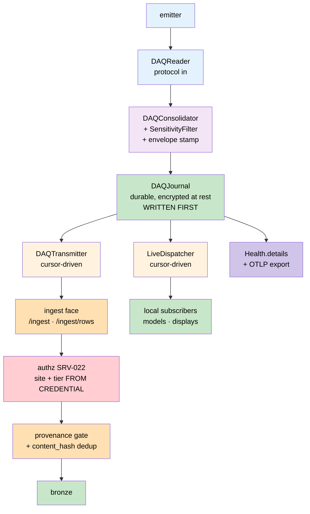

# Signal Ingest & Producer — Technical Specification

**Status:** Draft
**Owner:** Ben Booth
**Created:** 2026-08-25
**Last Updated:** 2026-08-25
**Extends:** `axiom-node-foundations/08-adr-daq-subsystem.md` (DAQ subsystem — Reader, Consolidator, Transmitter, LiveDispatcher, Journal) and `06-subsystem-contract.md` §6 (DAQ protocols), §7 (Actuators)
**Implements:** [prd-signal-ingest-and-producer.md](../prds/prd-signal-ingest-and-producer.md)
**Related:** [ADR-106](../adrs/adr-106-push-ingest-gateway.md) (ingest face), [ADR-107](../adrs/adr-107-signal-protocol-strategy.md) (protocol strategy), [ADR-097](../adrs/adr-097-gateway-ingress-org-hosted-serving-face.md) (one face, three bindings), [ADR-105](../adrs/adr-105-two-corpus-scope-redistribution-as-attribute.md) (`access_tier`), [ADR-052](../adrs/adr-052-database-tenancy-schema-per-extension.md) (tenancy), [spec-serve](spec-serve.md) §4–6, [spec-federation](spec-federation.md)

---

## 1. Scope

**This spec does not define a producer. ADR-08 already did.**

An earlier draft of this document specified a parallel "Producer" with its own
component set. That was a duplicate, and it is withdrawn. The DAQ subsystem is
the producer; this spec specifies only what DAQ does not yet carry:

| Withdrawn name (earlier draft) | Canonical — ADR-08 |
|---|---|
| `SourceAdapter` | `DAQReader` |
| `ProducerCore` | `DAQConsolidator` |
| `RemoteSink` | `DAQTransmitter` |
| `LocalStreamSink` | `LiveDispatcher` |
| `BufferSink` | `DAQJournal` |
| per-sink bounded queues | per-subscriber cursors into the one Journal |
| `SinkState` | `Health.details` (§6.3 of the subsystem contract) |

Three ADR-08 properties the earlier draft got wrong and this spec adopts
unchanged:

1. **The Journal is written before both Transmitter and LiveDispatcher.**
   Durability first, then fan-out. Parallel fan-out can lose a record that
   reached a live subscriber but not durable storage.
2. **OverflowPolicy is sensitivity-gated.** `block_producer` is mandatory for
   `ec-controlled` and `itar` streams; `drop_oldest` is available only for
   `open`/`internal`.
3. **The Journal encrypts at rest by sensitivity class, keyed through KEEP**,
   and consolidation applies the site's `SensitivityFilter` **before** anything
   crosses the site boundary.

**What this spec adds:** the signal envelope (§3), a second overflow axis for
safety-credited streams (§4), the receiving face (§5), federation identity and
fact-based observability (§6), silence detection (§7), payload-kind
classification (§8), the agent repair envelope (§9), and reserved provenance
(§10).

**Out of scope:** the actuator command path (subsystem contract §7); silver/gold
transformation; the stamping mechanism itself (§10 reserves its fields only).

## 2. Architecture



Every consumer — Transmitter included — is a **cursor into one Journal**. There
is no second buffer.

## 3. The signal envelope

ADR-08's `ConsolidatedRecord` carries `schema_id`, `ts`, `values`, `tags`,
`quality`, `sensitivity`. This spec adds ordering, identity, and provenance as an
envelope stamped by the Consolidator:

```python
@dataclass(frozen=True)
class SignalEnvelope:
    # --- identity ---------------------------------------------------------
    producer_id: str            # stable per Reader instance; NOT the site
    stream: str                 # logical stream name

    # --- ordering + chain -------------------------------------------------
    seq: int                    # monotonic, gapless per (producer_id, stream)
    prev_hash: str | None       # content hash of seq-1; None at seq 0
    content_hash: str           # over identity + ordering + record content

    # --- classification ---------------------------------------------------
    delivery_class: str         # 'standard' | 'credited'          (§4)
    payload_kind: str           # 'records' | 'artifact'           (§8)
    source_class: str           # 'measured' | 'predicted' | 'estimated'
    model_ref: str | None       # model + parameter-set identity, when not measured

    # --- provenance (reserved; §10) ---------------------------------------
    manifest_sig: str | None = None
    stamp_alg: str | None = None
```

Notes on fields that reconcile with existing contracts:

- **`sensitivity` is not repeated here** — the Consolidator already stamps it on
  `ConsolidatedRecord` and it propagates to bronze. One home per concept.
- **`quality` is not repeated either.** A ROM prediction outside its validated
  regime is `quality='uncertain'` or `'bad'` on the record — the existing field
  is the right place for out-of-regime, not a new one.
- **`source_class` is three-valued.** `measured` (instrument), `predicted`
  (model), `estimated` (filter/estimator output). The third value comes from the
  control-path design, where a state estimator's output is neither raw
  measurement nor raw model output.
- **`model_ref` identifies model *and parameters*.** A residual bound or gain set
  is part of what produced a value; a model identity that omits the parameter set
  cannot support reproducibility.
- **`site` is deliberately absent** — derived from the authenticated principal at
  the face (§5.2), never read from the payload.

`content_hash` covers any scale, unit, or normalization factor that determines a
value's meaning. A payload whose numbers are unchanged but whose scale factor
moved is a *different* record and must hash differently, or dedup silently
discards a real change.

## 4. Delivery class — the second overflow axis

ADR-08 gates OverflowPolicy on **sensitivity**, which answers *"may we lose this
record?"* Safety-credited streams pose a different question — *"may the consumer
act on a stale value?"* — and the two give different answers.

| | Controlled stream (sensitivity axis) | Credited stream (delivery axis) |
|---|---|---|
| Concern | must not lose the record | must not act on stale data |
| Full buffer | `block_producer` | **blocking is also wrong** — stalling acquisition is indistinguishable from signal loss and pushes backpressure into the Reader |
| Tolerates a multi-second stall | yes | no |

So `delivery_class = 'credited'` selects a third policy:

**`trip_on_gap`** — never drop silently, never block the Reader. Record the
discontinuity, advance, and let each consumer's deadline logic fail closed.
The data path stays live so the system can recover while *control authority*
drops.

### 4.1 Why silent drops are the specific hazard

`drop_oldest` is correct for a display and dangerous for an estimator, because
dropping a sample **silently changes the effective sample interval**.

A filter's update assumes a known Δt. Wrong Δt gives wrong covariance
propagation, which gives a wrong gain. The failure is not loud — the filter keeps
emitting estimates whose reported uncertainty is now fiction. Since a control
path's own divergence detector is built on exactly those residual and covariance
statistics, a silent drop degrades the detector and the estimate together. The
fault and its alarm share a cause.

### 4.2 The gap marker already exists

**A gap in `seq` is the discontinuity marker.** A consumer that sees
non-consecutive `seq` on a `credited` stream trips within its declared deadline.
No new mechanism: `seq` serves forensic gap proof (§10), tamper evidence with
`prev_hash`, and real-time safety detection with one field.

### 4.3 Required declarations

A `credited` stream declares a **staleness deadline**. Exceeding it, or observing
a `seq` gap, is a trip — not an alert. Deadline values are site-owned and belong
with the credited consumer's signed configuration, not in this spec.

## 5. The receiving face

### 5.1 Mounting

The extension declares one `service` block whose `mount_spec()` returns a single
`MountSpec` at prefix `/ingest`, carrying **both** lanes — `/ingest` (documents)
and `/ingest/rows` (rows). One namespace claim, two lanes; two mounts with
overlapping prefixes would trip `compose_app` conflict detection.
`requires_authz` stays at its default (`True`).

*Implemented:* `http/mounts.py::ingest_mount_spec()` — the `service` the `http`
extension already declared for the document lane — now includes both routers
under the one `/ingest` claim; the row lane is `POST /ingest/rows`.

This face is what `DAQTransmitter` targets. It is the substrate boundary named in
ADR-08 ("delivers consolidated records to the substrate boundary"), and the
Data Platform's `Marshaller` is its bronze-side counterpart — not a second door.

### 5.2 Identity and tenancy (normative)

1. Authenticate via the `authz` seam (SRV-022), or `peer_sig` (SRV-023) for
   federated producers.
2. Resolve `site` and `max_access_tier` **from the principal's grant**.
3. A payload asserting a different site is **403**. Never merged, never preferred.
4. A requested tier above `max_access_tier` is **403**.

Deriving `site` from the credential makes cross-site writes unrepresentable
rather than merely discouraged.

*Implemented:* `ingest_sink/tenancy.py` (`TenancyPolicy`, pure — no HTTP import)
is applied by both lanes before any sink is resolved. `site` = the principal's
`@name:site` context (falling back to the actor's tenant); the tier ceiling is
`AXIOM_INGEST_SITE_MAX_TIERS` (`site=tier,…`) then `AXIOM_INGEST_MAX_TIER`, on the
ladder `AXIOM_ACCESS_TIER_LADDER` (default `public,restricted,export_controlled`).
The credential's site is stamped on every item/batch `metadata.site`; a request
may carry `metadata.access_tier` only at or below its ceiling (unknown tier →
422). A credential with no site or no ceiling may neither assert a site nor
request a tier.

### 5.3 Bounds

| Condition | Status |
|---|---|
| Unknown source | 422 |
| Missing `source` / `schema_ref` | 422 |
| Batch or row count over cap | 422, before resolve or write |
| Payload site ≠ principal site | 403 |
| Tier above principal's max | 403 |
| `payload_kind='artifact'` requesting a redistributable tier | 403 (§8) |

## 6. Federation

- **Identity.** A producer may authenticate as a federation principal through the
  peer-signature seam rather than a separately issued key per producer. Trust is
  graduated via the trust graph.
- **Transfer gate.** Ingest crossing a node boundary is governed by the existing
  federation transfer gate — the same access-tier and safety checks as any
  cross-node content. No parallel control plane.
- **Observability crosses as facts; payload never does.** Remote aggregation
  consumes producer health, not signal data. This is the existing federation
  invariant (facts cross, raw content stays), and producer state is derived
  metadata — precisely what federation already propagates.

## 7. Observability

### 7.1 Surface

Extend ADR-08's required `Health.details` — which already carries `last_record_at`,
`journal_bytes`, and `backpressure` — with `seq` position, per-cursor lag, trip
count, and connection state. **Do not introduce a parallel state object.**

Exported as OpenTelemetry metrics over OTLP (ADR-107 D5): local read requires no
remote service, so a producer on a disconnected node stays diagnosable.

### 7.2 Silence detection (normative)

The failure to design for is not a crash. It is a producer that is up, reachable,
and delivering nothing.

Trip or alert when any of:

- `now - last_record_at` exceeds the stream's expected interval by its configured
  factor;
- `journal_bytes` or cursor lag rise monotonically across N samples;
- `seq` has not advanced while the Reader's probe reports healthy;
- **content is unchanged while `seq` advances** — the "value stuck while the
  heartbeat claims live" case. Detectable because `content_hash` is per record.

**A heartbeat is not evidence of data freshness.** Liveness is a completed
handshake or an advancing hash — never a successful ping.

## 8. Payload kind and code in the payload

A batch may carry executable or model artifacts — a model package, weights, or a
control law — rather than records. When it does, classification must be evaluated
on **what the payload contains**, not merely where it came from.

- `payload_kind='artifact'` marks a batch carrying code or model artifacts.
- Such a batch **may never default to a redistributable tier.** It routes to
  artifact registration and screening; auto-promotion is refused (§5.3).
- Export-control screening applies to the *artifact*, on the principle that
  controls attach to code and methods rather than to measurements.

This keeps the generic framework honest for deployments where the distinction
between data and code in a payload is the difference between an unrestricted and
a restricted transfer.

## 9. Agent repair envelope

An agent may mutate a producer's local environment to repair it. That capability
needs no new safety model: **repair actions are commands**, and the actuator
subsystem already has the machinery — `EnvelopeCheck`, `AuthorityRegistry`
(shadow → limited → automatic), `CommandJournal`, and `ReversibilityDeclaration`.

**The governing rule:**

> The agent **selects** from a signed catalogue of pre-declared repair actions.
> It never **synthesizes** one.

An agent choosing among N signed, individually reviewed, reversible actions is a
different risk object from an agent with a shell — and the catalogue ships in the
signed package, so its contents are reviewed at delivery time rather than at
runtime. That is what makes the safety argument evaluable by a review body.

**Inside the envelope** (reversible, transport-scoped): restart a Reader or
Transmitter process; re-establish a transport; re-read configuration from the
signed package; roll a Journal segment within retention; reset a subscriber
cursor.

**Bright lines — outside, unconditionally:**

- any write to the installed load or a package pointer;
- any change to envelope parameters, residual bounds, or trip thresholds;
- anything on the actuator command path;
- any authority-class change (escalation is a governance event, not an agent
  decision);
- anything upstream of a one-way data boundary.

Every repair action journals with the same envelope and provenance as a signal
batch. At `shadow` the agent proposes and journals only; escalation follows the
same evidence ladder as any other authority change.

## 10. Provenance and stamping *(reserved — not built)*

Live from day one: `producer_id`, `seq`, `prev_hash`, `content_hash` (§3). These
alone give **gap detection** (a missing `seq` is unambiguous loss) and **tamper
evidence** (a mutated record breaks the chain) with no cryptography.

Reserved: `manifest_sig`, `stamp_alg`, nullable. Populating them later requires
no bronze migration and no producer contract change.

Per ADR-107 D6, stamping will use **in-toto attestations signed via Sigstore**,
extending the existing signed-release trust root rather than introducing a second
one. Note that Sigstore's log is itself an RFC 9162-style transparency log, so
adopting D6 delivers much of D7's verifiable-inclusion property as a consequence
rather than as separate work.

**Honest degradation:** an unstamped record reports as *unstamped* — never as
verified. Verification has three outcomes (unstamped / stamped-valid /
stamped-invalid), not two.

## 11. Test obligations

| Area | Must prove |
|---|---|
| Journal-first ordering | A crash after LiveDispatcher delivery but before durable write is impossible by construction |
| Idempotency | A replayed batch lands its records once |
| Restart | Resumes at correct `seq`; no gap, no duplicate `seq` |
| Cursor isolation | A stalled Transmitter cursor does not stall a live subscriber cursor |
| Credited trip | A `seq` gap on a `credited` stream trips within the declared deadline |
| Stuck value | Unchanged content with advancing `seq` is detected |
| Overflow gating | `drop_oldest` is refused on `ec-controlled`/`itar`; `block_producer` is refused on `credited` |
| Tenancy | A payload asserting a foreign site is rejected 403 |
| Artifact routing | `payload_kind='artifact'` cannot reach a redistributable tier |
| Repair envelope | An action outside the signed catalogue is refused and journaled |
| Chain | A mutated record breaks `prev_hash`; a missing `seq` is detected |

## 12. Open questions

- Authoritative clock when a Reader's source timestamps disagree with host wall
  clock (`ConsolidatedRecord.ts` is Reader wall clock today).
- Whether the Journal retains raw `RawSample` payloads alongside
  `ConsolidatedRecord` — forensic value against storage cost.
- Whether peer relay (PRD SIG-E5) earns its trust-model complexity.
- Minimum viable signed repair catalogue for the first agent-repair deployment.
