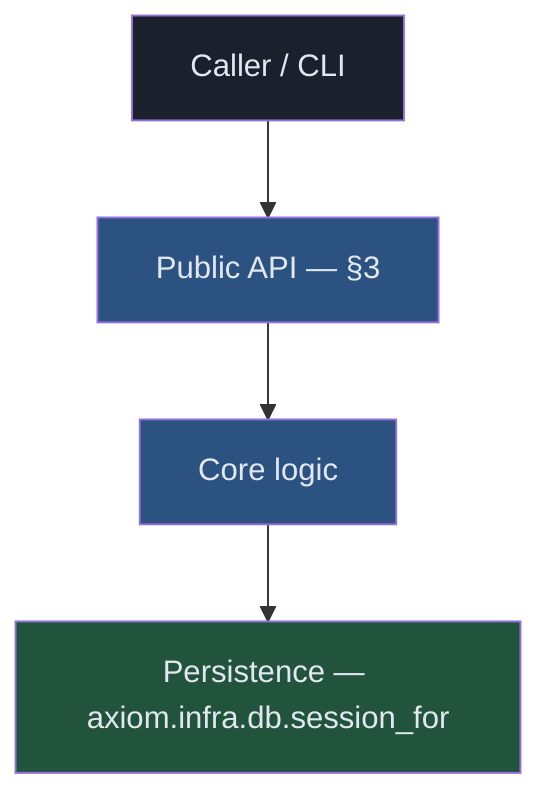

# [Component] — Technical Specification

**Status:** [Draft / Review / Accepted / Implemented]   •   **Owner:** [Name / Team]   •   **Last updated:** [YYYY-MM-DD]

**Implements:** [`prd-<name>.md`]   •   **Decisions:** [ADR-NNN, ADR-NNN]

---

> A spec turns an accepted PRD into a buildable design. Keep prose tight; let
> the diagram, the API surface, and the tables carry the weight. Delete any
> section that doesn't apply (say "N/A — <why>" rather than leaving it blank).

## Overview

Two or three sentences: what this component is, where it sits in Axiom, and the
single most important design choice. Link the PRD for the "why" — this doc is
the "how".

## 1. Scope & Goals

- **In scope:** the capabilities this spec covers (trace each to a PRD goal).
- **Out of scope:** what is explicitly deferred, and to where.
- **Non-goals:** things a reader might expect but that are deliberately not done.

## 2. Architecture Summary

One paragraph, then a diagram. Per repo convention: **Mermaid only**, vertical
`TD`/`TB` flow, every node and subgraph styled with `fill:` and `color:`.



## 3. Public API Surface

The contract callers depend on. Show real signatures; mark `__all__`. Keep it to
the surface — implementation lives in the code, not here.

```python
# axiom/<module>/__init__.py

def do_the_thing(params: Params, ctx: Context) -> Result:
    """One-line contract: what it guarantees, what it raises."""

__all__ = ["do_the_thing", "Params", "Result"]
```

## 4. Data Model & Schema

Types, persisted shapes, and config. Note the storage discipline: extensions
persist through `axiom.infra.db.session_for("<ext>")` (schema-per-extension,
never `public`; ADR-052).

```toml
# axiom-extension.toml / runtime config — the fields this component reads
[component]
option = "default"   # what it controls; allowed values
```

## 5. Key Flows

Walk the 1–3 paths that matter (happy path + the important edge). Numbered steps
or a sequence diagram. State what's transactional and what's idempotent.

## 6. Failure Modes

| Condition | Detection | Behavior | Caller sees |
|---|---|---|---|
| [dependency down] | [how] | [retry / fail-closed / degrade] | [error / fallback] |

State the default posture (fail-open vs fail-closed) and why.

## 7. Invariants & Determinism

- Invariant 1 — what must always hold (and what enforces it).
- Determinism / reproducibility guarantees, if any (e.g. stable ordering, signed
  provenance). Note any non-determinism and how it's bounded.

## 8. Security & Performance

- **Security:** authz/ownership (ADR-026), trust/classification boundaries,
  secret handling.
- **Performance:** target latencies/throughput, hot paths, known limits.

## 9. CLI Surface

CLI verbs are thin wrappers over skill functions (ADR-056) — one verb maps 1:1
to a `(params, ctx) -> SkillResult` skill fn; no logic in argparse handlers.

```
axi <noun> <verb> [--flag]    # one-line description
```

## 10. Integration Points

Which existing primitives this builds on (CompositionService, gateway, policy,
federation, AEOS manifest, …) — and the direction of dependency. New code reuses
primitives before inventing interfaces.

## 11. Test Strategy

- **Unit:** pure logic, runs anywhere (no DB/network).
- **Integration:** what needs Postgres/network, and how it skips when absent.
- **Determinism/regression:** the specific behaviors a future change must not break.
- TDD: tests precede implementation.

## 12. Rollout & Migration

Phasing, feature flags, data migration, and backward-compatibility. How to roll
back.

## 13. Open Questions

- Q1 — options, leaning, decide-by [date / milestone].
- Q2 — …

## References

- PRD: [`prd-<name>.md`]
- ADRs: [ADR-NNN — title]
- Related specs: [`spec-<name>.md`]

---

_Copyright (c) 2026 The University of Texas at Austin and B-Tree Labs. Apache-2.0 licensed._
