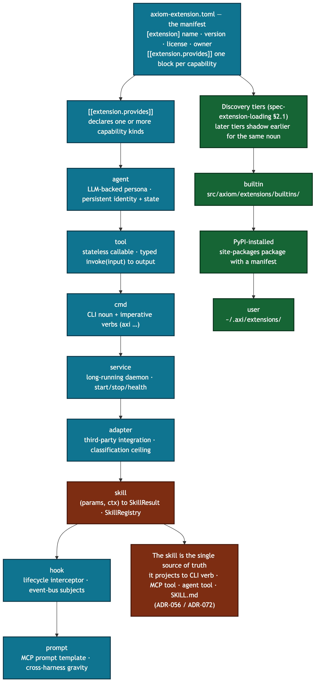

# `builtins/` — Domain-Agnostic Builtin Extensions

Each subdirectory is a self-contained extension that ships with the platform.
These are **domain-agnostic** — they work for any deployment without
customization.

## Anatomy of an extension



An extension is an `axiom-extension.toml` manifest plus the code it points at.
Each `[[extension.provides]]` block declares one of AEOS's **eight capability
kinds**; the skill is the single source of truth that projects onto the CLI
verb, the MCP tool, the agent-facing tool, and the generated SKILL.md
(ADR-056 / ADR-072). The platform discovers extensions from three tiers —
builtin → PyPI → user — with later tiers shadowing earlier ones for the same
noun.

## The eight capability kinds

Per AEOS §4, an extension provides one or more of exactly eight kinds:

| Kind | What it is |
|---|---|
| `agent` | LLM-backed persona with persistent identity + state across sessions |
| `tool` | Stateless callable with typed input/output schemas |
| `cmd` | A CLI noun-verb grouping that extends `axi` (or a consumer CLI) |
| `service` | A long-running daemon (scheduler, worker, server, watcher) |
| `adapter` | A third-party integration (IdP, LMS, channel, storage, compute) |
| `skill` | An executable capability `(params, ctx) -> SkillResult` in the `SkillRegistry` |
| `hook` | A lifecycle interceptor at an extension or platform boundary |
| `prompt` | A templated MCP prompt the Axi MCP server publishes to external harnesses |

## Naming Convention

**Extensions are named by purpose, with no type suffix** (per AEOS §5.4):
`signals/`, `publishing/`, `diagnostics/`. The capability kind — `agent`,
`tool`, `cmd`, `service`, `adapter`, `skill`, `hook`, `prompt` — lives in the
`axiom-extension.toml` manifest, not the directory name. Plural names go to
streams or collections (`signals/`, `agents/`); singular to activities and
states (`chat/`, `publishing/`, `hygiene/`).

A few representative extensions:

| Directory | Description |
|-----------|-------------|
| `signals/` | Signal ingestion, extraction, synthesis (hosts SCAN) |
| `chat/` | Interactive LLM assistant (hosts AXI; consumer layers rebrand) |
| `hygiene/` | Resource stewardship and system hygiene (hosts TIDY) |
| `diagnostics/` | AI-powered diagnostics and self-healing (hosts TRIAGE) |
| `publishing/` | Document lifecycle (md → docx → publish, hosts PRESS) |
| `federation/` | Multi-node federation — discovery, trust, resources (hosts WARDEN) |
| `rag/` | Retrieval corpus management (ingest, search, audit) |
| `data_platform/` | Bronze/Silver/Gold storage backends (hosts PLINTH) |

Discover the rest via `axi commands` or by reading the per-extension
`axiom-extension.toml` manifests.

## Discovery tiers

Extensions resolve in a fixed precedence order (see
[`spec-extension-loading.md §2.1`](../../../../docs/specs/spec-extension-loading.md)):

1. **builtin** — `src/axiom/extensions/builtins/*/axiom-extension.toml` (these)
2. **PyPI-installed** — site-packages packages that ship a manifest at their root
3. **user** — `~/.axi/extensions/*/axiom-extension.toml`

(Project-local `<cwd>/.axi/extensions/` sits above user for the same noun, and
hard-coded core commands sit below builtin.) Higher tiers shadow lower ones for
the same noun, so a user- or PyPI-installed extension can override a builtin —
the `builtin < user < project` hierarchy used throughout the platform.

## Extension Layout

Each extension follows this structure:
```
{name}/
  axiom-extension.toml  # REQUIRED — manifest
  cli.py                # CLI entry point (build_parser + main)
  tests/                # Colocated tests
  docs/                 # Extension-specific specs/docs
  infra/                # Dockerfiles, plist, deploy configs
  ...                   # Implementation files
```

Agent-hosting extensions add an `agents/<name>/` package with the agent's
`persona.md` (its system-prompt role definition), internal to the agent and not
a standalone skill (AEOS §4.1).

## What belongs here

- New domain-agnostic extensions (useful to any deployment)
- Extensions that are part of the core Axiom experience

## What does NOT belong here

- **Domain-specific extensions** (industry-specific tools) →
  external repos, installed to `.axi/extensions/` or `~/.axi/extensions/`
- **Platform infrastructure** → `src/axiom/infra/`
- **Runtime data** → `runtime/`

## AI Agent Policy

When creating a new extension:
1. Pick a purpose-named directory — no type suffix (per AEOS §5.4)
2. Declare the capability kind(s) in the manifest: `agent` (LLM autonomy),
   `tool` (invoked capability), `cmd`, `service`, `adapter`, `skill`, `hook`, `prompt`
3. Create `{name}/axiom-extension.toml` with name, version, and a
   `[[extension.provides]]` block per capability
4. Create `{name}/cli.py` following the `build_parser()` + `main(argv)` pattern
5. Create `{name}/tests/` for colocated tests
6. Commands register from the manifest — the registry discovers each
   `[[extension.provides]] kind = "cmd"` entry, so no central dispatcher
   file needs editing

Never place loose Python files directly in `builtins/`. Every piece of
functionality must live inside a named extension subdirectory.
_Copyright (c) 2026 The University of Texas at Austin and B-Tree Labs. Apache-2.0 licensed._
