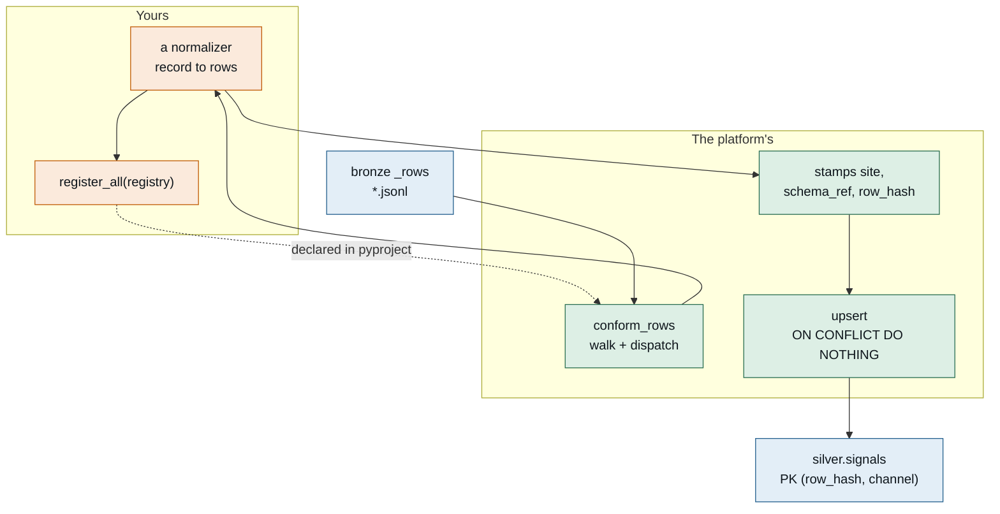

# Write a normalizer — one path, from a raw row to canonical silver

You own a payload shape. This is how that shape becomes canonical
`silver.signals` rows, without you owning the walk, the upsert, or the schema.

Three ways to drive it, all on one spine: **plain Python**, the **CLI**, and
**chat or MCP** into whatever harness you already use. They are three doors onto
one function, not three implementations, and there is a test that keeps it that
way — see *One spine* at the bottom.

---

## The lifecycle way (ADR-005) — scaffold, dev up, activate, validate

This RECIPE is the *mechanism* — one function of one dict. The lifecycle tooling
wraps it end to end, and that is the path to prefer:

```bash
neut ext new conform my_norm       # scaffolds a normalizer + tests (with a prove-it-can-fire guard)
neut dev up                        # local synthetic bronze->silver->gold; iterate offline, no node
conform_try < a_bronze_row.json    # dry-run: your canonical rows + the (row_hash,channel) collision lint
neut ext activate my_norm --env prod   # guided + RACI-gated. REGISTERS THE CONNECTOR: an unregistered
                                       # source is what dead-lettered 1441 rows (HTTP 422) on 2026-09-11;
                                       # activation pre-flight refuses until it is registered.
neut ext validate my_norm --env prod   # smoke: unknown_schema empty + parity; result on HERALD
```

Full ladder (local -> staging -> prod -> validation) + the agent path: ut-triga-site
`docs/extension-dev-guide.md` and ADR-005.

---

## The picture first



You write one function of one dict. Everything else exists.

---

## The one thing to know before you write a line

`silver.signals` is keyed **`(row_hash, channel)`** and the upsert is
**`ON CONFLICT DO NOTHING`**.

Every row you yield from one bronze record inherits the *same* `row_hash`,
because they all came from one record. So **two yielded rows with the same
channel name collide, and the second is discarded with no error and no
warning** — while the funnel still counts both in `rows_out`.

That is invisible in production. It is the reason `wide_frame` carries an
explicit channel map and raises on a collision rather than trusting itself, and
it is the first thing the dry-run checks.

---

## Path 1 — plain Python

A normalizer is a function of a dict. No base class, no decorator, no import
from the platform at all.

```python
from collections.abc import Iterable
from typing import Any

SCHEMA_REF = "mysite.frame/v1"

CHANNELS = {"t_in": "temperature.inlet", "t_out": "temperature.outlet"}
UNITS = {"temperature.inlet": "degC", "temperature.outlet": "degC"}


def my_frame(record: dict[str, Any]) -> Iterable[dict[str, Any]]:
    payload = record["row"]
    ts = payload["ts"]
    for key, channel in CHANNELS.items():
        if key not in payload:
            continue          # an absent channel is not an error
        yield {
            "stream": "mysite",
            "channel": channel,
            "ts": ts,
            "value": float(payload[key]),
            "unit": UNITS[channel],
            "source_class": "measured",
        }
```

Run it from a REPL with one literal:

```python
>>> list(my_frame({"row": {"ts": "2026-09-08T12:00:00+00:00", "t_in": 20.0}}))
[{'stream': 'mysite', 'channel': 'temperature.inlet', ...}]
```

Four rules, each because the alternative fails quietly:

**Do not set `site`, `schema_ref` or `row_hash`.** `conform_rows` fills them
from the connector mapping and the record. Setting them yourself creates a
second source for one field, and the two agree right up until a connector is
remapped.

**Raise rather than emit a value you do not believe.** A raise costs one record,
counted in the funnel's `errored`, and the walk continues. A `None` in silver is
indistinguishable from a real reading of nothing.

**Do not raise for an absent optional channel.** `conform_rows` skips the whole
record when a normalizer raises, so raising over one missing channel silently
costs the channels that *were* present.

**Timestamps carry a timezone.** The column is `timestamptz`; a naive stamp is
read as server-local and nobody notices until two sites disagree by hours.

---

## Path 2 — the CLI

Dry-run your normalizer over one record without a database, a bronze root, or an
upsert:

```bash
axi data conform-try --schema-ref mysite.frame/v1 \
  --record '{"row": {"ts": "2026-09-08T12:00:00+00:00", "t_in": 20.0}}'

# identical, if you prefer the flag form
axi data conform --dry-run --schema-ref mysite.frame/v1 --record @tests/fixtures/one_row.json
```

Both spellings resolve to one skill through a single alias table, and a test
asserts they produce byte-identical output. More than one way to say a thing is
fine while the ways stay cheap and predictable to maintain, which is true only
while resolution happens in one place — the moment a spelling grows its own code
path they can disagree, and the disagreement reads as different output from what
you believe is the same command.

`axi data conform` without `--dry-run` does not quietly do the dry run
instead — it points you at the real pass. That pass has a terminal door of its
own:

```bash
axi data conform-run              # the real bronze→silver pass, upserts to silver
axi data conform-run --no-strict  # report the funnel but never exit non-zero
```

`conform-run` builds the normalizer registry from portfolio entry points,
resolves each connector's site from the connector registry (populated by
`register --site`, Step 5b), ensures the silver/gold DDL, and upserts canonical
rows into `silver.signals`. It is the peer of the Dagster conform asset — two
doors onto one `run_conform`, and the entry point for a systemd timer where no
pipeline runtime exists. It is **strict by default**: a skipped connector
(`unmapped_connectors`) or a dropped `schema_ref` (`unknown_schema`) exits
non-zero rather than reporting a green run that quietly lost data.

With no `--schema-ref`, it lists what is registered — which is the fastest way
to discover your entry point did not load:

```bash
axi data conform-try
```

It reports the rows you would produce **and the mistakes silver would absorb
silently**: a duplicate channel, a naive timestamp, a missing unit, a field the
platform owns. It exits non-zero when any of those fire, so CI can gate on it.

---

## Path 3 — chat, or MCP into your own harness

The same function, reached a third way:

```
neut chat
> dry-run my normalizer mysite.frame/v1 on this row: {"row": {...}}
```

Or from an agent or an MCP client:

```python
ctx.registry.invoke("data.conform_try", {"schema_ref": ..., "record": ...}, ctx)
```

Nothing extra was written to make this work. Registering the skill with a spec
is what projects one definition onto the CLI verb, the MCP tool, the
agent-facing function and the generated SKILL.md (ADR-072). **A verb registered
without a spec exists at the terminal and nowhere else.**

---

## Step 4 — test it, with nothing installed

```python
def test_fans_out_to_one_row_per_channel():
    rows = list(my_frame({"row": {"ts": TS, "t_in": 20.0, "t_out": 21.0}}))
    assert [r["channel"] for r in rows] == ["temperature.inlet", "temperature.outlet"]


def test_an_absent_channel_does_not_discard_the_present_ones():
    rows = list(my_frame({"row": {"ts": TS, "t_in": 20.0}}))
    assert len(rows) == 1
```

No database, no gateway, no VPN, no node. A normalizer that needs any of those
to be tested is doing two jobs, and the fetching half belongs in a provider.

---

## Step 5 — register it

```toml
[project.entry-points."axiom.portfolio_member"]
my-package = "my_package:__name__"

[project.entry-points."axiom.data_platform.normalizers"]
my-package = "my_package.normalizers:register_all"
```

```python
def register_all(registry):
    registry.register(SCHEMA_REF, my_frame)
```

Both entry points are required. The portfolio one is an authority boundary
rather than paperwork: loading an entry point means importing and calling your
code, so a distribution that does not declare membership is **skipped and
logged, never imported**.

Confirm with `axi data conform-try` and no arguments. A conform run that found
no normalizer for your `schema_ref` counts it under `unknown_schema` and moves
on — and `axi data conform-run` reads that funnel for you, exiting non-zero on
exactly this in its default strict mode, so an undeployed normalizer is a loud
failure rather than a healthy-looking run.

---

## Step 5b — register the *connector* it lands under (with a site)

Step 5 registered the *normalizer* — the function that turns a `schema_ref` into
rows. This step registers the *connector* — the named landing zone your producer
POSTs to, whose rows that normalizer will conform. They are two different
registrations, and forgetting the second is the quietest way to lose data.

```bash
axi data register netl-triga-console --site ut-triga \
  push --schema-ref triga-console/serial-v1 --bronze-root ~/.axi/bronze
```

**`--site` is the whole game.** A connector with no site is *unattributable*:
conformance cannot decide which site its rows belong to, so it skips the
connector entirely (the funnel's `unmapped_connectors`) and the rows sit in
bronze forever. `axi data register` succeeds either way, but without `--site` it
prints a loud warning — heed it. One flag replaces the old two-step dance of
registering and then hand-editing a connector→site map; the connector now
carries its own site, and `conform-run` reads the map straight from the
connector registry. Miss the flag anyway and the runner stays loud: a siteless
registered connector is warned about on every run (before its rows even
arrive), and once it has bronze rows the skip fails the run in strict mode.

Your producer then POSTs batches under that name (`ConsolidatedRecord`s to
`/ingest/rows`); the ingest face refuses rows for an unregistered connector with
HTTP 422, which is what dead-lettered 1441 rows on 2026-09-11 before the
connector existed. Register first, then send.

---

## Step 6 — CI

Your normalizer is tested by the `pytest` your package already runs, because it
is a function. Add one thing:

```yaml
- name: Normalizer is discoverable and clean
  run: |
    axi data conform-try --schema-ref mysite.frame/v1 \
      --record "$(cat tests/fixtures/one_row.json)"
```

That guards what a unit test cannot see: the function is correct, the entry
point is misspelled, and silver quietly has one fewer stream than you think.

---

## Step 7 — watch it stay fresh

Once rows are conforming, the platform gives you an always-up-to-date status
surface for free — no per-site SQL, no dashboard to build. Two views over
canonical silver:

```sql
-- every stream you own, newest first by lag
SELECT site, stream, points, last_ts, lag, typical_gap
FROM gold.ingest_freshness ORDER BY lag DESC;

-- only the streams that have gone quiet
SELECT * FROM gold.ingest_stale;
```

`lag` is `now() - max(ts)`, computed at read time, so the view itself never goes
stale. `gold.ingest_stale` flags a stream whose lag exceeds **4x its own typical
cadence** — a 1/min stream trips after ~4 minutes, a daily stream after ~4 days
— so one query covers mixed-cadence streams without a per-stream threshold to
tune, and without crying wolf on the slow ones. `neut chat`, the studio, an MCP
client, or plain `psql` all read these as ordinary SELECTs.

Your stream appears here the moment it conforms. That is the test that the whole
chain worked: normalizer registered, connector registered *with a site*, producer
POSTing, rows landing in silver.

---

## The whole loop, end to end

Everything above is one loop's ingest, and it is the same shape for every loop.
The UT reactor console is the worked reference — connector `netl-triga-console`,
schema `triga-console/serial-v1`, the `d8f` normalizer, a reversible cutover from
the old bespoke table to `silver.signals`, and these freshness views. To bring
**a new loop** (ACU, VCU, TAMU, …) online you repeat exactly these steps with
your own names:

1. Write (or reuse) a normalizer for your payload — Steps 1–4.
2. Register the normalizer's entry points — Step 5.
3. Register the connector **with `--site <your-site>`** — Step 5b.
4. Point your producer at `/ingest/rows` under that connector name.
5. Conform bronze → silver: the Dagster conform asset where the pipeline
   runtime exists, or `axi data conform-run` (a systemd timer's entry point)
   where it does not — same spine either way.
6. Confirm it in `gold.ingest_freshness` — Step 7.

No step is site-specific code; the site is a flag and a name. That is the point.

---

## One spine

Plain Python, the CLI and chat/MCP must produce **byte-identical** canonical
rows, and
`conformance/examples/tests/test_examples.py::test_every_pathway_produces_the_same_canonical_rows`
asserts exactly that against all three.

Three doors onto one function is the design. Three implementations of one
behaviour is a bug waiting for the day they diverge — and when they do, the
symptom is wrong rows in silver rather than a stack trace, so nobody thinks to
look in the door they did not use.

If you add a fourth pathway, add it to that test.

---

## What good looks like

A reviewer should answer all of these from your file alone:

- What `schema_ref` does this claim, and where is it registered?
- How many rows come out of one record, and can two of them ever share a channel?
- What happens when an optional channel is missing? (Skip, not raise.)
- What happens when a required value is missing? (Raise, not `None`.)
- Can I run its tests on a laptop with nothing installed? (Yes.)
