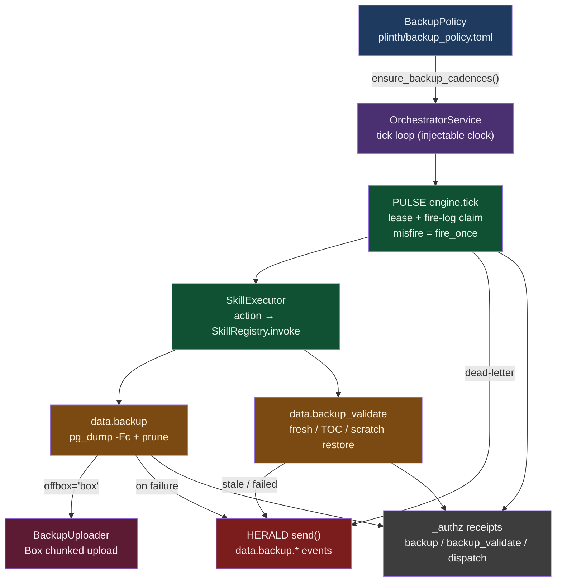

# Productized Database Backups

**Status:** Shipped (2026-07-11) · **Surface:** `axi data backup` / `axi data backup-validate` · **Host:** `data_platform_orchestrator` service

The problem this productizes away: a production node was found with a bare
backup posture — no scheduled dumps, no validation, no alerting, one stale
manual `pg_dumpall`. Backups are part of the DB-deployment lifecycle, so the
data-platform extension now configures them, schedules them through PULSE,
and periodically **proves** they are restorable — with HERALD alerting when
anything degrades.

## The pieces

| Piece | Where | What it does |
|---|---|---|
| `BackupPolicy` | `database/backup_policy.py` | TOML-persisted posture (`$AXI_STATE/plinth/backup_policy.toml`): `enabled`, `schedule`, `validate_schedule` (PULSE cadence strings), `target_root`, `retention_count`, `schemas`, `offbox`, `box_folder_id` |
| `data.backup` | `skills/backup.py` | Custom-format (`pg_dump -Fc`) dump scoped to policy schemas → prune to `retention_count` → optional off-box replica. HERALD `data.backup.failed` on any failure |
| `data.backup_validate` | `skills/backup_validate.py` | Fail-closed check battery: exists / fresh (default 26 h) / non-empty / `pg_restore --list` TOC / optional scratch-restore + row sanity. HERALD `data.backup.stale` / `data.backup.validate_failed` |
| `BackupUploader` seam | `database/backup_uploader.py` | Off-box protocol; `BoxBackupUploader` does direct multipart ≤50 MB and the Box chunked-upload session (SHA-1 digests, `Content-Range`, commit) above it |
| `SkillExecutor` | `schedule/executor.py` | PULSE's production `Executor`: action string == qualified skill name → `SkillRegistry.invoke`; failures raise so retry/dead-letter engages |
| `OrchestratorService` | `orchestration/service.py` | The `data_platform_orchestrator` service: tick loop (default 30 s, `AXI_ORCHESTRATOR_TICK_SECONDS`), BackupPolicy → cadence projection, dead-letter → HERALD |

## Flow



## Scheduling (PULSE, not cron)

When the policy is `enabled`, the orchestrator registers two cadences
(idempotently — policy edits reschedule, disabling pauses, re-enabling
resumes):

- `data.backup` on `schedule` (default `0 2 * * *`)
- `data.backup_validate` on `validate_schedule` (default `30 6 * * *`)

Dispatch guarantees: single-flight per instant (PULSE lease + the fire-log's
unique-constraint claim), run-once-if-overdue misfire handling (`fire_once` —
no post-downtime flood), one `dispatch` authz receipt per fire, terminal
failures dead-letter and publish `data.dispatch.dead_letter`.

## Validation is the point

A schedule without validation converges on "one stale artifact nobody can
restore." `data.backup_validate` is fail-closed: any FAIL → `ok=false`,
non-zero exit, HERALD event. The optional live proof
(`--validate-restore --scratch-dsn ...`) restores into a disposable database,
sanity-checks user tables/rows against live, and drops the scratch objects.
Restore itself remains interactive-only by design (the `restore` authz verb
is reserved, deliberately unwired).

## Ops note (production node example)

On a server-profile node with durable storage mounted (e.g.
`/natura/axiom-data`), set:

```toml
# $AXI_STATE/plinth/backup_policy.toml
[backup_policy]
enabled = true
schedule = "0 2 * * *"
validate_schedule = "30 6 * * *"
target_root = "/natura/axiom-data/backups"
retention_count = 14
offbox = "box"                 # off-box leg via Box CCG/OAuth/JWT auth
box_folder_id = "<folder-id>"  # BOX_JWT_CONFIG (or --box-secret-ref) supplies auth
```

Then run the `data_platform_orchestrator` service (manifest `kind = "service"`,
entry `orchestration.service:OrchestratorService`). One-off runs stay
available: `axi data backup`, `axi data backup-validate --json`.

_Copyright (c) 2026 The University of Texas at Austin and B-Tree Labs. Apache-2.0 licensed._
