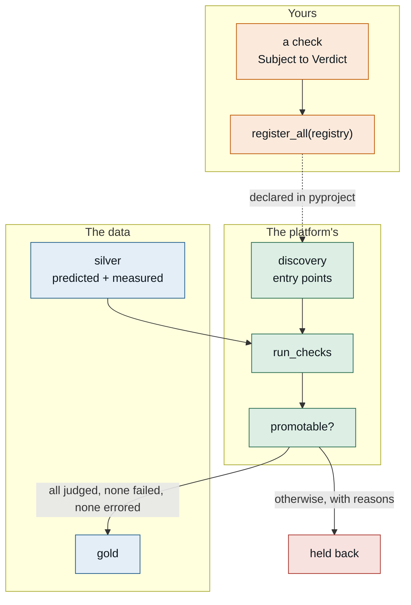

# Write a QC check — one path, from empty file to promotion gate

You own a judgement: whether a model is fit to serve. This is how that judgement
becomes something the promotion path runs on every candidate, without you owning
the promotion path.

Companion to the alert-monitor RECIPE a domain extension ships, which does
the same for alerts. Same shape on purpose: plain code you can read, a test that needs no
infrastructure, then a real run.

---

## The picture first: how your code actually runs



You write one function. Everything else already exists.

---

## Before you start — is this even yours to build?

A check belongs here when it answers **"is this model fit to serve?"** and the
answer depends on domain judgement rather than plumbing.

It does **not** belong here if:

- It is about whether the data arrived. That is ingest's problem, and a QC check
  that fires on a missing feed will fire constantly and be muted within a week.
- It is a threshold someone wants to tune weekly. Put the number in
  configuration and let the check read it; recompiling to change a limit means
  the limit stops being changed.
- It needs to notify a person. Checks return verdicts. Delivery is HERALD's, and
  the promotion path decides what is worth telling anyone.

---

## Step 0 — get the data in front of you (once per machine)

```bash
pip install -e ".[dev]"
axi ext doctor                 # environment, lint, validate, test in one table
```

You need no database and no credentials for steps 1 through 4.

---

## Step 1 — make a home for your check

Inside your own package, not this one:

```
my_package/
  checks/
    __init__.py          # register_all lives here
    reading_bounds.py  # one check per file, named after what it judges
    tests/
      test_reading_bounds.py
```

One check per file. They fail for different reasons and are read at different
times, and a file holding five of them gets skimmed.

---

## Step 2 — look at the data before you pick a threshold

This is the step people skip, and it is the one that decides whether the check
means anything.

```bash
axi data aggregate --metric <your-metric> --since 30d --stat p99
```

Two questions to answer before writing any number down:

**What resolution is the signal actually recorded at?** If it arrives quantised
coarsely, a relative tolerance below a few percent is measuring the
quantisation, not the model. This is not hypothetical: a decimation gate on this
platform kept 8,152 of 8,152 frames because one count on a base of fifteen reads
as a 6.7% change and passed a relative test.

**What does the signal do when nothing is wrong?** A threshold that has never
been exceeded in thirty days of normal operation is a threshold you have not
tested. One that fires twice a day is one nobody will read.

---

## Step 3 — write the check

```python
from axiom.extensions.builtins.data_platform.validation import (
    Outcome, Subject, Verdict, paired, within_tolerance,
)

MAX_ABSOLUTE = 5.0        # instrument resolution is 1 unit; 5 is five counts
MAX_RELATIVE = 0.02       # and 2% once the signal is well above the noise


def reading_bounds(subject: Subject) -> Verdict:
    """Predicted values must track the reference within bounds."""
    rows = paired(subject.predicted, subject.measured, key="ts", value="reading")

    if not rows:
        # No overlap is NOT a failure. The model is not wrong because the
        # instrument was not sampling, and reporting it as wrong would make the
        # number track the measurement schedule instead of the model.
        return Verdict(
            check="tracks-reference",
            model_ref=subject.model_ref,
            outcome=Outcome.ERROR,
            detail="no paired predicted/measured rows in the window",
        )

    worst = max(rows, key=lambda r: abs(r[1] - r[2]))
    ok = all(
        within_tolerance(pred, meas, absolute=MAX_ABSOLUTE, relative=MAX_RELATIVE)
        for _, pred, meas in rows
    )

    return Verdict(
        check="tracks-reference",
        model_ref=subject.model_ref,
        outcome=Outcome.PASS if ok else Outcome.FAIL,
        observed=abs(worst[1] - worst[2]),
        threshold=MAX_ABSOLUTE,
        detail=f"{len(rows)} paired points, worst deviation at {worst[0]}",
        evidence={"worst_ts": worst[0], "predicted": worst[1], "measured": worst[2]},
    )
```

Three things that are not decoration:

**Return `ERROR`, not `FAIL`, when you cannot judge.** Missing reference data,
an empty window, a query that failed. A QC score that drops when the network
does is measuring the network.

**Set both tolerances.** Passing `absolute=0` is a decision, and usually the
wrong one. See step 2.

**Carry `observed` and `threshold`.** A pass by a hair and a pass by three
orders of magnitude are different facts about a model, and a boolean loses that.

---

## Step 4 — test it with no infrastructure at all

A check is a pure function. This is the whole reason it is one.

```python
from axiom.extensions.builtins.data_platform.validation import Outcome, Subject
from my_package.checks.reading_bounds import reading_bounds


def _subject(pred, meas):
    return Subject(
        model_ref="model:example-surrogate@3",
        predicted=tuple({"ts": t, "reading": v} for t, v in pred),
        measured=tuple({"ts": t, "reading": v} for t, v in meas),
    )


def test_tracks_within_bounds():
    assert reading_bounds(_subject([(1, 300.0)], [(1, 302.0)])).outcome is Outcome.PASS


def test_flags_a_real_excursion():
    assert reading_bounds(_subject([(1, 300.0)], [(1, 340.0)])).outcome is Outcome.FAIL


def test_no_overlap_is_an_error_not_a_failure():
    """The property most worth pinning: absence of evidence is not evidence."""
    assert reading_bounds(_subject([(1, 300.0)], [(9, 300.0)])).outcome is Outcome.ERROR


def test_quantisation_alone_does_not_fail():
    """One instrument count of disagreement is not a model defect."""
    assert reading_bounds(_subject([(1, 15.0)], [(1, 16.0)])).outcome is Outcome.PASS
```

```bash
pytest my_package/checks/tests/ -q
```

No database, no gateway, no VPN, no node. If your check needs any of those to be
tested, it is doing two jobs and the query half belongs outside it.

---

## Step 5 — run it against a sandbox

When you want real rows without touching production, seed a throwaway database:

```python
import pytest

pytest.importorskip("pytest_postgresql", reason="needs an ephemeral database")

pytestmark = pytest.mark.integration      # CI's unit job deselects this


def test_against_real_rows(postgresql):
    ...
```

**Both gates matter.** The marker is what CI's fast job filters with
`-m "not integration"`. The `importorskip` is what keeps the plain
`pytest` command clean for someone who has not installed the plugin — a marker
does not stop pytest resolving fixtures, so without it the documented command
reports collection errors rather than skips. Expected errors train a reader to
scroll past red, which is the one habit a test suite cannot afford.

---

## Step 6 — register it

Two entry points. The first says your distribution is platform code; the second
says where your checks are.

```toml
# pyproject.toml
[project.entry-points."axiom.portfolio_member"]
my-package = "my_package:__name__"

[project.entry-points."axiom.data_platform.validators"]
my-package = "my_package.checks:register_all"
```

```python
# my_package/checks/__init__.py
from my_package.checks.reading_bounds import reading_bounds


def register_all(registry):
    registry.register("model:example-surrogate@3", "tracks-reference", reading_bounds)
```

Both are required, and the portfolio one is an authority boundary rather than
paperwork: loading an entry point means importing and calling your code, so "may
this package register a check?" is the same question as "may this package run in
the promotion path?". A distribution that does not declare membership is
**skipped and logged**, never loaded.

Register against a **specific model revision**. A bound that was right for `@3`
is an assumption about `@4`, and revisions exist because the model changed.

Confirm it loaded:

```python
from axiom.extensions.builtins.data_platform.validation import CheckRegistry
from axiom.extensions.builtins.data_platform.validation.discovery import register_discovered

registry = CheckRegistry()
print(register_discovered(registry))     # your distribution should be listed
print(registry.names("model:example-surrogate@3"))
```

A promotion run that found no checks promotes everything and looks exactly like
a healthy run. Assert on what loaded.

---

## Step 7 — CI

Nothing new to wire. Your checks are tested by the same `pytest` your package
already runs, because they are functions.

What is worth adding once, in your package's CI:

```yaml
- name: Checks are discoverable
  run: |
    python - <<'PY'
    from axiom.extensions.builtins.data_platform.validation import CheckRegistry
    from axiom.extensions.builtins.data_platform.validation.discovery import register_discovered
    r = CheckRegistry()
    loaded = register_discovered(r)
    assert "my-package" in loaded, f"our checks did not register: {loaded}"
    assert r.names("model:example-surrogate@3"), "registered nothing for the model"
    PY
```

That guards the failure mode a unit test cannot see: the check is correct, the
entry point is misspelled, and the promotion gate quietly has one fewer opinion
than you think.

---

## What good looks like

A reviewer should be able to answer all of these from your file alone:

- What does this judge, and against what reference?
- What happens when the reference is missing? (It should be `ERROR`.)
- Where did the threshold come from, and what is the signal's resolution?
- Which model revision is it registered for?
- Can I run its tests on a laptop with nothing installed? (Yes.)
