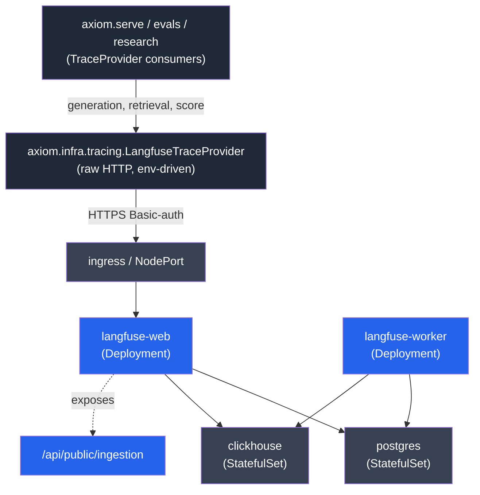

# `observability` — Axiom Observability Substrate Extension

> Packages the **install + lifecycle** of the Langfuse trace+eval server
> alongside the data-platform. The Langfuse Python **client** already
> ships in `axiom.infra.tracing.langfuse_provider` and is consumed by
> the serving / evals / research surfaces. This extension owns the
> **server side**: helm chart, Terraform module, install / verify /
> diagnose skills.

## What this is

A first-class observability substrate delivered as an Axiom extension,
mirroring the `data_platform` shape so an operator runs:

```bash
axi observe install \
  --namespace axiom-observability \
  --release axiom-observability \
  --kube-context <ctx>
```

…and gets a working Langfuse instance running against the **shared
axiom OLTP Postgres** (schema `langfuse`) plus dedicated ClickHouse and
Redis deployments. Axiom's tracing clients (resolved from `LANGFUSE_*`
env vars via `axiom.infra.tracing.env`) start logging generations as
soon as those env vars are bound to the install output.



## Boundaries (ADR-052 honored)

- **Postgres is shared.** Langfuse rides the axiom OLTP DB with
  `?schema=langfuse` on the connection string; Prisma migrations stay
  inside that schema and never touch `public`. The install skill does
  a one-time `CREATE SCHEMA IF NOT EXISTS langfuse` +
  `CREATE EXTENSION IF NOT EXISTS pgcrypto` and refuses to proceed if
  no shared DSN is reachable (via `pg_dsn` or `DP1_RAG_DSN` env).
- **ClickHouse + Redis are separate.** Different engines (column-store
  trace ingestion, event queue) — not a tenancy decision.
- **Internal-Postgres override.** Operators who want full isolation
  pass `postgres_mode=internal` and the chart brings up its own
  Postgres StatefulSet. That's the explicit escape hatch, not the
  default.
- **EC posture deferred.** Whether to run a second Langfuse instance
  for export-controlled traces, or to disable Langfuse on the EC path,
  is left to a follow-up ADR.

## CLI surface

| Command | Purpose |
|---|---|
| `axi observe install` | Helm-install the Langfuse server + deps; emits `LANGFUSE_PUBLIC_KEY`/`SECRET_KEY`/`HOST` for the env-driven trace provider. |
| `axi observe verify` | Pre-flight (helm, kubectl, context, namespace) + post-install (web pod ready, /api/public/health, scratch trace round-trip). |
| `axi observe diagnose` | Deterministic health probes (helm release, Deployments, StatefulSets); invokes the agent on irregularity. |

## Helm install

```bash
helm install axiom-observability ./deploy/helm \
  --namespace axiom-observability \
  --create-namespace \
  --set langfuse.salt=<random> \
  --set langfuse.nextauthSecret=<random> \
  --set langfuse.encryptionKey=<random>
```

The chart bakes in (no manual post-install patches required):

- Langfuse v3 `langfuse-web` Deployment + `langfuse-worker` Deployment
- Postgres 16 StatefulSet (Langfuse metadata)
- ClickHouse 24 StatefulSet (Langfuse v3 trace store)
- Required Secrets (salt, nextauth, encryption-key, basic-auth)
- ClusterIP Services + an Ingress stub (disabled by default; enable via
  `--set ingress.enabled=true`)
- An init Job that waits for Postgres + ClickHouse readiness before
  starting the web pod (no manual `kubectl rollout`)

## Trace-provider wiring (consume, don't re-wire)

`axi observe install` writes the resolved `LANGFUSE_*` triple to its
SkillResult.value. The operator binds those env vars on the Axiom
process (or sets them in the Axiom deployment) and the existing
`build_trace_provider_from_env()` path auto-selects the `langfuse`
backend. No code change required — the client seam already exists in
`axiom.infra.tracing.env` and is consumed by the serving, evals, and
research surfaces. This extension deliberately ships no call-site
instrumentation of its own.

## Roadmap (deferred; not in this PR)

- **Prometheus + Grafana** as planned siblings in the same chart behind
  `--set prometheus.enabled=true` / `--set grafana.enabled=true`. The
  ADR notes them as planned. System telemetry sits next to LLM
  telemetry in one operator-facing surface.
- **EC posture** — a separate Langfuse instance for export-controlled
  traces, or no Langfuse on the EC path. Follow-up ADR required.

## Related

- [ADR-001 (observability)](docs/decisions/adr-001-observability-substrate.md)
  — Observability substrate as an extension
- ADR-031 — Extension self-containment
- ADR-052 — DB tenancy (the Postgres leg honors it)
- ADR-056 — CLI verbs are thin skill-fn wrappers
- `axiom.infra.tracing.{provider,langfuse_provider,env,factory}` — the
  client side of the seam
