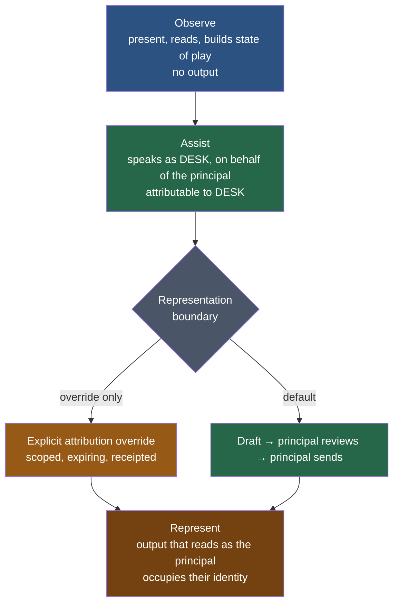

# PRD: `axiom.principal` — Knowing the Human, and Writing in Their Voice (DESK)

**Status:** Draft (2026-08-19)
**Owner:** Benjamin Booth
**Companion Spec:** [spec-axiom-principal-comms.md](spec-axiom-principal-comms.md)
**Builds on:** [`prd-axiom-notifications.md`](../../../../../../docs/prds/prd-axiom-notifications.md) (HERALD — delivery), [ADR-067](../../../../../../docs/adrs/adr-067-herald-gateway-inbound.md) (inbound gateway, reply-bind-back, correlation threading), [`spec-axiom-notifications.md`](../../../../../../docs/specs/spec-axiom-notifications.md) §3 (thread reconstruction)
**Primitive class:** AEOS built-in extension (`axiom.extensions.builtins.principal`)
**Agent:** DESK (Sensor + Generator) — *codename proposed, owner's call*
**Depends on:** ADR-103 *(directory providers — in flight, axiom#688)* (directory seam — identity resolution), `axiom.memory` (voice observations), delegated Microsoft Graph on the tenant's sign-in app registration
**Surface:** tools on the node's single composed Axiom MCP server (one server per node), plus `axi principal …`

---

## 1. Elevator Pitch

Every harness runs on behalf of a person, and today the platform cannot name them.
It can deliver a notification to a *channel* — a webhook, an inbox, a room — but it
does not know whose desk that lands on, how they prefer to be reached about a given
subject, or whether the last thing it sent was ever seen.

DESK gives every harness a **principal**: a named entity with verified contact
endpoints, stated preferences, and a proven delivery path. Once the platform knows
who it works for, three things become possible that are not possible now. It can
reach them proactively on the right channel. It can accept their reply and carry a
real conversation. And it can draft on their behalf **in their own voice**, close
enough that the principal's edit is a tweak rather than a rewrite.

A principal is **not necessarily a person**. A harness may work for a service
identity, another agent, or a node, and the platform already models that: an Axiom
`Principal` is "a named, public-keyed entity (human, agent, node, org)." Keying DESK
on the same `@name:context` handle is what makes non-human principals nearly free
rather than a second design — see §5.1.

The shape DESK is aiming at is a **chief of staff**: an assistant that shadows its
principal across the spaces they work in, holds the state of play, and acts on their
behalf up to a line — stopping where the principal must represent themselves
directly. §5.10 defines that line as a mode boundary rather than a prohibition,
which is what makes shadowing shippable without weakening attribution.

## 2. Problem / Opportunity

### What's missing today

1. **The harness has no human.** A node profile describes the machine. Nothing
   records the person accountable for it, so "notify the operator" resolves to a
   channel constant, not an identity. When a channel silently degrades, there is no
   one the platform knows to tell.
2. **Preferences are implicit and per-channel.** `axi notifications setup <vendor>`
   configures a *transport*. There is no place to say *this* person wants incidents
   by chat within minutes, weekly digests by email, and nothing at all between
   22:00 and 07:00.
3. **Configured is not delivering.** Channels register from config and are assumed
   healthy. A live instance ran for weeks with an empty override shadowing a valid
   webhook: registration looked fine, delivery went nowhere, and nothing noticed.
   Setup that does not end in a *proven round trip* is a promise, not a capability.
4. **The reply path is designed but unbuilt.** ADR-067 specifies the inbound
   gateway and correlation binding; the `Thread` model carries a `correlation_id`
   with zero readers and zero writers. Humans can be told things and cannot answer.
5. **Nothing writes in anyone's voice.** Generated text reads as generated. A
   principal asked to approve a draft that sounds nothing like them will rewrite it
   from scratch, which costs more than writing it themselves — so the assistance
   never gets used.

### Why now

The delivery substrate is finished and the inbound design is already pinned. What
blocks an assistant is not transport, it is *identity and voice*. Both are now
tractable: the directory seam resolves people, and the memory system already stores
per-person communication posture — the platform is closer to knowing how someone
writes than to knowing who they are.

## 3. Goals & Success Metrics

| Goal | Metric | Target |
|---|---|---|
| Every harness has a named principal | Harnesses with a verified principal record | 100% of installs after setup |
| Setup proves delivery, not just config | Setup runs ending in a confirmed round trip on every declared channel | 100% |
| Silent channel degradation is caught | Median time from channel breakage to principal notified on a *surviving* channel | < 1 hour |
| Reaching people works | Proactive contacts acknowledged on the first-choice channel | > 80% |
| **Drafts sound like the principal** | **Median edit distance between proposed draft and what the principal actually sent** | **Declining month over month; < 15% of draft length by GA** |
| Assistance is wanted | Proposed drafts sent with edits rather than discarded | > 60% |
| No ungranted autonomy | Autonomous messages sent outside an active, unexpired grant | **Zero, always** |
| Autonomy is earned, never drifted | Default-A classes (§5.11) entered by graduation rather than explicit grant | **Zero, structurally** |
| Autonomy stays attributable | Autonomous messages not attributable to DESK, absent an explicit attribution override | **Zero** |
| Overrides stay deliberate | Active attribution overrides with no expiry, or no receipt | **Zero** |

The voice metric is the load-bearing one. Fidelity claims that cannot be measured
become taste arguments; edit distance against the *actually sent* text is the only
honest scoreboard, and it is free to collect because approval already passes
through the platform.

## 4. Key Users / Personas

- **The principal** — the human a harness works for. Wants to be told what matters,
  on the channel they already watch, and to answer without leaving it.
- **The delegate** — someone the principal designates for a topic class (an
  on-call peer, an assistant). Receives what the principal routes to them.
- **The agent author** — wants `notify_principal(topic=…)` to resolve correctly
  without knowing anything about the person or their channels.
- **The service principal** — a non-human entity the harness works for: an equipment
  or shared mailbox, another agent, a node. Has endpoints and routing, has no
  interview and no personal voice, and is verified by machine round trip rather than
  by a human confirming receipt (§5.1, §5.3).
- **The reviewer** — needs every message attributable, every draft's approval
  recorded, every voice observation traceable to a consented source, and every
  autonomous send traceable to the grant that permitted it.

## 5. Scope — Key Capabilities

### 5.1 The principal record

One durable record per harness, linking a resolved identity to contact endpoints
and preferences. Identity resolution reuses the directory seam (ADR-103); DESK does
not maintain a parallel user store.

The record carries a **`principal_kind`** — `human | agent | service | node | org` —
because the kind changes which capabilities apply, not merely how the record reads.
A human principal is interviewed, has a personal voice, and confirms delivery by
replying. A service principal is provisioned declaratively, has a *service persona*
rather than a voice, and is verified by machine round trip. Everything else — the
handle key, endpoints, preferences, routing, grants — is identical across kinds,
which is the payoff for keying on the platform handle instead of an invented
identifier: `@room-scheduler:site` is a valid principal today, with no new scheme. Endpoints are typed (email, chat, SMS, inbox),
each carrying its own verification state — an endpoint is `unverified` until a
round trip proves it, and an unverified endpoint is never used for anything that
matters.

### 5.2 The setup interview

An interactive flow at install time that asks the person, in their own words, who
they are and how they want to be reached. It captures endpoints, per-topic channel
preference, urgency thresholds, quiet hours, escalation order, and the **style
card** (§5.7). It is resumable, re-runnable, and non-interactive-safe: in a headless
install it writes a pending record and the harness stays in `principal:unverified`
rather than guessing.

**The interview is for human principals only.** A service, agent, or node principal
is provisioned declaratively — endpoints and topic routing are stated, no style card
is collected, and setup completes without a person in the loop. Asking a mailbox how
it prefers to be addressed is not a degraded interview, it is the wrong operation.

### 5.3 The comms test run

Setup does not complete until each declared endpoint has **carried a real message
and been confirmed**. Outbound proves delivery; where the channel is bidirectional,
the principal's reply proves the return path and simultaneously verifies the
correlation binding. A channel that cannot complete the round trip is recorded as
`degraded` with the reason, and the harness reports itself partially configured
rather than healthy. This is the direct answer to "registered but delivering
nowhere."

For a **non-human principal the platform holds both ends**, so the round trip is
machine-attested rather than human-confirmed: write, read back, and clean up. That
is *stronger* evidence than a person saying they received something, and it needs no
one to be awake. The invariant was always **proof of delivery**, not proof of human
attention, and machine attestation satisfies it exactly. This is already
demonstrated in a deployment: an equipment mailbox round-trips CREATE 201 →
READ 200 → PATCH 200 → DELETE 204 → GET 404, self-cleaning, under permissions the
tenant had already granted.

### 5.4 Topic-aware routing

Preference is expressed as *topic class → ordered channel list*, with urgency and
quiet-hours modifiers. Routing is deterministic and inspectable: given a topic and a
timestamp, `axi principal route <topic>` prints the channel that would be chosen and
why. Escalation walks the ordered list on non-acknowledgement, and a channel marked
`degraded` is skipped rather than silently swallowing the message.

### 5.5 Proactive contact

Agents gain `notify_principal(topic, summary, urgency)` — they address a *person and
a subject*, never a channel. Rate limiting, deduplication, and quiet-hours deferral
are enforced centrally so no agent has to be trusted to be polite. The RACI
graduation rules from the notifications PRD (§5.7) govern how a recurring proactive
contact earns or loses its standing.

### 5.6 Assisted correspondence

When a thread reaches the principal's endpoint, DESK reconstructs it via the
correlation binding (ADR-067), summarises the state of play, identifies the
participants visible in the envelope, and — when the principal wants one — proposes
a reply as a draft.

**Drafts are proposals, and the drafting path never sends.** An agent that can send
as a person, into threads with external recipients, is the highest-consequence
surface the platform has, so the assisted-correspondence module keeps its structural
guarantee: it contains no send call at all (spec §5.2). The propose → ask → back off
escalation rules apply without exception, and three declines on a thread stop DESK
offering on it.

Autonomous correspondence is a **separate capability with a separate authorization**
(§5.11), not a flag on this one. Keeping them apart is deliberate: the guarantee that
matters most — that drafting on a person's behalf cannot become sending on their
behalf by accident — survives intact, and the weaker, grant-gated guarantee is
confined to a module that was built to carry it.

### 5.7 Voice fidelity — the critical capability

A draft that does not sound like the principal is worse than no draft. It is not a
polish item; it decides whether the feature is used at all.

Voice is captured from four sources, in ascending order of value:

1. **The style card** — declarative, from the interview. Greeting and sign-off
   habits, formality by recipient class, sentence length, punctuation preferences,
   emoji, and explicit prohibitions. Negative constraints matter as much as positive
   ones: *never* is easier for a person to state accurately than *always*, and it is
   easier to check.
2. **Consented exemplars** — a bounded set of representative messages the principal
   contributes deliberately. Not a mailbox scrape. The principal chooses what
   represents them, which is both better data and a cleaner consent story.
3. **Observed posture from memory** — the platform already records per-person
   communication facts. DESK consumes those rather than building a parallel store.
4. **Approved-edit diffs — the strongest signal.** Every time the principal edits a
   draft before sending, the diff is a labelled example of *how they would have said
   it*. It needs no additional permission, it is generated by normal use, and it
   improves precisely where the model is currently wrong. This is the mechanism by
   which fidelity compounds.

Voice is **plural, not singular**. People write differently to a supervisor, a
vendor, a student, and a peer. The style card is captured per recipient class, and
a draft to an unfamiliar class inherits the nearest one and says so.

Voice fidelity applies to **expression only, never to substance**. Sounding like the
principal must never extend to inventing commitments, dates, numbers, or opinions
they have not expressed. The spec separates the two paths explicitly, and a draft
containing an unsupported factual claim is a defect regardless of how well it reads.

### 5.8 Reachable from wherever the principal works

DESK is exposed as **tools on the node's single composed Axiom MCP server** — not a
new server, not a second surface. A principal running an agent session in whatever
IDE they prefer gets `principal.setup`, `principal.route`, `principal.threads`,
`principal.draft`, and `principal.style` as ordinary tools, with the same
authorization and receipts as any other Axiom capability. The CLI and chat surfaces
call the same functions; there is one implementation and three front doors.

This matters for adoption more than it looks. Correspondence assistance that
requires leaving the editor to visit a separate app will not be used during the work
it is meant to support.

### 5.9 Email is the organisation's email

Transport is **Microsoft Graph, delegated, acting as the principal** — the standard
institutional paradigm, not a side-channel. The principal signs in once; DESK holds
a refresh token scoped to them and operates as them.

Two consequences make this the right choice rather than a compromise:

- **No application permissions.** Delegated `Mail.Send` sends only as the signed-in
  person and reaches nothing they cannot already reach, which is a categorically
  different request from tenant-wide application access — and it is the scope
  already in flight on the sign-in registration.
- **The approval gate becomes native.** Graph has a first-class *draft*. DESK
  creates a reply draft in the principal's own mailbox, in the real thread, and
  stops. The principal reviews it in Outlook and presses Send themselves. DESK never
  calls a send endpoint at all, so "never sends unattended" is enforced by the
  absence of a code path rather than by a policy flag.

Threading likewise comes from the platform: Graph exposes `conversationId` and
`internetMessageId`, so thread reconstruction binds to real message identity instead
of a correlation token smuggled through a reply address.

### 5.10 Shadowing, and the representation boundary

The capabilities above route *messages*. A chief of staff also needs **presence**:
DESK accompanies its principal into the spaces they work in — a channel, a meeting, a
thread, a room — holds the state of play, and acts there. Presence is a different
object from routing and needs its own authorization, because being in a room is not
the same permission as being reachable.

Shadowing is expressed as three **representation modes**, ordered by how much of the
principal DESK occupies:

**Most chief-of-staff value lives in Assist**, and Assist is cheap to authorize
precisely because it is disclosed: scheduling, chasing, status, routing, summarising,
"Ben asked me to get this booked" — all of it is DESK speaking as DESK, and none of
it requires occupying anyone's identity. Designs that jump straight to Represent
inherit the hardest authorization problem in exchange for capability they mostly did
not need.

The boundary sits between Assist and Represent. **By default DESK does not cross it
unattended**; the crossing is the drafting path, where the principal reviews and
sends. The boundary is overridable, and the override is a deliberate act with a
scope and an expiry (§5.11) rather than a setting.

Two properties hold in every mode. DESK's presence in a space is **visible to the
people in it** — a shadow nobody can see is surveillance, not assistance. And every
mode transition is **receipted**, so "what was DESK allowed to do in that room, and
when" is answerable after the fact rather than reconstructed.

### 5.11 Autonomous correspondence

There are people DESK should simply correspond with, without asking every time. A
standing scheduling counterpart, a vendor contact on a routine thread, an internal
colleague on a recurring status exchange: routing each of these through an approval
prompt trains the principal to approve without reading, which is worse than not
gating at all.

This is supported, and it is **granted, not configured**.

**The grant.** Autonomous correspondence is an explicit object scoped to
`(principal, counterparty, topic_class)`, with an expiry, a revocation path, and a
receipt. "Certain people" is literally the grant's scope; there is no global
autonomy switch, because a global switch cannot express the thing the principal
actually means.

**The rung.** Grants land on `N` (act-then-notify) from ADR-045 D6.1 by default, not
`I` (silent). DESK sends, the message appears in a batched digest, and the principal
has an undo window. D6 exists because of the 2026-05-26 CI flood — one unattended
action on a schedule, flooding an inbox — which is exactly the failure mode
autonomous correspondence reproduces if it graduates straight to silent.

**Earned, not set.** Grants are proposed by graduation (ADR-045 D4) from observed
approvals: DESK earns autonomy with the counterparties whose drafts the principal has
been approving unedited. That also supplies the honest scoreboard — autonomy tracks
demonstrated agreement rather than optimism.

**Default-A classes.** Four classes default to *approve every time* regardless of
earned trust:

| Class | Why |
|---|---|
| First contact | Graduation reasons from observed approvals; a counterparty with no history has no evidence base by construction |
| Commitments and sign-offs | Money, schedule, scope, staffing, approvals, concurrence — these carry the principal's authority rather than their words |
| Export-controlled / classified context | Inherits ADR-045 D5.2; several cells there *refuse* rather than gate |
| Regulated operations | Licensing and regulatory correspondence in whatever domain the deployment operates in, where the sender's identity is part of the record. A deployment maps its own topic classes onto this one |

These are **strong defaults, and they are overridable** — but the override is an
explicit, scoped, expiring, receipted grant, never a toggle and never something DESK
proposes for itself. The invariant that makes overridability safe:

> **Graduation can never move a default-A class. Only an explicit human grant can.**

So the system cannot drift into autonomy on the consequential classes no matter how
much trust it accumulates elsewhere; someone always walked through a door.

**The one class DESK cannot grant past.** Export-controlled and classified context
inherits a floor DESK does not own. ADR-045 D5.2 collapses those cells to refuse, and
D5 includes a meta-rule preventing an action from editing the rule out of existence.
The override there is real but it is the **declassification / cleared-cohort ceremony
that already exists**, not a DESK-level grant. DESK's job is to name that ceremony in
the refusal rather than to offer a switch it has no authority to honour.

**Attribution.** An autonomous message is attributable to DESK acting for the
principal by default, disclosed in both envelope and body. That default is
overridable where the scenario calls for it, through the same grant mechanism, with
its own expiry and receipt — an attribution override is recorded as a distinct
decision from the autonomy grant, because permission to write to someone is not
permission to be someone.

## 6. Non-Goals

- **Ungranted autonomous sending.** Autonomy is always scoped to a grant
  (§5.11). What is out of scope permanently is a *global* autonomy switch, and
  autonomy arrived at by graduation on a default-A class.
- **Trawling the principal's mailbox.** Delegated access technically reaches
  everything the principal can reach, so this boundary is a *policy* one and must be
  stated as such rather than implied by permissions: DESK reads only threads the
  principal has put in scope, and every read is receipted. A capability that quietly
  indexed someone's whole mailbox because it could would not survive its first
  review, and should not.
- **A new identity store.** Identity resolution belongs to the directory seam, and
  the principal *kind* (§5.1) is an attribute of the profile, not a second taxonomy.
- **Invisible shadowing.** DESK's presence in a space is visible to the people in
  it. A shadow nobody can see is surveillance, not assistance.
- **Undisclosed impersonation.** DESK writes as itself on the principal's behalf
  unless an explicit, expiring attribution override says otherwise (§5.11). What is
  permanently out of scope is DESK occupying a principal's identity *silently* —
  without a grant, a receipt, and an expiry.
- **Rebuilding inbound transport.** ADR-067 owns the gateway and correlation binding.

## 7. Non-Functional Constraints

- **Bcc is not observable.** On received mail, blind recipients are absent from the
  message by protocol — not hidden by a setting. DESK can know Bcc only on what it
  sends itself. Any situational-awareness claim must be scoped to To and Cc, and the
  UI must not imply otherwise.
- **Consent is explicit and revocable.** Every voice source records where it came
  from and when it was permitted. A principal can purge their voice profile, and
  purging it degrades drafting rather than breaking delivery.
- **Fail closed and say so.** An unverified endpoint is not used. A degraded channel
  is skipped loudly. Silence is never treated as success — that failure mode is what
  motivated this PRD.
- **Attributable by construction.** Every proposed draft, every approval, and every
  send carries a receipt linking principal, thread, and the voice sources consulted.

## 8. Phases

Each phase ships something usable on its own.

- **P0 — Principal record, interview, and proven round trip.** Works against the
  channels a harness already has. Delivers immediately: the class of silent
  degradation described in §2.3 becomes detectable on day one, with no new
  credentials.
- **P1 — Email as a first-class endpoint.** Delegated Graph on the sign-in
  registration, acting as the principal. Proactive contact by email starts working,
  and it arrives from the person's own address, in the organisation's own mail
  system, with nothing to explain to a recipient.
- **P2 — Inbound and threading.** Threads are read back through Graph
  `conversationId`, persisted, and bound to the correlation model, making the
  `Thread` model load-bearing at last. The loop closes.
- **P3 — Assisted correspondence and voice.** Thread summarisation, participant
  awareness, and proposed drafts under the style card, with edit-diff learning
  running from the first approval.
- **P4 — Shadowing and granted autonomy.** Presence in a space with the Observe and
  Assist modes (§5.10), then the grant object, the `N` digest with its undo window,
  and graduation proposals (§5.11). P4 depends on P3 having produced enough approved
  drafts for graduation to reason from — autonomy proposed before there is an
  approval history to earn it from is a slider wearing a ladder's clothes.

**P0.5 — the service principal, available now.** Non-human principals (§5.1) need no
interview, no voice, and no delegated mail; their round trip is machine-attested
(§5.3). The tenant has already granted the permissions this requires, so a service
principal can be stood up and proven against a live mailbox **without registration B,
without the Azure Bot resource, and without any new consent** — which makes it the
shortest path to exercising the record, endpoint, verification, and routing
machinery end to end against something real.

Chat rides the same rails: the bidirectional chat transport is already specified, so
a principal who prefers chat is a preference-map entry, not a second design.

---

_Copyright (c) 2026 The University of Texas at Austin and B-Tree Labs. Apache-2.0 licensed._
