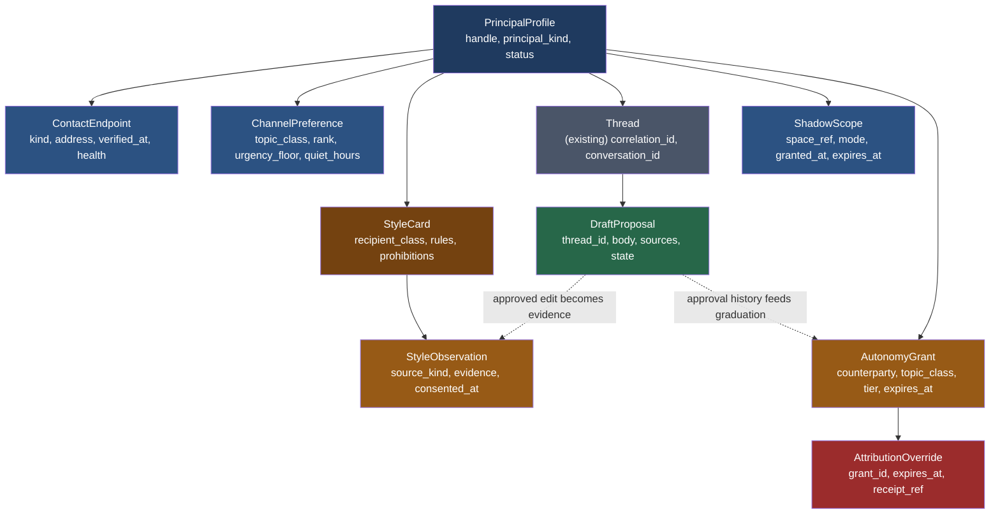
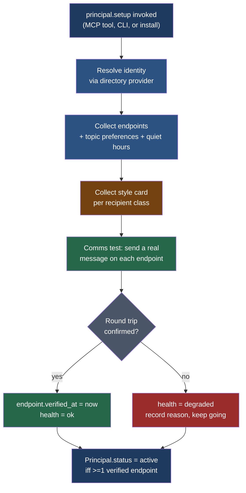
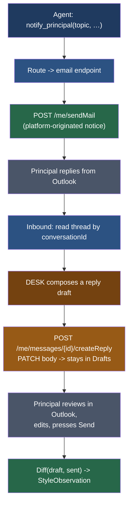
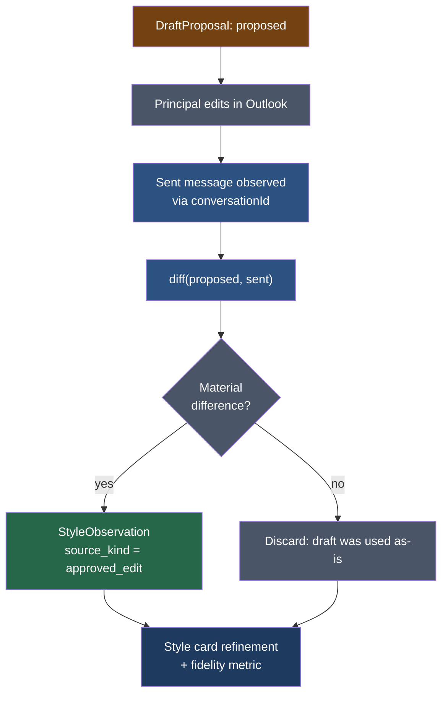

# Tech Spec: `axiom.principal` — DESK

**Status:** Draft (2026-08-19)
**Implements:** [`prd-axiom-principal-comms.md`](prd-axiom-principal-comms.md)
**Substrate:** [`spec-axiom-notifications.md`](../../../../../../docs/specs/spec-axiom-notifications.md) §3 (thread reconstruction), [ADR-067](../../../../../../docs/adrs/adr-067-herald-gateway-inbound.md) (inbound gateway, correlation binding), ADR-103 *(directory providers — in flight, axiom#688)* (directory seam)
**Audience:** Engineers implementing DESK P0–P3, channel-adapter authors, security reviewers.

The PRD answers *why*. This spec is *how*. It pins the storage model, the interview
and verification protocol, the routing algorithm, the delegated-Graph mail path, the
draft-as-approval-gate mechanism, the voice model and its learning loop, the MCP tool
surface, and the deferred questions.

---

## 1. What already exists, and is not rebuilt

Read this section before writing code; most of the transport already exists.

| Concern | Owner | State |
|---|---|---|
| Outbound delivery, channel adapters, receipts | `axiom.notifications` (HERALD) | Built |
| Inbound gateway, signature verification, dedup | ADR-067 | Designed, unbuilt |
| Thread ↔ correlation binding | `notifications/db_models.py::Thread` | Model exists, **zero readers/writers** |
| Provable identity (handle + key) | `vega.identity.Principal` | Built |
| Acting posture on an invocation | `infra.PrincipalContext` | Built |
| Identity + group resolution | ADR-103 directory providers | Designed |
| Per-person communication posture | `axiom.memory` | Populated |
| Delegated OAuth, PKCE, refresh-token storage | `axiom.extensions.builtins.auth` | Built (`flow.py`, `pkce.py`, `token_store.py`, `token_source.py`) |
| MCP exposure | node's single composed MCP server | Built |
| Trust ladder `A → C → N → I`, graduation, floor | ADR-045 (D4, D5, D6) | Designed |
| Agent action gating, reversibility, volume bounds | `policy/agent_action_guard.py` | Built |

DESK adds exactly six things: a **principal profile** (reachability, keyed on the
existing handle), a **preference and routing layer**, a **delegated-Graph mail
adapter**, a **voice model**, a **presence/shadowing model** (§7), and an
**autonomous-correspondence grant** (§8). Everything else is composition — notably
the trust ladder, which DESK consumes from ADR-045 rather than growing a private
notion of how much autonomy an agent has earned.

Read that table downward and the gap is visible: the platform can prove who you
are, decide what you may do, and attribute what was done — and cannot *reach* you.
Every existing layer handles identity flowing inward. DESK is the outward
direction, and it deliberately mirrors the inbound discipline: `PrincipalContext.
assured` is true only when identity is cryptographically proven, and
`ContactEndpoint.verified_at` is set only when delivery is proven. Configuration
is not evidence in either direction.

## 2. Storage model



**`PrincipalProfile`** — one per harness. Deliberately **not** named `Principal`:
Axiom already has two, and they are different questions. `vega.identity.Principal`
is *who an entity is, provably* (handle + public key); `infra.PrincipalContext` is
*who is acting now, at what assurance posture*. This is the third question —
*how do we reach the human behind that handle* — and it is a profile **about** a
principal, not another one.

It therefore keys on the **same `@name:context` handle** (ADR-020), validated
through `vega.identity.parse_handle` so the grammar cannot drift between layers.
A skill invocation that knows it is acting as `@ben:netl` can look up how to
reach `@ben:netl`; a separate identifier scheme here would leave reachability
unable to join to identity, which is the whole point of the layer.
`directory_ref` carries the ADR-103 object id when one is known — an attribute,
not the key, because not every principal comes from a directory.
`status ∈ {pending, unverified, active, revoked}`.

**`principal_kind ∈ {human, agent, service, node, org}`.** `vega.identity.Principal`
already admits all five ("a named, public-keyed entity (human, agent, node, org)"),
so this records what the identity layer already permits rather than widening it. The
kind is a **capability discriminator, not a label**:

| Kind | Interview (§3) | Voice (§6) | Verification (§3.2) |
|---|---|---|---|
| `human` | interactive, resumable | personal voice, edit-diff learning | human round trip |
| `agent`, `service`, `node`, `org` | declarative, no prompts | service persona, declarative only | machine round trip |

Endpoints, preferences, routing, shadow scopes, and grants are **identical across
kinds**. That uniformity is the dividend from keying on the platform handle: a
service principal is a value of a field, not a parallel type.

**`ContactEndpoint`** — typed (`email | chat | sms | inbox`), with `verified_at` and
`health ∈ {ok, degraded, failed}` plus a `health_reason`. **An endpoint with
`verified_at IS NULL` is never selected by routing.** This is the schema-level
expression of "configured is not delivering."

**`ChannelPreference`** — `(topic_class, rank)` ordered list per principal, with
`urgency_floor` and `quiet_hours` as a local-time window. Deterministic input to §4.

**`Thread`** — the **existing** model. DESK adds `conversation_id` (Graph's native
thread identity) alongside the existing `correlation_id`, and becomes its first
reader and writer.

**`DraftProposal`** — `state ∈ {proposed, edited, sent, discarded}`, plus
`sources_json` recording which style inputs informed it. The state transition
`proposed → edited → sent` is what feeds §6.4.

**`StyleCard` / `StyleObservation`** — §6.

**`ShadowScope`** — one row per space DESK is present in: `space_ref` (channel,
thread, room, meeting), `mode ∈ {observe, assist, represent}`, `granted_at`,
`expires_at`, `disclosed` (must be true; see §7). Presence is scoped and expiring by
construction — there is no ambient "DESK is everywhere" state.

**`AutonomyGrant`** — `(principal, counterparty, topic_class) → tier`, where
`tier ∈ {A, C, N, I}` per ADR-045. Carries `expires_at`, `granted_by`,
`receipt_ref`, `revoked_at`, and `source ∈ {explicit, graduated}`. **A grant on a
default-A class (§8.2) may only ever carry `source = explicit`** — the constraint is
declared here and enforced in §8.3.

**`AttributionOverride`** — a *separate* row from the grant it attaches to, with its
own `expires_at` and `receipt_ref`. Permission to correspond with someone and
permission to appear as the principal are different decisions and are recorded as
such; revoking one must not silently revoke or preserve the other.

## 3. Setup interview and the comms test run

### 3.1 Flow



### 3.2 Verification semantics

- **Outbound proof** is a delivery receipt from the adapter — the existing
  `receipt_id`/`correlation_id` pair, not a local "no exception raised."
- **Round-trip proof**, on bidirectional channels, is the principal's reply arriving
  and correlating to the sent message. This verifies the return path *and* the
  correlation binding in one act, which is why it is worth doing at setup rather
  than discovering it in an incident.
- **Machine round-trip proof** applies when the principal is non-human and the
  platform holds both ends: write, read back, and clean up, asserting the artifact
  existed and then did not. This is not a weaker substitute for a human reply, it is
  stronger — it proves the path without depending on anyone being awake, and it is
  re-runnable on a schedule, which a human confirmation is not. `verify` therefore
  becomes a liveness probe for service principals rather than a one-time ceremony.
  The round trip must be **self-cleaning**: a verification that leaves artifacts
  behind will be switched off by whoever owns that mailbox.
- A failed endpoint **does not abort setup**. It records `degraded` with a reason and
  continues, because a partially reachable principal is strictly better than none.
- Re-running setup is idempotent per endpoint and never silently discards a verified
  one.

### 3.3 Non-interactive installs

Headless installs **for a human principal** write `status = pending` and emit a
startup warning naming the tool to run. The harness must not invent a principal, and
must not report itself healthy while unverified — the health check exposes
`principal:pending` explicitly.

A **non-human principal is not a headless human**. It is provisioned declaratively
(handle, `principal_kind`, endpoints, topic routing), skips the interview and the
style card entirely, and proceeds directly to the comms test. It reaches `active` with
no person in the loop, because §3.2's machine round trip is complete evidence for it.
Implementations must not funnel a service principal through the interview with
defaults filled in — a record that looks interviewed but was not is exactly the
"configured therefore fine" failure this extension exists to prevent.

## 4. Routing

Deterministic, inspectable, and free of agent discretion:

```
route(topic, urgency, now) ->
  candidates = preferences[topic] or preferences["*"]
  candidates = [c for c in candidates if endpoint(c).verified_at is not None]
  candidates = [c for c in candidates if endpoint(c).health != "failed"]
  if in_quiet_hours(now) and urgency < preference.urgency_floor:
      defer until quiet_hours.end          # deferred, never dropped
  return first(candidates) or ESCALATE
```

Escalation walks the ranked list on non-acknowledgement within the topic's SLA. If
every candidate is unusable the notification goes to `inbox` — which is local and
therefore always available — and raises a `principal.unreachable` event. **Silence is
never an outcome.**

`axi principal route <topic> [--at <ts>]` prints the selected channel and the reason
each candidate was kept or dropped. Routing you cannot interrogate is routing you
cannot trust after an incident.

## 5. Mail: delegated Graph, and the draft as the approval gate

### 5.1 Authentication

Delegated Microsoft Graph, acting as the principal. Authorization-code + PKCE via the
existing `auth` extension; refresh token in `token_store`, keyed to the principal.
Scopes: `Mail.Send`, `Mail.ReadWrite`, `offline_access`, `User.Read` — **all
delegated**, all reaching only what the principal can already reach. No application
permission is requested, and none is required.

### 5.2 Sending is a draft, not a send



The load-bearing property: for **assisted correspondence DESK never calls a send
endpoint**. It calls `createReply`, which produces a real draft in the principal's own
Drafts folder, correctly threaded, addressed, and quoting the original. The principal
presses Send in the client they already use.

"The drafting path never sends" is therefore enforced by the *absence of a code
path*, not by a policy flag someone can flip. The review surface is Outlook, which
needs no building and is already trusted. **Implementations must not add a send call
to the assisted-correspondence module** — this remains true after §8 introduces
autonomy, and §11 keeps the import-level test that proves it.

There are consequently **three send-capable paths, three modules, three
authorizations**, and they must not be merged:

| Path | Speaks as | Authorization | Send call |
|---|---|---|---|
| Platform notice (step C) | the platform, as itself | node config | `sendMail` |
| Assisted correspondence | the principal, after their review | none needed — the human sends | **none, structurally** |
| Autonomous correspondence (§8) | DESK for the principal, or the principal under override | an active `AutonomyGrant` | `sendMail`, gated |

The separation is the point. Introducing autonomy in its own module means the
guarantee that matters most — that *drafting* on a person's behalf cannot silently
become *sending* on their behalf — keeps its structural enforcement, while the
weaker, grant-checked guarantee is confined to code written to carry it. A single
module with a boolean would have traded the strong property for the weak one
everywhere at once.

### 5.3 Threading

Graph supplies `conversationId` and `internetMessageId`. `Thread.conversation_id`
binds to the former; correlation with platform-originated notices continues to use
`correlation_id` per ADR-067. No plus-addressed reply tokens are needed on this path
— real message identity is available, so use it.

### 5.4 Participant awareness, honestly scoped

`To` and `Cc` are read from the message. **`Bcc` is not present on received mail** —
absent by protocol, not hidden by configuration. DESK knows Bcc only on messages it
drafted itself. The API surfaces `participants_visible` and never a field implying
completeness, and the UI must not claim to see the full recipient set.

## 6. The voice model

The capability lives or dies here. A draft that does not sound like the principal is
worse than no draft, because rewriting costs more than composing.

### 6.1 Sources, in ascending order of value

1. **Style card** — declarative, from the interview. Greeting and sign-off habits,
   formality per recipient class, sentence-length target, punctuation preferences,
   emoji use, and **prohibitions**. Negative rules ("never use an em-dash", "never
   open with an apology") are more reliably self-reported than positive ones and are
   mechanically checkable, so they are stored separately and enforced as filters.
2. **Consented exemplars** — a bounded set the principal deliberately contributes.
   Not a mailbox scrape: they choose what represents them, which is better data and a
   cleaner consent record.
3. **Observed posture from `axiom.memory`** — the platform already records
   per-person communication facts. DESK reads them; it does not fork a second store.
4. **Approved-edit diffs** — see §6.4. The strongest signal available.

### 6.2 Voice is plural

Style cards are keyed by `recipient_class` (e.g. supervisor, peer, external, student,
vendor). People do not have one voice. A draft to an unclassified recipient inherits
the nearest class and **says so in the proposal metadata** rather than silently
guessing.

### 6.3 Expression, never substance

Two separated paths, enforced structurally:

- **Content assembly** decides what is true and what is being said. Grounded in
  thread contents and tool results only.
- **Voice rendering** decides how it is said. It may not introduce facts, numbers,
  dates, names, or commitments absent from the content stage.

A draft containing an unsupported factual claim is a defect regardless of how well it
reads. The proposal records both stages so a reviewer can see which introduced what.

### 6.4 The learning loop



Every edit is a labelled example of *how they would have said it*, produced by normal
use, requiring no extra permission, and concentrated exactly where the model is
currently wrong. Both outcomes are informative: a near-zero diff is positive evidence
and must be recorded, not discarded.

**Fidelity metric:** normalised edit distance between `proposed` and `sent`, per
recipient class, tracked over time. This is the PRD's load-bearing metric and it is
free to collect because approval already passes through the platform.

### 6.5 Consent and revocation

Every `StyleObservation` records `source_kind`, `evidence_ref`, and `consented_at`.
`principal.style --purge` deletes the voice profile; drafting degrades to the
declarative style card and then to plain prose. **Purging voice never affects
delivery** — the two are separately owned so a privacy action cannot break alerting.

## 7. Shadowing and the representation boundary

### 7.1 Modes

`ShadowScope.mode` is one of three, and the mode determines what DESK may emit into
the space — not merely how it behaves:

| Mode | Reads | Emits | Attributed to |
|---|---|---|---|
| `observe` | yes | nothing | — |
| `assist` | yes | messages as DESK, on behalf of the principal | DESK |
| `represent` | yes | content that reads as the principal | the principal |

`observe` and `assist` are the shippable surface and carry most of the value.
`represent` is reachable two ways: through the drafting path, where the principal
reviews and sends (§5.2), or under an explicit `AttributionOverride` (§8.4).

### 7.2 Disclosure is structural

`ShadowScope.disclosed` exists but is not a choice: a scope whose `disclosed` is
false is rejected at write time. DESK's presence in a space is announced to that
space on entry, and `principal.spaces` lists every active scope with its mode and
expiry, readable by the principal at any time.

The reasoning is not squeamishness. An assistant that observes a room without the
room knowing is indistinguishable from surveillance to everyone in it, and the first
time that becomes visible, the capability is withdrawn — along with trust in
everything adjacent to it. Disclosure is what makes shadowing *durable*.

Disclosure of **presence** is separate from attribution of **messages**. A space
always knows DESK is there; whether a given message is signed by DESK or by the
principal is §8.4's question.

### 7.3 Scopes expire

Every scope carries `expires_at`. There is no permanent presence and no ambient
"DESK shadows Ben" state, because a permission granted for one meeting should not
still be live six months later. Renewal is explicit and re-receipted; expiry is not
an error condition and must degrade to `observe` rather than to a failure.

## 8. Autonomous correspondence

### 8.1 The grant

Autonomy is carried by an `AutonomyGrant` row, never by configuration. The unit is
`(principal, counterparty, topic_class) → tier`, and the API deliberately offers no
way to express "all counterparties" — a global autonomy switch cannot represent what
a principal actually means when they say some correspondence is routine, and its
existence would be the single most attractive thing in the system to misconfigure.

Tiers are ADR-045's: `A` (ask every time), `C` (prompt), `N` (act, then notify), `I`
(silent). **`N` is the default destination for a granted or graduated class**, per
ADR-045 D6.1: DESK sends, the message lands in a batched digest with an undo window
(default 24h), and the principal retracts inside it if wrong. `I` is reserved for
trivially reversible, high-frequency, low-blast-radius classes and is never the
destination of an automatic proposal.

D6 was written against the 2026-05-26 CI flood — one unattended action on a schedule,
flooding an operator's inbox. Autonomous correspondence is that same shape aimed at
other people's inboxes, so it inherits the brakes rather than rediscovering the need
for them.

### 8.2 Default-A classes

Four classes default to tier `A` regardless of earned trust:

| Class | Detection | Rationale |
|---|---|---|
| First contact | no prior `DraftProposal` with `state = sent` for this counterparty | graduation reasons from approval history; a cold counterparty has none by construction |
| Commitments and sign-offs | topic class, plus a content-stage classifier for obligation language | these carry the principal's authority rather than their words |
| EC / classified context | ADR-045 D2.2–D2.4 classification signals | inherits the D5.2 floor; several cells there **refuse** rather than gate |
| Regulated operations | topic class, declared per deployment | licensing and regulatory correspondence, where sender identity is part of the record |

### 8.3 Overridable, but only through the door

Default-A is a **strong default, not a floor**. It is overridable by an explicit
grant. The invariant that makes that safe is a single rule, and it is the most
important sentence in this section:

> **Graduation may never move a default-A class. Only an explicit human grant may.**

Mechanically: the graduation proposer (ADR-045 D4) filters default-A classes out of
its candidate set before it ever computes `current_level + 1`, so the system cannot
arrive at autonomy on a consequential class by accumulating trust elsewhere. An
`AutonomyGrant` on such a class is rejected at write time unless
`source = explicit`. Someone always walked through a door, and the receipt records
who, when, for which counterparty, and until when.

**The exception DESK does not own.** EC and classified context inherit ADR-045 D5.2,
a genuine floor, protected by D5's meta-rule against actions editing the rule out of
existence. An explicit grant there is **rejected, not gated**. The override is real
but it is the existing declassification / cleared-cohort ceremony, and DESK's
obligation is to name that ceremony in the refusal — per ADR-045, "refusal is not a
missing approval." Offering a switch DESK has no authority to honour would be worse
than offering nothing, because it would read as permission.

### 8.4 Attribution

By default an autonomous message is attributable to **DESK acting for the
principal**, disclosed in the envelope (display name) and in the body. This keeps the
representation boundary (§7.1) structural for the ordinary case: DESK does not occupy
the principal's identity unattended.

The default is overridable by an `AttributionOverride`, which is a **distinct row
from the `AutonomyGrant`**, with its own expiry and receipt. Permission to write to
someone is not permission to be them; conflating the two would make every autonomy
grant silently an impersonation grant. An override on a default-A class is rejected
for the same reason the grant would be.

### 8.5 Demotion

Retraction inside the undo window is a demotion signal. Per ADR-045 D4, a retraction
rate above 20% over 10 actions demotes the grant automatically; the principal is
informed and the demotion does not block. A grant demoted twice is not re-proposed by
graduation — at that point the evidence says this counterparty is not routine, and
continuing to propose it is the nagging D6 exists to prevent.

## 9. MCP tool surface

Registered on the node's **single composed Axiom MCP server** — no new server, no
second surface. The CLI and chat call the same functions.

| Tool | Purpose |
|---|---|
| `principal.setup` | Run or resume the interview; triggers the comms test |
| `principal.status` | Record, endpoint health, verification state |
| `principal.route` | Explain which channel a topic would take, and why |
| `principal.threads` | List threads in scope, with state of play |
| `principal.draft` | Propose a reply for a thread; returns the draft, never sends |
| `principal.style` | Inspect, amend, or purge the style card and observations |
| `principal.spaces` | List active shadow scopes, their mode and expiry; enter or leave a space |
| `principal.grants` | List, grant, and revoke autonomy grants and attribution overrides |
| `principal.digest` | The act-then-notify digest, with the undo window still open |

Every tool authorizes through GUARD and emits receipts like any other capability. A
principal working in their IDE reaches all of it without leaving the session — which
is the point: correspondence assistance that requires switching apps will not be used
during the work it exists to support.

## 10. Security and privacy

- **Delegated for human principals.** No application permission is requested to act
  for a person: DESK acting as a human principal reaches nothing that principal
  cannot already reach. This is the argument that makes the ask tractable and it must
  not be diluted.
- **Application permissions only for non-human principals, and only scoped.** A
  `service` principal has no user to act as, so its transport is necessarily
  app-only. That is acceptable *only* under an explicit resource scope — for
  Exchange, an `ApplicationAccessPolicy` with `-AccessRight RestrictAccess` naming
  the mailbox group; for SharePoint, `Sites.Selected` with a per-site grant. An
  unscoped application permission is tenant-wide by construction and must never be
  requested for this capability, which is also why it was declined the last time it
  was asked for unscoped.
- **Scope is policy, not permission.** Delegated access technically reaches the whole
  mailbox; DESK reads only threads explicitly in scope, and every read is receipted.
  This must be stated plainly in user-facing docs rather than implied.
- **Token custody** reuses `auth.token_store`. Tokens are per-principal and revoked
  with the principal record.
- **No send path in the assisted-correspondence module** — unchanged by §8, and
  still verified structurally (§11). Autonomy lives in a different module.
- **Autonomy is a row, not a setting.** There is no configuration key, environment
  variable, or CLI flag that enables autonomous sending. Absence of an active,
  unexpired, unrevoked `AutonomyGrant` is a hard denial.
- **Graduation is filtered before it proposes** (§8.3), so trust accumulated on
  ordinary correspondence cannot reach a default-A class. This is enforced in the
  proposer, not only checked at the write, so the system never even *offers* the
  step.
- **Attribution overrides are separately granted, separately expiring, and
  separately revocable** from the autonomy grants they attach to.
- **Shadow presence is disclosed** (§7.2); an undisclosed scope is unwritable.
- **Receipts** link principal, thread, draft, approval, the voice sources consulted,
  and — for an autonomous send — the grant and any attribution override that
  permitted it, so any sent message is reconstructible after the fact together with
  the authority it was sent under.

## 11. Testing

- Routing: table-driven over topic × urgency × quiet hours × endpoint health, with
  the explain-string asserted, not just the choice.
- Verification: an endpoint that sends but never round-trips must end `degraded`, and
  must never be selected by routing.
- **Draft gate: assert no code path in the assisted-correspondence module reaches a
  Graph send endpoint.** Enforce structurally (import-level), not by mocking. This
  test survives §8 unchanged — if introducing autonomy required weakening it, the
  module boundary was drawn wrong.
- **Autonomy denial by default:** with no grant row, an autonomous send attempt must
  fail closed, and the failure must name the missing grant rather than read as a
  transport error.
- **Graduation filter:** a default-A class with a long clean approval history must
  still never appear in the graduation proposer's candidate set. Assert on the
  candidate set, not on the final decision — a proposer that offers the step and is
  refused later has already shown the principal a door that should not exist.
- **EC refusal:** an explicit grant on an export-controlled class is rejected, and
  the rejection names the declassification ceremony. Assert the message, since an
  unactionable refusal is the failure mode ADR-045 calls out by name.
- **Attribution independence:** revoking an `AutonomyGrant` must not leave an
  `AttributionOverride` live, and revoking an override must not revoke the grant.
- **Non-human principals:** a `service` principal must reach `active` without any
  interactive prompt, must have no `StyleCard`, and its verification round trip must
  leave no artifact behind (assert the cleanup, not just the create).
- **Disclosure:** a `ShadowScope` with `disclosed = false` must be unwritable.
- Voice: prohibitions in the style card are filters, so a draft violating one is a
  test failure. Fidelity metric computed over a fixture corpus of proposed/sent pairs.
- Substance separation: a rendering stage that introduces a number, date, or name
  absent from the content stage fails.
- Bcc: a received fixture with blind recipients must never populate a field implying
  they are known.

## 12. Deferred

- Delegates (one harness, several accountable humans). Shared-mailbox principals are
  **no longer deferred** — they are `principal_kind = service` (§2).
- Cross-principal autonomy: DESK for @ben granting autonomy on behalf of @someone-else.
- Voice transfer between principals — deliberately not designed; the consent story
  is unclear and the failure mode is impersonation. Note this is *not* what §8.4's
  attribution override does: an override lets DESK sign as its own principal, never
  as a third party.
- Autonomy on inbound-initiated threads where the counterparty is unauthenticated;
  the grant keys on a counterparty identity that a spoofable envelope cannot supply.
- Non-Graph mail transports. The delegated-Graph path is the institutional paradigm;
  SMTP/IMAP would be a second implementation and is not justified until a tenant
  without Graph appears.
- Attachment understanding in threads.
- Cross-harness principal identity (one person, many nodes) — depends on the
  federation identity work.

---

_Copyright (c) 2026 The University of Texas at Austin and B-Tree Labs. Apache-2.0 licensed._
