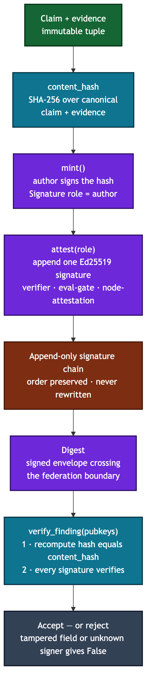

# Findings — signed, content-addressed claims

A `Finding` is the atomic unit that crosses federation boundaries: an immutable
claim plus its evidence, fixed by a content hash and carried with an
append-only chain of Ed25519 signatures. You care because this is how a claim's
origin and every endorsement it collects can be verified anywhere, without
trusting the transport that delivered it.

## The shape (`finding.py`)

- `Finding(claim, evidence, content_hash, signatures)` — a frozen dataclass.
  `evidence` is a tuple of strings; `signatures` is a tuple of `Signature`.
- `Signature(signer, signature, role)` — `signer` is a principal handle (e.g.
  `@ben.booth:axiom`), `signature` is raw Ed25519 bytes, and `role` is one of
  **`author` | `verifier` | `eval-gate` | `node-attestation`**.

## Lifecycle

1. **`mint(claim, evidence, author_handle, author_keypair)`** computes
   `content_hash = SHA-256(canonical(claim, evidence))` and returns a Finding
   whose single signature is the author's, with `role="author"`. The signature
   is over the **hash**, not the raw payload, so chain verification needs only
   the hash plus each signature.
2. **`attest(finding, role=...)`** appends one more signature over the same
   content hash. Rebroadcast preserves the whole chain, so a verifier, an eval
   gate, or a node can each stack its own endorsement.
3. **`verify_finding(finding, pubkeys)`** returns `True` only if (1) the
   recomputed hash equals `content_hash` **and** (2) every signature verifies
   against the supplied public key for its signer. A missing pubkey, a tampered
   field, or a forged signature each yields `False`.

Across federation a finding rides inside a signed `Digest`
(`axiom.vega.federation.digest`) and is re-verified by the receive pipeline
(`axiom.vega.federation.receive`) before it is allowed to promote into the
local corpus.

## Invariants a newcomer must not violate

- **The hash covers `claim + evidence`; signatures cover the hash.** Never
  sign the raw payload or a subset — the two-level scheme is what makes
  rebroadcast cheap and tamper-evident.
- **Findings are immutable.** There is no mutating setter. `with_claim()`
  exists only to forge a tamper case in tests; it deliberately does not
  recompute the hash, so `verify_finding` fails on the result.
- **Verify on every hop.** Attribution fraud requires forging an Ed25519
  signature — but that guarantee only holds if the local eval gate actually
  calls `verify_finding` before ingest. Do not accept a Finding because it came
  from a trusted peer; verify the chain.
- **Append-only.** `attest` only ever grows the signature tuple. Never drop,
  reorder, or rewrite existing signatures.

## Not to be confused with

- **ADR-109 build provenance** signs *artifacts* — the published wheel —
  keylessly via Sigstore. Findings sign *claims* with named-principal Ed25519
  keys. Different objects, different trust roots.
- **`axiom.memory.attest`** signs *memory fragments* and audit entries with the
  same Ed25519 primitives, but a fragment is a stored memory, not a portable
  cross-boundary claim.

## Related ADRs

ADR-021 (federation threat model — signed content-addressed findings, P2–P7),
ADR-025 (formal threat model), ADR-028 (trust graph). Contrast: ADR-109 (build
provenance).
