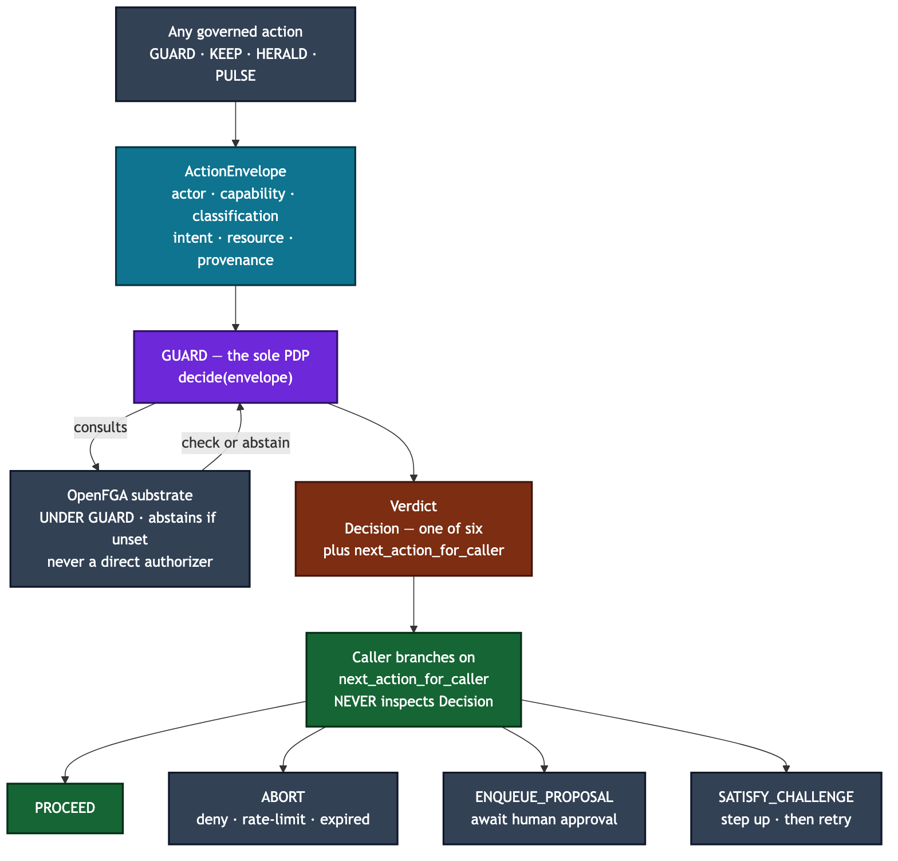

# Governance — one shape for every governed action

`axiom.governance` is the shared substrate (ADR-055) beneath the platform's
four governance primitives. Every action that crosses a trust, classification,
or ownership boundary is expressed as one `ActionEnvelope` and answered with one
`Verdict`, so authorization, secrets, notifications, and scheduling all speak
the same language. You care because this is the single choke point where "who
may do what, to what, under whose authority" is decided and recorded.

## Four consumers, one substrate

- **GUARD** (`authz`) — consumes an `ActionEnvelope`, returns a `Verdict`.
- **KEEP** (`vault`) — issues and verifies `CapabilityToken`s; owns the
  outbound-call choke point.
- **HERALD** (`notifications`) — every send carries an envelope.
- **PULSE** (`schedule`) — every fire constructs an envelope.

## Types you will meet

- **`ActionEnvelope`** (`envelope.py`) — actor (`Principal`), capability,
  classification, intent, resource, provenance parent, federation origin,
  deadline, dedup key. Optional `subject` / `actor_context` ride alongside for
  the authorization substrate.
- **`ActorContext` / `Assurance`** (`actor.py`, ADR-084) — the unified
  who-is-acting view (handle, tenant, roles, assurance / AAL), composed from
  verified claims with no I/O. `Principal` stays minimal because its bytes are
  load-bearing in capability signatures.
- **`Classification`** (`classification.py`) — the data-tier label *of the
  resource being acted on*: `PUBLIC < INTERNAL < REGULATED < CONTROLLED`.
  `classification_lte` is the routing predicate; the upper tiers denote
  regulated and controlled data whose access turns on formal authority.
- **`CapabilityToken`** (`capability.py`) — a scoped (intent + resource
  pattern), classification-ceilinged, time-bounded, revocable, and
  bounded-depth-delegable assertion of authority. KEEP mints and verifies it.
- **`Verdict` / `Decision` / `NextAction`** (`verdict.py`) — the typed answer,
  carrying a `reason` and a `receipt_fragment_id` so every decision is
  auditable.
- **`ProvenanceRef`** (`provenance.py`) — a pointer to the fragment that caused
  the action; `SYNTHETIC` is reserved for boot-time actions only.
- **`controlled_code`** (`controlled_code.py`) — a registry that *declares*
  whether a named simulation program is export-controlled. It **declares; it
  does not enforce** — no `permit()`, no gating. Enforcement lives elsewhere
  (filesystem permissions on a local run, an authorized-persons check in the
  job broker).

## `Decision` has six values

`PERMIT · DENY · PROPOSE_TO_HUMAN · RATE_LIMIT · EXPIRED_CAPABILITY ·
STEP_UP_REQUIRED`. Each maps to a `NextAction` the caller acts on: `PROCEED ·
ABORT · ENQUEUE_PROPOSAL · AWAIT_HUMAN · SATISFY_CHALLENGE`.

## Invariants a newcomer must not violate

- **GUARD is the sole PDP.** Only GUARD decides. No other primitive
  re-implements authorization.
- **OpenFGA sits *underneath* GUARD (ADR-083), never beside it.** It is a
  fine-grained substrate GUARD consults; when unconfigured it `ABSTAIN`s. Never
  call OpenFGA as a direct authorizer.
- **Branch on `next_action_for_caller`, never inspect `Decision`.** The typed
  next-action is the call-site contract; reading `decision` directly
  re-implements the mapping and will drift. Note that `STEP_UP_REQUIRED` →
  `SATISFY_CHALLENGE` is recoverable (step up, then retry) and must not collapse
  into `ABORT`.
- **`controlled_code` declares; it does not enforce.** If you find yourself
  wanting `registry.permit(...)`, you are in the wrong module. Its three answers
  are `CONTROLLED / NOT_CONTROLLED / UNKNOWN`, and `UNKNOWN` is not
  `NOT_CONTROLLED` — a control that appears to permit everything is worse than
  none.
- **A `Verdict` is always auditable.** `reason` and `receipt_fragment_id` are
  non-empty by construction; a `Challenge` is present iff the decision is
  `STEP_UP_REQUIRED`.

## Related ADRs

ADR-055 (unified governance fabric), ADR-082 (agent-native identity provider),
ADR-083 (authorization substrate under GUARD — OpenFGA), ADR-084 (identity
unification — ActorContext), ADR-086 (authenticated delegation — token
exchange).
