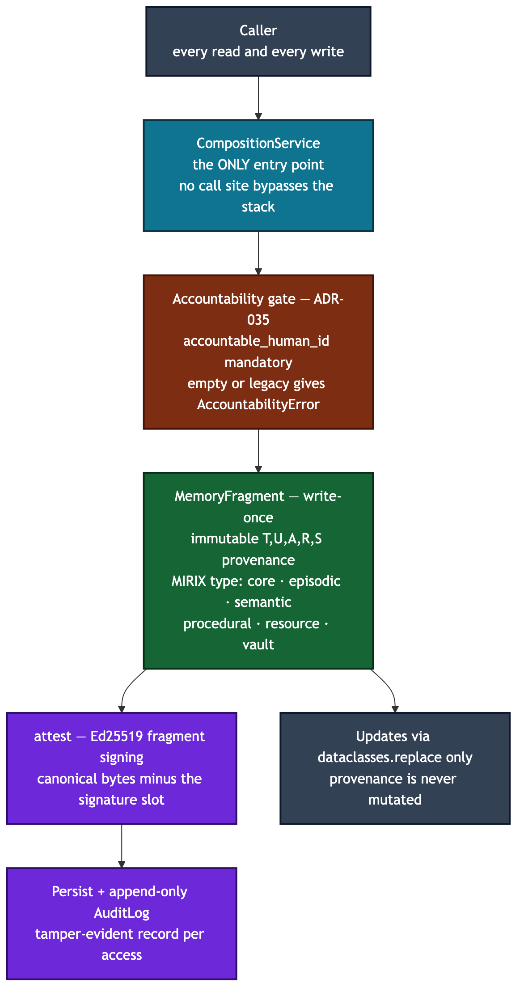

# Memory — the write-once fragment

A `MemoryFragment` is the atomic, write-once unit of Axiom's memory: immutable
provenance plus a MIRIX cognitive type and — because every AI action must answer
to a person — a mandatory binding to the human accountable for it. You care
because this is where "what the system remembers" is made tamper-evident and
attributable.

## The fragment (`fragment.py`)

- **Immutable provenance `(T, U, A, R, S)`** (`Provenance`, from the
  Collaborative Memory paper §3.2): `T` creation timestamp, `U` contributing
  principal, `A` agents, `R` resources, `S` originating session id. It is a
  frozen dataclass — access-control changes propagate through the access graphs
  (`access.py`), never through a rewrite. ADR-087 adds a write-once `origin`
  coordinate for imported/absorbed fragments; native fragments carry none.
- **MIRIX six-type taxonomy** (`CognitiveType`): `core · episodic · semantic ·
  procedural · resource · vault`. Each type gets its own storage, retention,
  and retrieval profile.
- **Accountability (ADR-035).** `provenance.accountable_human_id` (mandatory)
  names the human whose authority the actor invokes; `delegation_chain` records
  the principals between that human and the actor. Every AI action traces to a
  named human.

## Signing and audit (`attest.py`)

- `sign_fragment` / `verify_fragment_signature` — Ed25519 over a deterministic
  canonical encoding that **excludes the signature slot**, so signing and
  verifying are self-consistent and tampering with any field invalidates the
  signature.
- `AuditLog` — an append-only JSONL log. Each entry records principal, agent,
  fragment, and outcome, and can be per-entry signed so it stays tamper-evident
  across federation boundaries.

## The write path (`composition.py`)

`CompositionService.write()` is the single door: it builds the fragment,
enforces accountability, resolves policy and write scope, signs, persists, and
records the audit entry — `resolve → route → transform → sign → persist →
audit`. `read()` and `llm_response()` compose the same primitives, so every
guard is consulted on every operation.

## Invariants a newcomer must not violate

- **Every read and write goes through `CompositionService`.** No call site
  bypasses the stack — that is the contract that makes "every primitive is
  consulted on every operation" true. Do not construct and persist fragments
  directly.
- **Provenance is immutable; mutate with `dataclasses.replace` only.**
  Fragments are frozen. The write path itself rebuilds provenance via
  `dataclasses.replace` so no field is silently dropped; follow that pattern and
  never mutate in place.
- **`accountable_human_id` is mandatory at write time.** Empty strings and the
  `legacy:` read-back sentinel are rejected with `AccountabilityError` *before*
  any persistence. The sentinel exists only so old-shape fragments decode on
  read; it may never be written.
- **Default-safe classification and visibility.** A fragment defaults to
  `SCOPE_INTERNAL` visibility and an unclassified stamp, so effective outflow is
  default-deny until a writer widens it deliberately.

## Related ADRs

ADR-026 (ownership model), ADR-027 (federated memory), ADR-028 (trust graph),
ADR-035 (human-principal binding), ADR-087 (portable cross-harness memory —
origin coordinate), ADR-111 (canonical local principal resolution).
