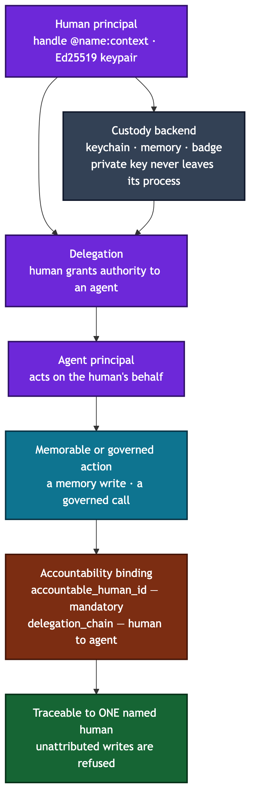

# Vega — federation, identity, and trust

Vega is the layer that lets one Axiom node prove who it is, decide who it
trusts, and exchange signed knowledge with other nodes. You care because every
cross-node claim, every principal handle, and every trust decision on the
platform bottoms out here.

> **Pre-extraction staging (ADR-031 Phase 3).** Vega is UT-owned and destined
> for its own repository; until then it lives under `axiom.vega.*`. The legacy
> import roots `axiom.federation`, `axiom.identity`, and `axiom.security` have
> been **removed** — there are no compatibility shims in this tree. Import from
> `axiom.vega.federation.*` and `axiom.vega.identity.*` only.

Vega's identity layer is what makes accountability possible: a human principal
(handle plus keypair, custodied by the OS) delegates authority to an agent, and
every downstream action stays bound to that named human.

## Subpackages

**`axiom.vega.identity`** — the cryptographic identity primitives.
- `Keypair` (`identity/keypair.py`) — a thin Ed25519 wrapper over
  `cryptography`. Raw 32-byte public bytes, `sign()` / `verify()`, no PEM/DER.
- `Principal` (`identity/principal.py`) — a named, public-keyed entity (human,
  agent, node, or org) addressed by a Matrix-style handle.
- Custody (`identity/custody.py`) — pluggable backends (`keychain` default,
  `memory` for tests, `badge` / `hardware` spikes) so the private key can live
  in the OS keychain and never touch disk in the clear.
- Local principal (`identity/local.py`) — `load_or_create_local_keypair()`
  returns the stable "me" keypair; loading it is the OS-gated unlock.

**`axiom.vega.federation`** — the node-to-node protocol and trust surface.
- Peer identity and discovery — `NodeIdentity` plus a readable fingerprint for
  out-of-band verification (`federation/identity.py`), a peer registry
  (`federation/discovery.py`), and zero-config LAN/VPN discovery over mDNS
  (`federation/mdns.py`, service type `_axiom._tcp.local.`).
- A2A — Google Agent2Agent v0.3 agent cards (`federation/agent_card.py`),
  served at `/.well-known/agent-card.json`.
- Trust — invitation-based joining with time-limited tokens
  (`federation/trust.py`); trust profiles and per-fragment visibility horizons
  that scope cohort and boundary outflow (`federation/policy.py`); and the
  gateway that gates outbound projection and inbound acceptance
  (`federation/gateway.py`).
- Signed exchange — findings travel in signed digests and pass a local eval
  gate before ingest (`federation/digest.py`, `federation/receive.py`).
- Hostile-content defense — a prompt-injection sanitizer for all federated
  content (`federation/content_sanitizer.py`) and a Wasmtime sandbox with no
  filesystem or network for untrusted compute (`federation/wasm_sandbox.py`).

## Invariants a newcomer must not violate

- **Handle grammar (ADR-020).** A principal handle is `@name` or
  `@name:context` — exactly one leading `@`, an optional `:context` suffix. The
  fediverse double-`@` form (`@name@server`) and email `user@domain` are
  rejected at construction by `Principal.__post_init__`. Do not loosen the
  regex.
- **Import from `axiom.vega.*`.** The old `axiom.federation` /
  `axiom.identity` / `axiom.security` roots are gone. Do not reintroduce them.
- **Private keys never leave their process.** Signing happens behind
  `Keypair` and custody; verification is a pure function of public bytes,
  message, and signature. Never serialize a private key into a fragment, an
  agent card, or a log.
- **Default-deny outflow.** A fragment's effective reach is
  `min(visibility, classification ceiling)`, and both default to the most
  restrictive value. Do not widen visibility to "fix" a projection — raise it
  deliberately or not at all. Regulated regimes can restrict further (the
  gateway filters by nationality at projection time); they can never relax the
  writer's intent.
- **Verify before you trust.** Inbound digests are signature-checked and
  eval-gated before anything enters the local corpus, and federated content is
  sanitized before it reaches a prompt. Arriving from a trusted peer is not a
  substitute for verifying the signature.

## Related ADRs

ADR-016 (multi-node federation), ADR-020 (identity layers and handle grammar),
ADR-022 (identity roots vs. membership separation), ADR-023 (topology,
lifecycle, propagation), ADR-024 (root availability, delegation, key hygiene),
ADR-025 (formal threat model), ADR-027 (federated memory), ADR-028 (trust
graph), ADR-029 (federation composition). Staging and extraction: ADR-031.
